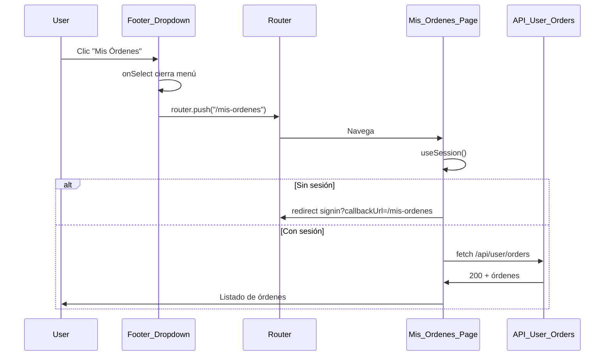

# Plan: Mis órdenes desde dropdown y Dashboard con sentido

## 1. Problema: "Mis órdenes no funciona desde el dropdown"

**Causas probables:**

- La ruta `/mis-ordenes` **no tiene protección por sesión**: si el usuario llega sin sesión (o la sesión expiró), la página hace `fetch('/api/user/orders')`, recibe 401 y muestra solo un mensaje de error, sin redirigir a login.
- Navegación desde un **DropdownMenu de Radix**: un `<Link>` dentro de `<DropdownMenuItem asChild>` a veces no dispara la navegación de forma fiable (el menú cierra el portal y puede interferir con el click). Es más robusto cerrar el menú y navegar por código.

**Archivos implicados:**

- [src/app/mis-ordenes/layout.tsx](src/app/mis-ordenes/layout.tsx) – actualmente solo define `dynamic`/`revalidate`, sin comprobar sesión.
- [src/app/mis-ordenes/page.tsx](src/app/mis-ordenes/page.tsx) – cliente que llama a `/api/user/orders`; si hay 401, solo pone error en estado.
- [src/components/layout/Footer.tsx](src/components/layout/Footer.tsx) – dropdown con `<Link href="/mis-ordenes">` dentro de `DropdownMenuItem`.
- [src/components/Header/ActionButtons.tsx](src/components/Header/ActionButtons.tsx) – mismo patrón para "Mis Órdenes" en el header.

**Cambios propuestos:**

1. **Proteger la ruta Mis órdenes**
  Añadir en el layout (o en la page como client) la misma lógica que usa el dashboard: si `useSession()` indica que no hay sesión una vez cargada, redirigir a `/api/auth/signin?callbackUrl=/mis-ordenes`. Así siempre se llega a la página ya autenticado y el listado puede cargar bien.
2. **Navegación fiable desde el dropdown (footer y header)**
  En lugar de depender solo del `<Link>` dentro del `DropdownMenuItem`:
  - Usar `DropdownMenuItem` con `onSelect` (y opcionalmente `e.preventDefault()` si hace falta).
  - Dentro del handler: cerrar el dropdown (Radix lo hace al seleccionar) y llamar a `router.push('/mis-ordenes')`.
  - Mantener accesibilidad: el ítem debe seguir siendo activable por teclado y anunciado como enlace a "Mis órdenes".

Aplicar el mismo patrón para "Mi Dashboard" si se mantiene en el menú, para evitar el mismo tipo de fallo.

---

## 2. Problema: "Dashboard con configuraciones hardcodeadas y sin funciones reales"

**Estado actual:**

- [src/app/dashboard/page.tsx](src/app/dashboard/page.tsx):  
  - **Estadísticas fijas:** "Total de Órdenes" = 0, "Total Gastado" = $0, "Órdenes Pendientes" = 0, "Sesiones Activas" = '1'. No se llama a ninguna API.
  - Enlaces a `/dashboard/profile`, `/dashboard/security`, `/mis-ordenes` son válidos, pero el valor del dashboard como “resumen” es nulo.
- [src/app/dashboard/security/page.tsx](src/app/dashboard/security/page.tsx):  
  - Formulario de cambio de contraseña con `// TODO: Implementar cambio de contraseña`; no hay backend (NextAuth con Google no gestiona contraseña propia).
- Preferencias ([src/components/User/Preferences/PreferencesPage.tsx](src/components/User/Preferences/PreferencesPage.tsx)) usan `useUserPreferences`; hace falta confirmar si ese hook persiste en backend o solo en estado local. Si no persiste, también son “fake”.

**Opciones de enfoque:**

**Opción A – Dashboard útil con datos reales y sin mentir**

- Añadir un endpoint de resumen de usuario, por ejemplo `GET /api/user/orders/summary` (o reutilizar `/api/user/orders` con agregaciones), que devuelva:
  - Número total de órdenes.
  - Total gastado (suma de `total` de órdenes pagadas/entregadas).
  - Órdenes pendientes (por estado `pending` o similar).
- En la página del dashboard, sustituir los valores 0 / $0 por datos devueltos por esa API (con estados de carga y error).
- "Sesiones Activas": o bien quitarla, o dejarla como "1" con texto tipo "Sesión actual" sin dar a entender que hay un sistema de sesiones múltiples implementado.
- En "Acciones rápidas":
  - Mantener enlaces a **Mis órdenes**, **Editar perfil** (si existe y funciona).
  - Para **Configurar Seguridad** y **Preferencias**: si no hay backend real, quitar esas tarjetas o sustituirlas por un texto tipo "Próximamente" y deshabilitar el enlace, para no dar la impresión de que ya funcionan.

**Opción B – Simplificar: quitar Dashboard como hub**

- En el dropdown del footer (y header): quitar el ítem "Mi Dashboard".
- Dejar solo "Mis Órdenes" y "Cerrar sesión" (y "Panel Admin" si aplica).
- La ruta `/dashboard` puede redirigir a `/mis-ordenes` (por ejemplo con `redirect('/mis-ordenes')` en `dashboard/page.tsx` o en un layout), de modo que quien tenga un enlace antiguo al dashboard llegue directamente a mis órdenes.

**Recomendación:** Opción A si quieres mantener un “hub” de usuario con resumen real; Opción B si prefieres menos superficie de UI y que el foco sea solo “Mis órdenes” desde el dropdown.

---

## 3. Resumen de tareas

| Tarea                                 | Descripción                                                                                                                                                                                                                                                         |
| ------------------------------------- | ------------------------------------------------------------------------------------------------------------------------------------------------------------------------------------------------------------------------------------------------------------------- |
| Proteger `/mis-ordenes`               | Layout o page client: si no hay sesión, redirigir a signin con `callbackUrl=/mis-ordenes`.                                                                                                                                                                          |
| Navegación dropdown fiable            | En Footer y ActionButtons: ítem "Mis Órdenes" (y "Mi Dashboard" si se mantiene) con `onSelect` + `router.push(...)` en lugar de depender solo del Link.                                                                                                             |
| Dashboard: datos reales o simplificar | Opción A: API de resumen de órdenes + dashboard mostrando total órdenes, total gastado, pendientes; quitar o marcar como "Próximamente" seguridad/preferencias sin backend. Opción B: quitar "Mi Dashboard" del dropdown y redirigir `/dashboard` a `/mis-ordenes`. |

---

## 4. Flujo sugerido (Mis órdenes)

Si confirmas si prefieres **Opción A** (dashboard con datos reales) o **Opción B** (simplificar y quitar dashboard del menú), se puede bajar esto a pasos concretos por archivo (diffs o listas de cambios) en la siguiente iteración.