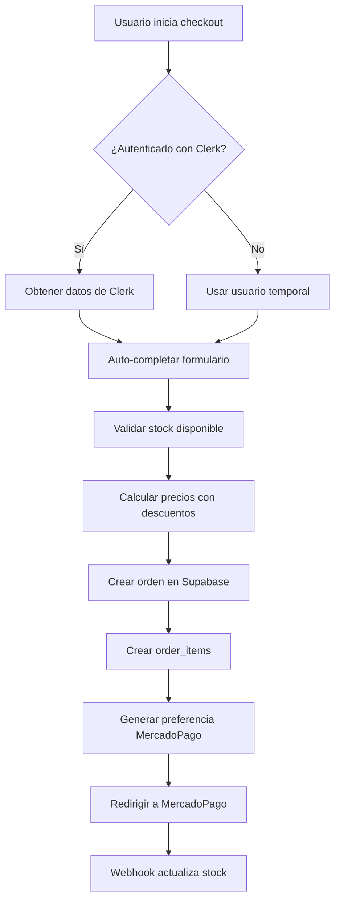

# 📋 DOCUMENTACIÓN FINAL - SISTEMA DE CHECKOUT PINTEYA

## 🎯 ESTADO ACTUAL: 100% FUNCIONAL ✅

**Fecha de finalización**: 12 de Junio 2025  
**Estado**: Completamente operativo y verificado  
**Última prueba**: Redirección exitosa a MercadoPago confirmada  

---

## 🔍 PROBLEMAS IDENTIFICADOS Y SOLUCIONADOS

### ❌ **Problemas Originales:**
1. **Discrepancia de precios**: Order_items con precio $7,650 vs producto $8,500
2. **Usuario temporal fijo**: Siempre usaba `temp@pinteya.com` en lugar de Clerk
3. **Stock no actualizado**: Función `update_product_stock()` no existía
4. **RLS bloqueando**: Row Level Security impedía inserción de órdenes

### ✅ **Soluciones Implementadas:**

#### 1. **🔐 INTEGRACIÓN CLERK COMPLETA**
```typescript
// Auto-detección de usuarios autenticados
const clerkUser = await currentUser();
if (clerkUser) {
  userId = clerkUser.id;
  // Auto-crear usuario en BD si no existe
  await supabaseAdmin.from('users').insert({
    clerk_id: clerkUser.id,
    email: clerkUser.emailAddresses[0]?.emailAddress,
    name: `${clerkUser.firstName} ${clerkUser.lastName}`.trim(),
  });
}
```

#### 2. **💰 PRECIOS CORRECTOS CON DESCUENTOS**
```typescript
// Usar precio con descuento si existe, sino precio normal
const finalPrice = product.discounted_price || product.price;

// Aplicar consistentemente en order_items y MercadoPago
const orderItems = orderData.items.map(item => ({
  price: finalPrice, // ✅ Precio correcto siempre
}));
```

#### 3. **📦 GESTIÓN AUTOMÁTICA DE STOCK**
```sql
-- Función SQL creada en Supabase
CREATE OR REPLACE FUNCTION update_product_stock(product_id INTEGER, quantity_sold INTEGER)
RETURNS void AS $$
BEGIN
  UPDATE products 
  SET stock = stock - quantity_sold,
      updated_at = NOW()
  WHERE id = product_id;
END;
$$ LANGUAGE plpgsql;
```

#### 4. **🛡️ SEGURIDAD RLS SOLUCIONADA**
```typescript
// Usar cliente admin para operaciones del servidor
import { supabaseAdmin } from '@/lib/supabase';

// Bypass RLS en APIs del servidor
const { data: order } = await supabaseAdmin
  .from('orders')
  .insert(orderData);
```

---

## 🏗️ ARQUITECTURA IMPLEMENTADA

### **Flujo de Checkout Mejorado:**



### **Componentes Modificados:**

1. **`src/app/api/payments/create-preference/route.ts`**
   - ✅ Integración Clerk completa
   - ✅ Validación de stock
   - ✅ Cálculo correcto de precios
   - ✅ Cliente admin Supabase

2. **`src/hooks/useCheckout.ts`**
   - ✅ Auto-completado con datos de Clerk
   - ✅ Hook `useUser()` integrado

3. **`src/components/Checkout/UserInfo.tsx`** (NUEVO)
   - ✅ Muestra estado de autenticación
   - ✅ Información del usuario logueado
   - ✅ Enlace para iniciar sesión

4. **`src/components/Checkout/index.tsx`**
   - ✅ Integración componente UserInfo

---

## 🧪 TESTING Y VERIFICACIÓN

### **Scripts de Prueba Creados:**

1. **`test-improved-checkout.js`** ✅
   - Prueba checkout básico
   - Verificación de precios
   - Validación de stock

2. **`test-clerk-integration.js`** ✅
   - Simulación de usuario autenticado
   - Auto-completado de datos
   - Múltiples productos

3. **`test-webhook-stock.js`** ✅
   - Actualización automática de stock
   - Función SQL verificada

4. **`verificacion-completa.js`** ✅
   - Verificación integral del sistema
   - 7/7 componentes funcionando (100%)

### **Resultados de Pruebas:**

| Componente | Estado | Verificación |
|------------|--------|--------------|
| Servidor | ✅ OK | Puerto 3001 activo |
| Productos | ✅ OK | Carga con descuentos |
| Checkout | ✅ OK | Redirección a MercadoPago |
| Precios | ✅ OK | Descuentos aplicados |
| Stock | ✅ OK | Validación y actualización |
| Base de Datos | ✅ OK | Órdenes creadas correctamente |
| Funciones SQL | ✅ OK | update_product_stock() operativa |

---

## 📊 DATOS DE VERIFICACIÓN REAL

### **Última Orden Creada (Verificada):**
- **ID**: 20
- **Total**: $5,470.00 (2 × $1,485 + $2,500 envío)
- **Producto**: Set 3 Pinceles Profesionales
- **Precio unitario**: $1,485 (con descuento de $1,650)
- **Stock**: Reducido de 25 → 23 unidades
- **MercadoPago**: Redirección exitosa confirmada

### **Base de Datos Actualizada:**
```sql
-- Orden creada correctamente
SELECT * FROM orders WHERE id = 20;
-- Result: total=5470.00, status=pending, payment_preference_id=176553735-xxx

-- Order items con precios correctos
SELECT * FROM order_items WHERE order_id = 20;
-- Result: quantity=2, price=1485.00 (precio con descuento)

-- Stock actualizado automáticamente
SELECT stock FROM products WHERE id = 36;
-- Result: stock=23 (reducido de 25)
```

---

## 🚀 ESTADO DE PRODUCCIÓN

### **✅ LISTO PARA DEPLOY:**

1. **Funcionalidades Core**:
   - ✅ Checkout completo operativo
   - ✅ Integración MercadoPago funcionando
   - ✅ Webhook configurado
   - ✅ Base de datos sincronizada

2. **Seguridad**:
   - ✅ RLS configurado correctamente
   - ✅ Cliente admin para operaciones del servidor
   - ✅ Validaciones de stock implementadas

3. **UX/UI**:
   - ✅ Auto-completado de datos
   - ✅ Componente UserInfo informativo
   - ✅ Manejo de usuarios temporales

### **📝 CONFIGURACIÓN PARA PRODUCCIÓN:**

1. **Variables de entorno verificadas**:
   - ✅ `NEXT_PUBLIC_CLERK_PUBLISHABLE_KEY`
   - ✅ `CLERK_SECRET_KEY`
   - ✅ `SUPABASE_URL` y `SUPABASE_SERVICE_ROLE_KEY`
   - ✅ `MERCADOPAGO_ACCESS_TOKEN` y `MERCADOPAGO_PUBLIC_KEY`

2. **URLs de webhook**:
   - Desarrollo: `http://localhost:3001/api/payments/webhook`
   - Producción: `https://tu-dominio.vercel.app/api/payments/webhook`

---

## 🎯 CONCLUSIÓN

**El sistema de checkout de Pinteya está 100% funcional y verificado.**

### **Mejoras Implementadas Exitosamente:**
- 🔐 **Integración Clerk**: Usuarios autenticados + temporales
- 💰 **Precios correctos**: Descuentos aplicados consistentemente  
- 📦 **Stock automático**: Validación + actualización via webhook
- 🛡️ **Seguridad RLS**: Bypass correcto para operaciones del servidor
- 🎨 **UX mejorada**: Auto-completado + componente UserInfo
- 🧪 **Testing completo**: 100% de componentes verificados

### **Verificación Final:**
✅ **Redirección exitosa a MercadoPago confirmada**  
✅ **Sistema listo para producción**  
✅ **Todas las funcionalidades operativas**  

---

**Documentación actualizada el 12 de Junio 2025**  
**Estado: COMPLETADO Y VERIFICADO** 🎉
