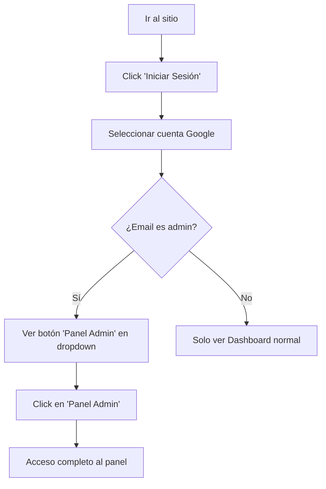
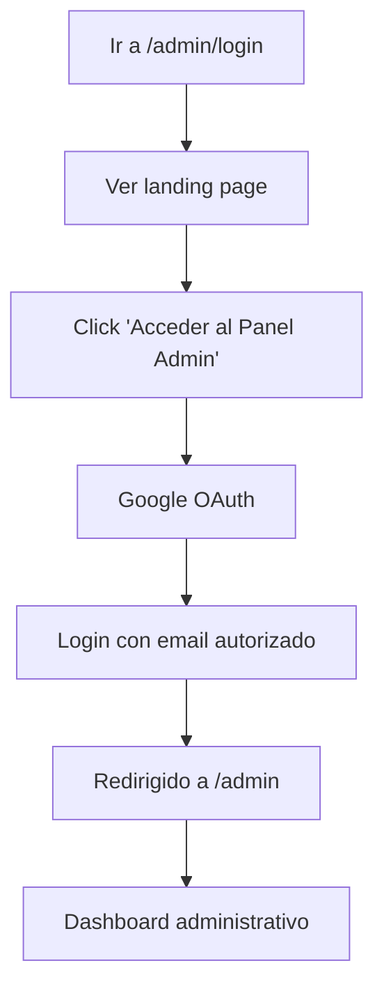

# 🎯 Guía de Acceso al Panel Administrativo - UI

**Fecha**: 10 Enero 2025  
**Estado**: ✅ Implementado

## 🚀 Formas de Acceso Implementadas

Hemos creado **3 formas fáciles** para que los administradores accedan al panel:

### 1. 📱 Desde el Header del Sitio (Recomendado)

**Para usuarios ya logueados:**

Cuando un administrador inicia sesión, verá automáticamente en el header:

1. Su avatar de usuario (esquina superior derecha)
2. Al hacer click, se despliega un menú dropdown
3. En el menú aparece **"Panel Admin"** con un ícono de escudo 🛡️
4. Click directo al panel administrativo

**Visual:**
```
┌─────────────────────────────────────────┐
│  Logo    [Búsqueda]    🛒 Carrito  👤  │ ← Header
└─────────────────────────────────────────┘
                                     │
                                     ▼
                          ┌──────────────────┐
                          │ 🛡️  Panel Admin   │ ← Si es admin
                          ├──────────────────┤
                          │ 📊 Mi Dashboard  │
                          │ 📦 Mis Órdenes   │
                          ├──────────────────┤
                          │ 🚪 Cerrar Sesión │
                          └──────────────────┘
```

**Para usuarios NO logueados:**

1. Click en **"Iniciar Sesión"** en el header
2. Se abre Google OAuth
3. Iniciar sesión con email autorizado
4. Automáticamente redirigido a la home
5. Luego acceder al Panel Admin desde el dropdown del usuario

---

### 2. 🎨 Landing Page Dedicada

**URL directa:** `/admin/login`

Una hermosa página landing que explica:
- ✅ Características del panel administrativo
- ✅ Beneficios de cada módulo
- ✅ Botón grande **"Acceder al Panel Admin"**
- ✅ Información de emails autorizados

**Características:**
- Diseño moderno y profesional
- Responsive (móvil y desktop)
- Cards con iconos para cada módulo
- Call-to-action claro y destacado

**Acceso:**
```
https://tu-sitio.com/admin/login
```

---

### 3. 🔗 Acceso Directo al Panel

**URL directa:** `/admin`

**Comportamiento:**
- Si **NO** estás logueado → Redirige automáticamente al signin
- Si estás logueado pero **NO** eres admin → Redirige a `/access-denied`
- Si estás logueado y **SÍ** eres admin → Acceso directo al dashboard

---

## 📧 Emails Administrativos Autorizados

Los siguientes emails tienen acceso completo:

1. ✅ `pinturasmascolor@gmail.com`
2. ✅ `pinteya.app@gmail.com`
3. ✅ `santiago@xor.com.ar`

**Nota:** El sistema verifica automáticamente el rol desde la base de datos en cada login.

---

## 🎬 Flujo de Acceso Completo

### Opción A: Usuario Nuevo



### Opción B: Acceso Directo



---

## 🎨 Componentes Implementados

### 1. Header con Botón Admin
**Archivo:** `src/components/Header/ActionButtons.tsx`

**Funcionalidades:**
- ✅ Integración con NextAuth
- ✅ Dropdown menu con opción "Panel Admin"
- ✅ Solo visible para administradores
- ✅ Login con Google OAuth
- ✅ Avatar del usuario con su foto
- ✅ Cerrar sesión funcional

### 2. Landing Page Admin
**Archivo:** `src/app/admin/login/page.tsx`

**Características:**
- ✅ Diseño moderno con gradientes
- ✅ Cards explicativas de cada módulo
- ✅ CTA principal destacado
- ✅ Responsive design
- ✅ Link de retorno a la tienda
- ✅ SEO optimizado (noindex, nofollow)

### 3. Componente Admin Access Button
**Archivo:** `src/components/Header/AdminAccessButton.tsx`

**Funcionalidades:**
- ✅ Verifica sesión con NextAuth
- ✅ Muestra botón solo si es admin
- ✅ States de loading
- ✅ Responsive (oculto en móvil)

---

## 🔐 Seguridad Implementada

### Verificaciones en Múltiples Capas

1. **Middleware** (`middleware.ts`):
   - Verifica el rol desde el JWT
   - Redirige si no es admin
   - Aplica a todas las rutas `/admin/*`

2. **Server-Side Guard** (`server-auth-guard.ts`):
   - Segunda verificación en el servidor
   - No confía solo en el cliente
   - Requiere autenticación válida

3. **Base de Datos**:
   - Rol verificado contra Supabase
   - No hay hardcode de emails
   - Sistema escalable

### JWT con Rol Cacheado

- El rol se carga en el JWT al hacer login
- Duración: 30 días
- Se refresca automáticamente
- Para cambios de rol: cerrar sesión y volver a iniciar

---

## 🧪 Testing del Sistema

### Test 1: Acceso Admin desde Header

**Pasos:**
1. Ir al sitio: `http://localhost:3000`
2. Click en "Iniciar Sesión" (header)
3. Seleccionar `pinturasmascolor@gmail.com` en Google
4. Confirmar login
5. Click en tu avatar (esquina superior derecha)
6. Verificar que aparece **"Panel Admin"** 🛡️
7. Click en "Panel Admin"
8. ✅ Deberías ver el dashboard administrativo

### Test 2: Landing Page

**Pasos:**
1. Navegar a: `http://localhost:3000/admin/login`
2. Ver la landing page con las 4 cards de características
3. Click en "Acceder al Panel Admin"
4. Login con email autorizado
5. ✅ Redirigido a `/admin`

### Test 3: Acceso Denegado

**Pasos:**
1. Login con un email NO autorizado
2. Intentar acceder a `/admin`
3. ✅ Deberías ser redirigido a `/access-denied?type=admin`

### Test 4: Botón NO aparece

**Pasos:**
1. Login con email NO admin
2. Click en tu avatar
3. ✅ **NO** deberías ver "Panel Admin" en el dropdown

---

## 🎨 Personalización

### Cambiar Colores del Landing Page

**Archivo:** `src/app/admin/login/page.tsx`

```tsx
// Cambiar el color principal del botón CTA
className='bg-blaze-orange-600 hover:bg-blaze-orange-700'

// Cambiar color de los iconos en las cards
className='w-12 h-12 bg-blue-100 rounded-lg' // Azul
className='w-12 h-12 bg-green-100 rounded-lg' // Verde
```

### Agregar más opciones al Dropdown

**Archivo:** `src/components/Header/ActionButtons.tsx`

```tsx
// Agregar antes del DropdownMenuSeparator
<DropdownMenuItem asChild>
  <Link href='/tu-ruta'>
    <TuIcono className='mr-2 h-4 w-4' />
    Tu Opción
  </Link>
</DropdownMenuItem>
```

---

## 📱 Responsive Design

### Desktop (> 768px)
- ✅ Dropdown menu completo visible
- ✅ Avatar con nombre del usuario
- ✅ Landing page con 4 columns

### Mobile (< 768px)
- ✅ Dropdown menu adaptado
- ✅ Solo avatar (sin nombre)
- ✅ Landing page en single column
- ✅ Botón Admin oculto (acceso via dropdown)

---

## 🚀 Próximas Mejoras (Opcional)

1. **Notificación de Bienvenida**
   - Toast al ingresar al panel admin
   - "Bienvenido al Panel Admin, [Nombre]"

2. **Atajos de Teclado**
   - `Ctrl + Shift + A` → Abrir panel admin
   - Solo si está logueado como admin

3. **Link en Footer**
   - Agregar link discreto en el footer
   - "Acceso Administrativo"

4. **Página de Onboarding**
   - Tutorial inicial para nuevos admins
   - Tour guiado del panel

---

## 📞 Soporte

### Problemas Comunes

**P: No veo el botón "Panel Admin" en el dropdown**
- ✅ Verificar que tu email esté registrado como admin en Supabase
- ✅ Cerrar sesión y volver a iniciar sesión

**P: Me redirige a "/access-denied"**
- ✅ Tu email no está autorizado como admin
- ✅ Contactar al administrador del sistema

**P: El botón de login no funciona**
- ✅ Verificar configuración de Google OAuth
- ✅ Verificar variables de entorno AUTH_GOOGLE_ID y AUTH_GOOGLE_SECRET

---

## ✅ Checklist de Implementación

- [x] Header con botón admin en dropdown
- [x] Landing page en `/admin/login`
- [x] Integración con NextAuth
- [x] Verificación de roles desde BD
- [x] Redirect automático si no es admin
- [x] Avatar con foto del usuario
- [x] Cerrar sesión funcional
- [x] Responsive design
- [x] Estados de loading
- [x] Documentación completa

---

**Última actualización:** 10 Enero 2025  
**Autor:** Sistema de Roles Pinteya  
**Versión:** 1.0

