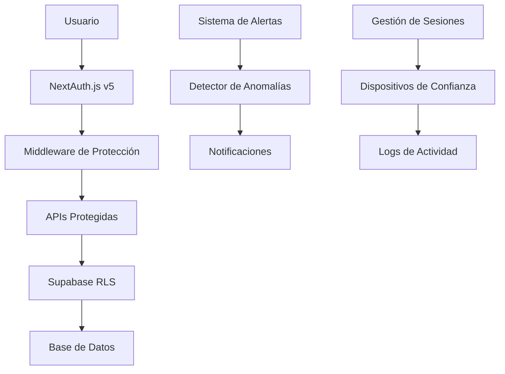

# 🔒 Documentación de Seguridad - Pinteya E-commerce

## 📋 Índice

1. [Resumen Ejecutivo](#resumen-ejecutivo)
2. [Arquitectura de Seguridad](#arquitectura-de-seguridad)
3. [Funcionalidades Implementadas](#funcionalidades-implementadas)
4. [Guías de Usuario](#guías-de-usuario)
5. [Procedimientos de Seguridad](#procedimientos-de-seguridad)
6. [Troubleshooting](#troubleshooting)
7. [Mejores Prácticas](#mejores-prácticas)
8. [Compliance y Regulaciones](#compliance-y-regulaciones)

## 🎯 Resumen Ejecutivo

Pinteya E-commerce implementa un sistema de seguridad multicapa que incluye:

- **Autenticación robusta** con NextAuth.js v5
- **Gestión avanzada de sesiones** con detección de anomalías
- **Sistema de alertas automáticas** para actividad sospechosa
- **Dispositivos de confianza** para mejorar UX sin comprometer seguridad
- **Logs de actividad completos** para auditoría
- **Exportación de datos** para compliance GDPR
- **Configuración granular** de privacidad y notificaciones

## 🏗️ Arquitectura de Seguridad

### **Componentes Principales**

### **Capas de Seguridad**

1. **Capa de Autenticación**: NextAuth.js con JWT y session management
2. **Capa de Autorización**: Middleware y RLS policies
3. **Capa de Detección**: Sistema de anomalías y alertas
4. **Capa de Auditoría**: Logging completo de actividad
5. **Capa de Privacidad**: Configuración granular y exportación GDPR

## ⚡ Funcionalidades Implementadas

### **1. Gestión de Sesiones**

#### **Características:**
- ✅ Visualización de sesiones activas
- ✅ Información detallada de dispositivos
- ✅ Cierre remoto de sesiones
- ✅ Detección automática de dispositivos
- ✅ Geolocalización de accesos

#### **Ubicación:**
- **Página**: `/dashboard/sessions`
- **API**: `/api/user/sessions`
- **Componente**: `SessionManager.tsx`

### **2. Configuración de Seguridad**

#### **Características:**
- ✅ Configuración de timeouts de sesión
- ✅ Límites de sesiones concurrentes
- ✅ Configuración de alertas
- ✅ Puntuación de seguridad en tiempo real
- ✅ Recomendaciones personalizadas

#### **Ubicación:**
- **Página**: `/dashboard/security`
- **API**: `/api/user/security`
- **Componente**: `SecuritySettings.tsx`

### **3. Sistema de Alertas Automáticas**

#### **Tipos de Alertas:**
- 🚨 **Críticas**: Acceso desde IP sospechosa, múltiples intentos fallidos
- ⚠️ **Altas**: Múltiples sesiones concurrentes, nueva ubicación
- 📢 **Medias**: Cambios de configuración, horarios inusuales
- ℹ️ **Bajas**: Nuevos dispositivos, actualizaciones de perfil

#### **Ubicación:**
- **Sistema**: `SecurityAlertSystem.ts`
- **Detector**: `AnomalyDetector.ts`
- **API**: Integrado en todas las APIs críticas

### **4. Dispositivos de Confianza**

#### **Características:**
- ✅ Marcado automático y manual de dispositivos
- ✅ Niveles de confianza dinámicos
- ✅ Gestión granular de permisos
- ✅ Estadísticas de uso por dispositivo
- ✅ Eliminación remota de dispositivos

#### **Ubicación:**
- **Componente**: `TrustedDevices.tsx`
- **API**: `/api/user/trusted-devices`

### **5. Logs de Actividad**

#### **Categorías Registradas:**
- 🔐 **Auth**: login, logout, password_reset
- 👤 **Profile**: update_profile, upload_avatar
- 🛒 **Order**: create_order, payment_completed
- 🔒 **Security**: enable_2fa, trust_device
- 💻 **Session**: session_start, session_end
- ⚙️ **Preference**: update_notifications, update_theme

#### **Ubicación:**
- **Página**: `/dashboard/activity`
- **API**: `/api/user/activity`
- **Sistema**: `ActivityLogger.ts`

### **6. Exportación de Datos (GDPR)**

#### **Características:**
- ✅ Exportación completa de datos personales
- ✅ Formatos JSON y CSV
- ✅ Descarga inmediata o por email
- ✅ Datos incluidos: perfil, órdenes, sesiones, actividad
- ✅ Cumplimiento GDPR completo

#### **Ubicación:**
- **API**: `/api/user/export`
- **Componente**: Integrado en `PrivacySettings.tsx`

## 👥 Guías de Usuario

### **Para Usuarios Finales**

#### **Acceder al Dashboard de Seguridad**
1. Iniciar sesión en Pinteya
2. Ir a "Mi Dashboard" en el menú de usuario
3. Navegar a la sección "Seguridad"

#### **Gestionar Sesiones Activas**
1. Ir a `/dashboard/sessions`
2. Ver lista de dispositivos conectados
3. Cerrar sesiones sospechosas con "Cerrar sesión"
4. Marcar dispositivos como confiables

#### **Configurar Alertas de Seguridad**
1. Ir a `/dashboard/security`
2. Ajustar configuración en la pestaña "Alertas"
3. Configurar notificaciones por email/push
4. Establecer límites de sesiones

#### **Revisar Actividad Reciente**
1. Ir a `/dashboard/activity`
2. Filtrar por categoría o fecha
3. Revisar acciones sospechosas
4. Exportar historial si es necesario

#### **Exportar Datos Personales**
1. Ir a `/dashboard/preferences`
2. Pestaña "Privacidad"
3. Hacer clic en "Exportar datos"
4. Seleccionar formato (JSON/CSV)
5. Descargar archivo o recibir por email

### **Para Administradores**

#### **Monitorear Seguridad del Sistema**
1. Acceder al panel de administración
2. Revisar alertas de seguridad globales
3. Monitorear patrones de actividad anómala
4. Gestionar usuarios con actividad sospechosa

#### **Configurar Políticas de Seguridad**
1. Establecer timeouts de sesión por defecto
2. Configurar límites de sesiones concurrentes
3. Ajustar sensibilidad del detector de anomalías
4. Configurar notificaciones administrativas

## 🔧 Procedimientos de Seguridad

### **Respuesta a Incidentes**

#### **Nivel 1: Actividad Sospechosa Detectada**
1. **Detección automática** por el sistema de anomalías
2. **Alerta generada** y enviada al usuario
3. **Revisión manual** por parte del usuario
4. **Acción correctiva** si es necesario

#### **Nivel 2: Compromiso de Cuenta Sospechado**
1. **Cierre automático** de sesiones sospechosas
2. **Notificación inmediata** al usuario por email
3. **Bloqueo temporal** de nuevos accesos
4. **Verificación de identidad** requerida

#### **Nivel 3: Compromiso Confirmado**
1. **Cierre de todas las sesiones** activas
2. **Cambio obligatorio de contraseña**
3. **Revisión completa** de actividad reciente
4. **Notificación a administradores**

### **Mantenimiento Preventivo**

#### **Diario**
- ✅ Revisión de alertas críticas
- ✅ Monitoreo de intentos de acceso fallidos
- ✅ Verificación de sistema de notificaciones

#### **Semanal**
- ✅ Análisis de patrones de actividad
- ✅ Revisión de dispositivos de confianza
- ✅ Limpieza de sesiones expiradas

#### **Mensual**
- ✅ Auditoría completa de logs
- ✅ Revisión de políticas de seguridad
- ✅ Actualización de reglas de detección

## 🔍 Troubleshooting

### **Problemas Comunes**

#### **"No puedo acceder a mi cuenta"**
1. Verificar credenciales de acceso
2. Revisar si hay alertas de seguridad activas
3. Comprobar si la cuenta está temporalmente bloqueada
4. Contactar soporte si persiste el problema

#### **"Recibo muchas alertas de seguridad"**
1. Revisar configuración de alertas en `/dashboard/security`
2. Ajustar sensibilidad de detección
3. Marcar dispositivos habituales como confiables
4. Verificar que no hay accesos no autorizados

#### **"Mi sesión se cierra constantemente"**
1. Verificar configuración de timeout de sesión
2. Comprobar si hay múltiples sesiones activas
3. Revisar si el dispositivo está marcado como confiable
4. Verificar conexión de red estable

#### **"No recibo notificaciones de seguridad"**
1. Verificar configuración en `/dashboard/preferences`
2. Comprobar que las alertas de seguridad están habilitadas
3. Revisar carpeta de spam en email
4. Verificar permisos de notificaciones push

### **Códigos de Error**

| Código | Descripción | Solución |
|--------|-------------|----------|
| SEC001 | Sesión expirada | Iniciar sesión nuevamente |
| SEC002 | Dispositivo no confiable | Marcar como confiable o verificar identidad |
| SEC003 | Demasiadas sesiones activas | Cerrar sesiones innecesarias |
| SEC004 | Actividad sospechosa detectada | Revisar actividad reciente |
| SEC005 | IP bloqueada temporalmente | Esperar o contactar soporte |

## 🛡️ Mejores Prácticas

### **Para Usuarios**

#### **Gestión de Contraseñas**
- ✅ Usar contraseñas únicas y complejas
- ✅ Habilitar autenticación de dos factores (cuando esté disponible)
- ✅ Cambiar contraseñas regularmente
- ✅ No compartir credenciales

#### **Gestión de Sesiones**
- ✅ Cerrar sesión al usar dispositivos públicos
- ✅ Revisar sesiones activas regularmente
- ✅ Marcar solo dispositivos personales como confiables
- ✅ Reportar actividad sospechosa inmediatamente

#### **Configuración de Privacidad**
- ✅ Revisar configuración de privacidad regularmente
- ✅ Limitar compartir datos con terceros
- ✅ Configurar notificaciones de seguridad
- ✅ Exportar datos periódicamente para backup

### **Para Desarrolladores**

#### **Implementación de Seguridad**
- ✅ Usar HTTPS en todas las comunicaciones
- ✅ Implementar RLS en todas las tablas
- ✅ Validar entrada en cliente y servidor
- ✅ Registrar actividad en APIs críticas

#### **Manejo de Datos Sensibles**
- ✅ Encriptar datos sensibles en reposo
- ✅ No registrar información sensible en logs
- ✅ Implementar retención de datos apropiada
- ✅ Seguir principios de minimización de datos

## 📋 Compliance y Regulaciones

### **GDPR (Reglamento General de Protección de Datos)**

#### **Derechos Implementados**
- ✅ **Derecho de acceso**: Exportación completa de datos
- ✅ **Derecho de rectificación**: Edición de perfil y preferencias
- ✅ **Derecho de supresión**: Eliminación de cuenta
- ✅ **Derecho de portabilidad**: Exportación en formatos estándar
- ✅ **Derecho de oposición**: Configuración granular de privacidad

#### **Medidas Técnicas**
- ✅ **Pseudonimización**: IDs UUID para usuarios
- ✅ **Encriptación**: Datos sensibles encriptados
- ✅ **Minimización**: Solo datos necesarios recopilados
- ✅ **Retención**: Políticas de limpieza automática

### **Otras Regulaciones**

#### **CCPA (California Consumer Privacy Act)**
- ✅ Transparencia en recopilación de datos
- ✅ Derecho a eliminar información personal
- ✅ Derecho a optar por no vender datos

#### **LGPD (Lei Geral de Proteção de Dados - Brasil)**
- ✅ Consentimiento explícito para procesamiento
- ✅ Transparencia en uso de datos
- ✅ Derechos de acceso y corrección

## 📞 Contacto y Soporte

### **Soporte Técnico**
- **Email**: soporte@pinteya.com
- **Horario**: Lunes a Viernes, 9:00 - 18:00 (GMT-3)

### **Reportar Incidentes de Seguridad**
- **Email**: security@pinteya.com
- **Urgente**: +54 11 XXXX-XXXX
- **Tiempo de respuesta**: < 2 horas para incidentes críticos

### **Recursos Adicionales**
- [Centro de Ayuda](https://help.pinteya.com)
- [Política de Privacidad](https://pinteya.com/privacy)
- [Términos de Servicio](https://pinteya.com/terms)

---

**Última actualización**: 13 de Septiembre, 2025  
**Versión**: 1.0  
**Autor**: Equipo de Desarrollo Pinteya

