# DOCUMENTACIÓN TÉCNICA COMPLETA - PINTEYA E-COMMERCE

## 📋 ÍNDICE

1. [Resumen Ejecutivo](#resumen-ejecutivo)
2. [Arquitectura del Sistema](#arquitectura-del-sistema)
3. [Configuración y Tecnologías](#configuración-y-tecnologías)
4. [Base de Datos](#base-de-datos)
5. [API Endpoints](#api-endpoints)
6. [Autenticación y Seguridad](#autenticación-y-seguridad)
7. [Componentes React](#componentes-react)
8. [Despliegue y DevOps](#despliegue-y-devops)
9. [Testing y Calidad](#testing-y-calidad)
10. [Documentación Adicional](#documentación-adicional)

---

## 🎯 RESUMEN EJECUTIVO

### Descripción del Proyecto
**PINTEYA E-COMMERCE** es una plataforma de comercio electrónico moderna desarrollada con Next.js 14, que incluye funcionalidades avanzadas como:

- Sistema de gestión de productos y categorías
- Carrito de compras y procesamiento de pagos
- Panel administrativo completo
- Sistema de logística y seguimiento de órdenes
- Autenticación con NextAuth.js (migrado desde Clerk)
- Integración con Supabase como base de datos
- Sistema de métricas y analytics
- Arquitectura enterprise con RLS (Row Level Security)

### Estado Actual
- **Fase**: Desarrollo activo con migración de autenticación completada
- **Versión**: Next.js 14 con App Router
- **Base de Datos**: Supabase PostgreSQL
- **Autenticación**: NextAuth.js v5 (migrado desde Clerk)
- **Despliegue**: Vercel con configuración Docker para módulos específicos

---

## 🏗️ ARQUITECTURA DEL SISTEMA

### Estructura de Directorios Principal

```
BOILERPLATTE E-COMMERCE/
├── src/
│   ├── app/                    # App Router (Next.js 14)
│   │   ├── api/               # API Routes
│   │   ├── (auth)/            # Rutas de autenticación
│   │   ├── admin/             # Panel administrativo
│   │   ├── shop/              # Tienda pública
│   │   └── logistics/         # Sistema de logística
│   ├── components/            # Componentes React reutilizables
│   ├── lib/                   # Utilidades y configuraciones
│   ├── middleware/            # Middleware de seguridad
│   └── types/                 # Definiciones TypeScript
├── supabase/                  # Configuración y migraciones de Supabase
├── docs/                      # Documentación del proyecto
├── docker/                    # Configuraciones Docker
└── __tests__/                 # Tests y pruebas E2E
```

### Patrones Arquitectónicos

1. **Arquitectura por Capas**
   - Presentación: Componentes React + Next.js
   - Lógica de Negocio: API Routes + Middleware
   - Datos: Supabase PostgreSQL + RLS

2. **Microservicios Modulares**
   - Módulo de Logística (Docker independiente)
   - Módulo de Pagos (Integración MercadoPago)
   - Módulo de Analytics (Métricas en tiempo real)

3. **Seguridad por Diseño**
   - Row Level Security (RLS) en base de datos
   - Middleware de seguridad multicapa
   - Validación JWT y CSRF

---

## ⚙️ CONFIGURACIÓN Y TECNOLOGÍAS

### Stack Tecnológico

#### Frontend
- **Framework**: Next.js 14.2.5 (App Router)
- **UI Library**: React 18 + TypeScript
- **Styling**: Tailwind CSS + Shadcn/ui
- **State Management**: Zustand + React Query
- **Forms**: React Hook Form + Zod validation

#### Backend
- **Runtime**: Node.js con Next.js API Routes
- **Base de Datos**: Supabase (PostgreSQL)
- **Autenticación**: NextAuth.js v5 (Google OAuth)
- **Pagos**: MercadoPago SDK
- **File Storage**: Supabase Storage

#### DevOps y Herramientas
- **Deployment**: Vercel + Docker
- **Testing**: Jest + Playwright + Testing Library
- **Linting**: ESLint + Prettier
- **Type Checking**: TypeScript 5.x
- **Monitoring**: Prometheus + Grafana (módulo logística)

### Variables de Entorno Requeridas

```env
# Base de Datos
NEXT_PUBLIC_SUPABASE_URL=
NEXT_PUBLIC_SUPABASE_ANON_KEY=
SUPABASE_SERVICE_ROLE_KEY=

# Autenticación NextAuth.js
NEXTAUTH_SECRET=
NEXTAUTH_URL=
AUTH_GOOGLE_ID=
AUTH_GOOGLE_SECRET=

# Pagos
MERCADOPAGO_ACCESS_TOKEN=
NEXT_PUBLIC_MERCADOPAGO_PUBLIC_KEY=

# Configuración
NODE_ENV=development|production
```

### Configuración de Build

```json
{
  "scripts": {
    "dev": "next dev",
    "build": "next build",
    "start": "next start",
    "test": "jest",
    "test:e2e": "playwright test",
    "lint": "next lint",
    "type-check": "tsc --noEmit"
  }
}
```

---

## 🗄️ BASE DE DATOS

### Esquema Principal (Supabase PostgreSQL)

#### Tablas Core

1. **users** - Perfiles de usuario
```sql
CREATE TABLE users (
  id UUID PRIMARY KEY DEFAULT gen_random_uuid(),
  email TEXT UNIQUE NOT NULL,
  name TEXT,
  image TEXT,
  role TEXT DEFAULT 'customer',
  created_at TIMESTAMPTZ DEFAULT NOW(),
  updated_at TIMESTAMPTZ DEFAULT NOW()
);
```

2. **products** - Catálogo de productos
```sql
CREATE TABLE products (
  id UUID PRIMARY KEY DEFAULT gen_random_uuid(),
  name TEXT NOT NULL,
  description TEXT,
  price DECIMAL(10,2) NOT NULL,
  category_id UUID REFERENCES categories(id),
  stock INTEGER DEFAULT 0,
  images JSONB,
  created_at TIMESTAMPTZ DEFAULT NOW()
);
```

3. **orders** - Sistema de órdenes
```sql
CREATE TABLE orders (
  id UUID PRIMARY KEY DEFAULT gen_random_uuid(),
  user_id UUID REFERENCES users(id),
  status TEXT DEFAULT 'pending',
  total DECIMAL(10,2) NOT NULL,
  payment_status TEXT DEFAULT 'pending',
  shipping_address JSONB,
  created_at TIMESTAMPTZ DEFAULT NOW()
);
```

#### Sistema de Roles y Permisos

```sql
-- Tabla de roles
CREATE TABLE user_roles (
  id UUID PRIMARY KEY DEFAULT gen_random_uuid(),
  name TEXT UNIQUE NOT NULL,
  description TEXT,
  permissions JSONB DEFAULT '[]'::jsonb
);

-- Roles predefinidos
INSERT INTO user_roles (name, description, permissions) VALUES
('admin', 'Administrador del sistema', '["admin_access", "manage_users", "manage_products"]'),
('manager', 'Gerente de tienda', '["manage_products", "view_analytics"]'),
('customer', 'Cliente regular', '["place_orders", "view_profile"]');
```

#### Row Level Security (RLS)

```sql
-- Habilitar RLS en todas las tablas
ALTER TABLE users ENABLE ROW LEVEL SECURITY;
ALTER TABLE orders ENABLE ROW LEVEL SECURITY;
ALTER TABLE products ENABLE ROW LEVEL SECURITY;

-- Políticas de seguridad
CREATE POLICY "Users can view own profile" ON users
  FOR SELECT USING (auth.uid() = id);

CREATE POLICY "Users can update own profile" ON users
  FOR UPDATE USING (auth.uid() = id);
```

### Migraciones Principales

1. **20250729000001_create_user_roles_system.sql**
   - Creación del sistema de roles y permisos
   - Configuración de perfiles de usuario
   - Índices para optimización

2. **20250131_enterprise_rls_system.sql**
   - Implementación de Row Level Security
   - Funciones auxiliares de seguridad
   - Políticas de acceso por roles

3. **20250131_orders_enterprise_system.sql**
   - Sistema completo de órdenes
   - Historial de estados
   - Notas administrativas

---

## 🔌 API ENDPOINTS

### Estructura de APIs

La aplicación utiliza Next.js App Router con la siguiente estructura de APIs:

```
src/app/api/
├── admin/                     # APIs administrativas
│   ├── analytics/            # Métricas y reportes
│   ├── users/               # Gestión de usuarios
│   └── orders/              # Gestión de órdenes
├── auth/                     # Autenticación
│   └── webhook/             # Webhooks de auth
├── products/                # Catálogo de productos
├── orders/                  # Gestión de órdenes
├── payments/                # Procesamiento de pagos
├── cart/                    # Carrito de compras
├── user/                    # Perfil de usuario
└── logistics/               # Sistema de logística
```

### Endpoints Principales

#### Productos
```typescript
GET    /api/products           # Listar productos
GET    /api/products/[id]      # Obtener producto específico
POST   /api/products           # Crear producto (admin)
PUT    /api/products/[id]      # Actualizar producto (admin)
DELETE /api/products/[id]      # Eliminar producto (admin)
```

#### Órdenes
```typescript
GET    /api/orders             # Listar órdenes del usuario
POST   /api/orders             # Crear nueva orden
GET    /api/orders/[id]        # Obtener orden específica
PUT    /api/orders/[id]/status # Actualizar estado (admin)
```

#### Carrito
```typescript
GET    /api/cart               # Obtener carrito actual
POST   /api/cart/add           # Agregar producto
PUT    /api/cart/update        # Actualizar cantidad
DELETE /api/cart/remove        # Remover producto
```

#### Pagos
```typescript
POST   /api/payments/create    # Crear preferencia de pago
POST   /api/payments/webhook   # Webhook de MercadoPago
GET    /api/payments/status    # Estado del pago
```

### Middleware de Seguridad

Cada endpoint está protegido por middleware específico:

```typescript
// Ejemplo: /api/products/route.ts
import { withEnhancedSecurity } from '@/lib/auth/enhanced-security-middleware';

export const GET = withEnhancedSecurity({
  enableRateLimit: true,
  rateLimitType: 'products'
})(async (request) => {
  // Lógica del endpoint
});
```

### Rate Limiting

Configuración por endpoint:
- `/api/payments`: 10 requests/minuto
- `/api/user`: 30 requests/minuto  
- `/api/orders`: 20 requests/minuto
- `/api/products`: 100 requests/minuto
- Default: 60 requests/minuto

---

## 🔐 AUTENTICACIÓN Y SEGURIDAD

### Sistema de Autenticación

#### NextAuth.js v5 (Migrado desde Clerk)

**Configuración Principal** (`src/lib/auth/auth-options.ts`):

```typescript
export const authOptions: NextAuthOptions = {
  providers: [
    GoogleProvider({
      clientId: process.env.AUTH_GOOGLE_ID!,
      clientSecret: process.env.AUTH_GOOGLE_SECRET!,
      authorization: {
        params: {
          prompt: "consent",
          access_type: "offline",
          response_type: "code"
        }
      }
    })
  ],
  session: {
    strategy: "jwt",
    maxAge: 30 * 24 * 60 * 60, // 30 días
  },
  callbacks: {
    async session({ session, token }) {
      if (token.sub) {
        session.user.id = token.sub;
      }
      // Rol de admin para usuarios específicos
      if (session.user.email === 'santiago@xor.com.ar') {
        (session.user as any).role = 'admin';
      }
      return session;
    }
  }
};
```

#### Funciones de Autenticación

```typescript
// Obtener usuario autenticado
export async function getAuthUser(): Promise<any | null>

// Verificar autenticación
export async function isUserAuthenticated(): Promise<boolean>

// Sincronizar con Supabase
export async function syncUserWithSupabase(user: NextAuthUser): Promise<void>
```

### Middleware de Seguridad Multicapa

#### 1. Enhanced Security Middleware

**Configuraciones Predefinidas**:

```typescript
// Para APIs de autenticación - máxima seguridad
auth: {
  enableJWTValidation: true,
  enableCSRFProtection: true,
  enableRateLimit: true,
  enableSecurityValidation: true,
  rateLimitType: 'auth',
  strictMode: true
}

// Para APIs admin - alta seguridad  
admin: {
  enableJWTValidation: true,
  enableCSRFProtection: true,
  enableRateLimit: true,
  jwtRequiredRole: 'admin',
  jwtRequiredPermissions: ['admin_access'],
  strictMode: true
}
```

#### 2. Security Headers

```typescript
// Content Security Policy
const csp = [
  "default-src 'self'",
  "script-src 'self' 'unsafe-inline' https://js.mercadopago.com",
  "style-src 'self' 'unsafe-inline' https://fonts.googleapis.com",
  "connect-src 'self' https://api.mercadopago.com https://*.supabase.co"
].join('; ');

// Headers adicionales
'X-Frame-Options': 'DENY'
'X-Content-Type-Options': 'nosniff'
'Referrer-Policy': 'strict-origin-when-cross-origin'
```

#### 3. JWT Validation

```typescript
// Validación de integridad JWT
export async function validateJWTIntegrity(
  request?: NextRequest | NextApiRequest
): Promise<JWTValidationResult>

// Validación de permisos
export async function validateJWTPermissions(
  requiredRole: string,
  requiredPermissions: string[] = []
): Promise<JWTValidationResult>
```

### Rutas Protegidas

```typescript
// Rutas públicas
export const publicRoutes = [
  '/', '/shop', '/products/(.*)', '/signin', '/signup'
];

// Rutas protegidas
export const protectedRoutes = [
  '/checkout', '/profile', '/orders', '/wishlist'
];

// APIs protegidas
export const protectedApiRoutes = [
  '/api/orders', '/api/user/(.*)', '/api/payments/(.*)'
];
```

---

## 🧩 COMPONENTES REACT

### Arquitectura de Componentes

#### Estructura Organizacional

```
src/components/
├── ui/                       # Componentes base (Shadcn/ui)
│   ├── button.tsx
│   ├── modal.tsx
│   ├── sheet.tsx
│   └── micro-interactions.tsx
├── forms/                    # Componentes de formularios
├── layout/                   # Componentes de layout
├── product/                  # Componentes específicos de productos
├── cart/                     # Componentes del carrito
├── admin/                    # Componentes administrativos
└── logistics/                # Componentes de logística
```

#### Componentes Principales

**1. Micro-interactions** (`ui/micro-interactions.tsx`)
```typescript
interface MicroInteractionProps {
  type: 'hover' | 'click' | 'focus' | 'loading';
  intensity?: 'subtle' | 'medium' | 'strong';
  duration?: number;
  children: React.ReactNode;
}
```

**2. Enhanced Search Bar** (`EnhancedSearchBar.tsx`)
```typescript
interface EnhancedSearchBarProps {
  onSearch: (query: string) => void;
  placeholder?: string;
  suggestions?: string[];
  isLoading?: boolean;
  className?: string;
}
```

**3. Real Time Dashboard** (`RealTimeDashboard.tsx`)
```typescript
interface RealTimeDashboardProps {
  metrics: DashboardMetrics;
  refreshInterval?: number;
  onMetricClick?: (metric: string) => void;
}
```

**4. Turn by Turn Navigation** (`TurnByTurnNavigation.tsx`)
```typescript
interface TurnByTurnNavigationProps {
  route: NavigationRoute;
  currentPosition: Position;
  onNavigationUpdate: (update: NavigationUpdate) => void;
}
```

### Patrones de Diseño

#### 1. Compound Components
```typescript
// Ejemplo: Modal compound component
<Modal>
  <Modal.Trigger>Abrir Modal</Modal.Trigger>
  <Modal.Content>
    <Modal.Header>Título</Modal.Header>
    <Modal.Body>Contenido</Modal.Body>
    <Modal.Footer>Acciones</Modal.Footer>
  </Modal.Content>
</Modal>
```

#### 2. Render Props
```typescript
// Ejemplo: Data fetching component
<DataFetcher url="/api/products">
  {({ data, loading, error }) => (
    loading ? <Skeleton /> : 
    error ? <ErrorBoundary /> : 
    <ProductList products={data} />
  )}
</DataFetcher>
```

#### 3. Custom Hooks
```typescript
// Hook para manejo de errores de búsqueda
export function useSearchErrorHandler() {
  const [error, setError] = useState<string | null>(null);
  
  const handleError = useCallback((error: Error) => {
    setError(error.message);
    // Logging y analytics
  }, []);
  
  return { error, handleError, clearError: () => setError(null) };
}
```

### Sistema de Tipos

```typescript
// Tipos comunes para componentes
export interface BaseComponentProps {
  className?: string;
  children?: React.ReactNode;
  'data-testid'?: string;
}

export interface ProductCardProps extends BaseComponentProps {
  product: Product;
  onAddToCart?: (productId: string) => void;
  showQuickView?: boolean;
}

export interface FormFieldProps extends BaseComponentProps {
  label: string;
  error?: string;
  required?: boolean;
}
```

---

## 🚀 DESPLIEGUE Y DEVOPS

### Configuración de Vercel

**vercel.json**:
```json
{
  "buildCommand": "npm run build",
  "outputDirectory": ".next",
  "installCommand": "npm install",
  "env": {
    "NEXT_PUBLIC_SUPABASE_URL": "@supabase-url",
    "NEXT_PUBLIC_SUPABASE_ANON_KEY": "@supabase-anon-key"
  },
  "headers": [
    {
      "source": "/api/(.*)",
      "headers": [
        { "key": "Access-Control-Allow-Origin", "value": "*" },
        { "key": "Access-Control-Allow-Methods", "value": "GET, POST, PUT, DELETE, OPTIONS" }
      ]
    }
  ]
}
```

### Docker Configuration

#### Módulo de Logística

**Dockerfile** (`docker/logistics/Dockerfile`):
```dockerfile
# Multi-stage build para optimización
FROM node:18-alpine AS dependencies
WORKDIR /app
COPY package*.json ./
RUN npm ci --only=production

FROM node:18-alpine AS builder
WORKDIR /app
COPY . .
RUN npm run build

FROM node:18-alpine AS runner
WORKDIR /app
ENV NODE_ENV production
COPY --from=dependencies /app/node_modules ./node_modules
COPY --from=builder /app/.next ./.next
EXPOSE 3000
CMD ["npm", "start"]
```

**Docker Compose** (`docker/logistics/docker-compose.yml`):
```yaml
version: '3.8'
services:
  app:
    build: .
    ports:
      - "3000:3000"
    environment:
      - NODE_ENV=production
    depends_on:
      - postgres
      - redis

  postgres:
    image: postgres:15
    environment:
      POSTGRES_DB: logistics
      POSTGRES_USER: postgres
      POSTGRES_PASSWORD: password
    volumes:
      - postgres_data:/var/lib/postgresql/data

  redis:
    image: redis:7-alpine
    ports:
      - "6379:6379"

  nginx:
    image: nginx:alpine
    ports:
      - "80:80"
    volumes:
      - ./nginx.conf:/etc/nginx/nginx.conf

  prometheus:
    image: prom/prometheus
    ports:
      - "9090:9090"

  grafana:
    image: grafana/grafana
    ports:
      - "3001:3000"
```

### Monitoreo y Observabilidad

#### Health Checks
```typescript
// Health check endpoint
export async function GET() {
  const checks = {
    database: await checkDatabase(),
    redis: await checkRedis(),
    external_apis: await checkExternalAPIs()
  };
  
  const healthy = Object.values(checks).every(check => check.status === 'ok');
  
  return Response.json({
    status: healthy ? 'healthy' : 'unhealthy',
    timestamp: new Date().toISOString(),
    checks
  }, { status: healthy ? 200 : 503 });
}
```

#### Métricas con Prometheus
```yaml
# prometheus.yml
global:
  scrape_interval: 15s

scrape_configs:
  - job_name: 'nextjs-app'
    static_configs:
      - targets: ['app:3000']
    metrics_path: '/api/metrics'
```

---

## 🧪 TESTING Y CALIDAD

### Estrategia de Testing

#### 1. Unit Tests (Jest + Testing Library)

**Configuración** (`jest.config.js`):
```javascript
module.exports = {
  testEnvironment: 'jsdom',
  setupFilesAfterEnv: ['<rootDir>/jest.setup.js'],
  moduleNameMapping: {
    '^@/(.*)$': '<rootDir>/src/$1'
  },
  collectCoverageFrom: [
    'src/**/*.{js,jsx,ts,tsx}',
    '!src/**/*.d.ts'
  ]
};
```

**Ejemplo de Test**:
```typescript
// __tests__/hooks/useSearchErrorHandler.test.tsx
describe('useSearchErrorHandler', () => {
  it('should handle search errors correctly', () => {
    const { result } = renderHook(() => useSearchErrorHandler());
    
    act(() => {
      result.current.handleError(new Error('Search failed'));
    });
    
    expect(result.current.error).toBe('Search failed');
  });
});
```

#### 2. Integration Tests

```typescript
// __tests__/api/products.test.ts
describe('/api/products', () => {
  it('should return products list', async () => {
    const response = await fetch('/api/products');
    const data = await response.json();
    
    expect(response.status).toBe(200);
    expect(data).toHaveProperty('products');
    expect(Array.isArray(data.products)).toBe(true);
  });
});
```

#### 3. E2E Tests (Playwright)

**Configuración Admin** (`e2e/admin.config.ts`):
```typescript
export default defineConfig({
  testDir: './e2e/admin',
  fullyParallel: true,
  forbidOnly: !!process.env.CI,
  retries: process.env.CI ? 2 : 0,
  workers: process.env.CI ? 1 : undefined,
  reporter: 'html',
  use: {
    baseURL: 'http://localhost:3000',
    trace: 'on-first-retry',
  },
  projects: [
    {
      name: 'admin-chrome',
      use: { ...devices['Desktop Chrome'] },
    }
  ]
});
```

**Test de Panel Admin**:
```typescript
// e2e/admin/admin-panel.spec.ts
test('admin can access dashboard', async ({ page }) => {
  await page.goto('/admin/login');
  await page.fill('[data-testid=email]', 'admin@test.com');
  await page.fill('[data-testid=password]', 'password');
  await page.click('[data-testid=login-button]');
  
  await expect(page).toHaveURL('/admin/dashboard');
  await expect(page.locator('h1')).toContainText('Dashboard');
});
```

#### 4. Performance Tests

```typescript
// __tests__/performance/seo-performance.test.ts
describe('SEO Performance', () => {
  it('should have good Core Web Vitals', async () => {
    const metrics = await measurePagePerformance('/');
    
    expect(metrics.LCP).toBeLessThan(2500); // Largest Contentful Paint
    expect(metrics.FID).toBeLessThan(100);  // First Input Delay
    expect(metrics.CLS).toBeLessThan(0.1);  // Cumulative Layout Shift
  });
});
```

#### 5. Accessibility Tests

```typescript
// __tests__/accessibility/a11y.test.tsx
import { axe, toHaveNoViolations } from 'jest-axe';

expect.extend(toHaveNoViolations);

test('should not have accessibility violations', async () => {
  const { container } = render(<ProductCard product={mockProduct} />);
  const results = await axe(container);
  expect(results).toHaveNoViolations();
});
```

### Cobertura de Código

**Objetivos de Cobertura**:
- Statements: > 80%
- Branches: > 75%
- Functions: > 85%
- Lines: > 80%

### CI/CD Pipeline

```yaml
# .github/workflows/test.yml
name: Tests
on: [push, pull_request]

jobs:
  test:
    runs-on: ubuntu-latest
    steps:
      - uses: actions/checkout@v3
      - uses: actions/setup-node@v3
        with:
          node-version: '18'
      
      - name: Install dependencies
        run: npm ci
      
      - name: Run unit tests
        run: npm run test:coverage
      
      - name: Run E2E tests
        run: npm run test:e2e
      
      - name: Upload coverage
        uses: codecov/codecov-action@v3
```

---

## 📚 DOCUMENTACIÓN ADICIONAL

### Documentos Existentes

#### 1. Documentación de Componentes
- **Ubicación**: `docs/components/README.md`
- **Contenido**: Estándares de componentes, estado actual, próximos pasos
- **Estado**: Certificación Fase 4 - Optimización

#### 2. Documentación de Arquitectura
- **Ubicación**: `docs/enterprise/README.md`
- **Contenido**: Patrones enterprise, arquitectura escalable
- **Incluye**: Diagramas de arquitectura, patrones de diseño

#### 3. Sistema de Diseño
- **Ubicación**: `docs/design-system/README.md`
- **Contenido**: Métricas de progreso, componentes UI
- **Estado**: En desarrollo activo

#### 4. Documentación de Admin
- **Ubicación**: `docs/admin/implementation/README.md`
- **Contenido**: Esquemas de base de datos, estrategia de testing
- **Incluye**: Diagramas ER, casos de uso

#### 5. Índice de Documentación
- **Ubicación**: `docs/DOCUMENTATION_INDEX.md`
- **Contenido**: Certificación de documentación completa
- **Estado**: Fase 4 de optimización

### Manuales de Usuario

#### Panel Administrativo
1. **Gestión de Productos**
   - Crear, editar y eliminar productos
   - Gestión de inventario
   - Categorización y etiquetado

2. **Gestión de Órdenes**
   - Visualización de órdenes
   - Actualización de estados
   - Procesamiento de pagos

3. **Analytics y Reportes**
   - Métricas de ventas
   - Análisis de comportamiento
   - Reportes financieros

#### Sistema de Logística
1. **Seguimiento de Envíos**
   - Rastreo en tiempo real
   - Notificaciones automáticas
   - Gestión de rutas

2. **Gestión de Inventario**
   - Control de stock
   - Alertas de reposición
   - Auditoría de movimientos

### Diagramas Técnicos

#### Diagrama de Arquitectura


#### Flujo de Autenticación

```mermaid
sequenceDiagram
    participant U as Usuario
    participant A as NextAuth.js
    participant G as Google OAuth
    participant S as Supabase
    
    U->>A: Iniciar sesión
    A->>G: Redirect OAuth
    G->>A: Código de autorización
    A->>A: Validar y crear JWT
    A->>S: Sincronizar usuario
    A->>U: Sesión establecida
```


### Procedimientos Operativos

#### Despliegue en Producción
1. **Pre-despliegue**
   - Ejecutar tests completos
   - Verificar variables de entorno
   - Backup de base de datos

2. **Despliegue**
   - Deploy automático via Vercel
   - Verificación de health checks
   - Monitoreo de métricas

3. **Post-despliegue**
   - Verificación funcional
   - Monitoreo de errores
   - Rollback si es necesario

#### Mantenimiento de Base de Datos
1. **Migraciones**
   - Usar Supabase CLI
   - Backup antes de migrar
   - Verificar integridad post-migración

2. **Optimización**
   - Análisis de queries lentas
   - Optimización de índices
   - Limpieza de datos obsoletos

---

## 🔄 PRÓXIMOS PASOS Y ROADMAP

### Fase Actual: Optimización y Estabilización

#### Tareas Pendientes
1. **Completar migración de Clerk a NextAuth.js**
   - Actualizar todos los componentes
   - Migrar middleware de autenticación
   - Testing completo del flujo

2. **Optimización de Performance**
   - Implementar lazy loading
   - Optimizar bundle size
   - Mejorar Core Web Vitals

3. **Mejoras de Seguridad**
   - Auditoría de seguridad completa
   - Implementar CSP más estricto
   - Fortalecer validaciones

#### Roadmap Futuro
1. **Q1 2025**: Lanzamiento MVP
2. **Q2 2025**: Módulo de analytics avanzado
3. **Q3 2025**: Integración con más pasarelas de pago
4. **Q4 2025**: Aplicación móvil

---

## 📞 CONTACTO Y SOPORTE

### Equipo de Desarrollo
- **Arquitecto Principal**: Santiago (santiago@xor.com.ar)
- **Repositorio**: GitHub (privado)
- **Documentación**: `/docs` directory

### Recursos Adicionales
- **Supabase Dashboard**: Panel de administración de BD
- **Vercel Dashboard**: Monitoreo de despliegues
- **Google Cloud Console**: Gestión de OAuth

---

*Documentación generada automáticamente el {{ fecha_actual }}*
*Versión del proyecto: Next.js 14.2.5 con NextAuth.js v5*


