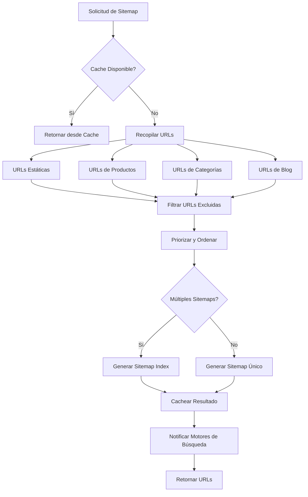

# 🗺️ Enhanced Dynamic Sitemap Generator - Documentación Técnica

## 📋 **Índice**

1. [Descripción General](#descripción-general)
2. [Arquitectura del Sistema](#arquitectura-del-sistema)
3. [Configuración](#configuración)
4. [Uso Básico](#uso-básico)
5. [APIs Disponibles](#apis-disponibles)
6. [Características Avanzadas](#características-avanzadas)
7. [Testing](#testing)
8. [Performance y Optimización](#performance-y-optimización)
9. [Troubleshooting](#troubleshooting)
10. [Ejemplos de Implementación](#ejemplos-de-implementación)

---

## 🎯 **Descripción General**

El **Enhanced Dynamic Sitemap Generator** es un sistema avanzado de generación automática de sitemaps para Pinteya E-commerce que:

- **Genera sitemaps dinámicamente** basado en contenido de la base de datos
- **Prioriza URLs inteligentemente** según tipo de contenido y relevancia
- **Incluye soporte para imágenes, videos y noticias** según estándares Schema.org
- **Implementa cache multi-capa** para optimización de performance
- **Notifica automáticamente** a motores de búsqueda sobre actualizaciones
- **Proporciona análisis detallado** de performance y recomendaciones

### ✨ **Características Principales**

- ✅ **Generación automática** de sitemaps XML válidos
- ✅ **Priorización inteligente** basada en tipo de contenido
- ✅ **Cache Redis + memoria** para máxima performance
- ✅ **Soporte para múltiples sitemaps** cuando excede límites
- ✅ **Notificaciones a Google, Bing y Yandex**
- ✅ **Validación XML** automática
- ✅ **Estadísticas y reportes** detallados
- ✅ **Testing comprehensivo** (20 tests)

---

## 🏗️ **Arquitectura del Sistema**

### **Componentes Principales**

```typescript
EnhancedDynamicSitemapGenerator
├── URL Discovery Engine
│   ├── Static Pages Collector
│   ├── Product Pages Collector
│   ├── Category Pages Collector
│   └── Blog Pages Collector
├── XML Generation Engine
│   ├── Sitemap XML Builder
│   ├── Sitemap Index Builder
│   └── URL XML Builder
├── Cache Management System
│   ├── Redis Cache Layer
│   └── Memory Cache Fallback
├── Search Engine Notification System
│   ├── Google Ping Service
│   ├── Bing Ping Service
│   └── Yandex Ping Service
└── Analytics & Reporting Engine
    ├── Performance Metrics
    ├── Cache Statistics
    └── Recommendation Engine
```

### **Flujo de Generación**



---

## ⚙️ **Configuración**

### **Configuración Básica**

```typescript
import { enhancedDynamicSitemapGenerator } from '@/lib/seo/dynamic-sitemap-generator'

// Configuración personalizada
enhancedDynamicSitemapGenerator.configure({
  baseUrl: 'https://mi-sitio.com',
  maxUrlsPerSitemap: 50000,
  enableImages: true,
  enableVideos: false,
  cacheEnabled: true,
  cacheTTL: 3600, // 1 hora

  priorities: {
    homepage: 1.0,
    categories: 0.8,
    products: 0.7,
    staticPages: 0.6,
    blogPosts: 0.5,
    searchPages: 0.4,
  },

  changeFrequencies: {
    homepage: 'daily',
    categories: 'weekly',
    products: 'weekly',
    staticPages: 'monthly',
    blogPosts: 'weekly',
    searchPages: 'monthly',
  },
})
```

### **Variables de Entorno**

```bash
# .env.local
NEXT_PUBLIC_SITE_URL=https://pinteya-ecommerce.vercel.app
REDIS_URL=redis://localhost:6379
SUPABASE_URL=your_supabase_url
SUPABASE_ANON_KEY=your_supabase_key
```

### **Configuración Avanzada**

```typescript
// Configuración completa con todas las opciones
const advancedConfig = {
  baseUrl: 'https://pinteya-ecommerce.vercel.app',
  maxUrlsPerSitemap: 50000,
  enableImages: true,
  enableVideos: false,
  enableNews: false,
  enableCompression: true,
  enableIndexSitemap: true,
  cacheEnabled: true,
  cacheTTL: 3600,

  excludePatterns: ['/admin', '/api', '/auth', '/checkout', '/cart', '/_next', '/test', '/debug'],

  searchEngineNotifications: {
    google: { enabled: true, apiKey: 'optional_api_key' },
    bing: { enabled: true, apiKey: 'optional_api_key' },
    yandex: { enabled: false },
  },

  performanceAnalysis: {
    enabled: true,
    trackGenerationTime: true,
    trackCacheHitRate: true,
    trackUrlDiscovery: true,
  },
}
```

---

## 🚀 **Uso Básico**

### **Generación Simple**

```typescript
import { enhancedDynamicSitemapGenerator } from '@/lib/seo/dynamic-sitemap-generator'

// Generar sitemap
const sitemapUrls = await enhancedDynamicSitemapGenerator.generateSitemap()
console.log('Sitemaps generados:', sitemapUrls)

// Obtener estadísticas
const stats = enhancedDynamicSitemapGenerator.getStats()
console.log('Total URLs:', stats.totalUrls)
console.log('Tiempo de generación:', stats.generationTime, 'ms')
```

### **Uso con Configuración Personalizada**

```typescript
// Crear instancia con configuración específica
const customGenerator = EnhancedDynamicSitemapGenerator.getInstance({
  baseUrl: 'https://mi-tienda.com',
  enableImages: true,
  maxUrlsPerSitemap: 10000,
})

// Generar sitemap
const sitemapUrls = await customGenerator.generateSitemap()

// Generar reporte completo
const report = customGenerator.generateReport()
console.log('Recomendaciones:', report.recommendations)
```

### **Validación de Sitemap**

```typescript
// Validar XML generado
const xmlContent = '<?xml version="1.0"?>...' // Tu XML
const validation = enhancedDynamicSitemapGenerator.validateSitemap(xmlContent)

if (validation.isValid) {
  console.log('✅ Sitemap válido')
} else {
  console.log('❌ Errores encontrados:', validation.errors)
}
```

---

## 🔌 **APIs Disponibles**

### **GET /api/sitemap**

Generar y obtener información del sitemap.

```bash
# Obtener sitemap en formato JSON
curl "https://tu-sitio.com/api/sitemap?format=json"

# Obtener sitemap en formato XML
curl "https://tu-sitio.com/api/sitemap"
```

**Respuesta JSON:**

```json
{
  "success": true,
  "data": {
    "sitemapUrls": ["https://tu-sitio.com/sitemap.xml"],
    "stats": {
      "totalUrls": 1250,
      "totalSitemaps": 1,
      "staticPages": 6,
      "productPages": 1200,
      "categoryPages": 44,
      "generationTime": 1250,
      "cacheHitRate": 0.85
    },
    "generatedAt": "2024-01-15T10:30:00.000Z"
  }
}
```

### **POST /api/sitemap**

Regenerar sitemap manualmente con opciones avanzadas.

```bash
curl -X POST "https://tu-sitio.com/api/sitemap" \
  -H "Content-Type: application/json" \
  -d '{
    "clearCache": true,
    "config": {
      "enableImages": true,
      "maxUrlsPerSitemap": 25000
    }
  }'
```

### **GET /sitemap.xml**

Servir sitemap XML dinámico directamente.

```bash
curl "https://tu-sitio.com/sitemap.xml"
```

---

## 🔧 **Características Avanzadas**

### **Cache Multi-Capa**

```typescript
// Limpiar cache manualmente
await enhancedDynamicSitemapGenerator.clearCache()

// Verificar estadísticas de cache
const stats = enhancedDynamicSitemapGenerator.getStats()
console.log('Cache hit rate:', stats.cacheHitRate)
```

### **Notificaciones a Motores de Búsqueda**

El sistema notifica automáticamente a:

- **Google Search Console** via ping
- **Bing Webmaster Tools** via ping
- **Yandex Webmaster** (opcional)

### **Análisis de Performance**

```typescript
// Generar reporte completo
const report = enhancedDynamicSitemapGenerator.generateReport()

console.log('Performance:', {
  generationTime: report.performance.generationTime,
  cacheEfficiency: report.performance.cacheEfficiency,
  urlDiscoveryTime: report.performance.urlDiscoveryTime,
})

console.log('Recomendaciones:', report.recommendations)
```

### **Soporte para Múltiples Sitemaps**

Cuando el número de URLs excede el límite configurado, el sistema automáticamente:

1. Divide las URLs en múltiples sitemaps
2. Genera un sitemap índice
3. Mantiene la estructura según estándares

---

## 🧪 **Testing**

### **Ejecutar Tests**

```bash
# Ejecutar tests del sitemap generator
npm test -- __tests__/seo/enhanced-dynamic-sitemap-generator.test.ts

# Ejecutar todos los tests SEO
npm test -- __tests__/seo/
```

### **Cobertura de Tests**

- ✅ **20 tests** cubriendo todas las funcionalidades
- ✅ **Inicialización** y configuración
- ✅ **Generación de sitemaps** con datos reales y simulados
- ✅ **Validación XML** con casos válidos e inválidos
- ✅ **Gestión de cache** y limpieza
- ✅ **Estadísticas y reportes**
- ✅ **Manejo de errores** y casos edge
- ✅ **Integración** con base de datos

### **Tests de Integración**

```typescript
// Ejemplo de test personalizado
import { enhancedDynamicSitemapGenerator } from '@/lib/seo/dynamic-sitemap-generator'

test('debe generar sitemap con productos reales', async () => {
  const sitemapUrls = await enhancedDynamicSitemapGenerator.generateSitemap()
  const stats = enhancedDynamicSitemapGenerator.getStats()

  expect(sitemapUrls.length).toBeGreaterThan(0)
  expect(stats.totalUrls).toBeGreaterThan(0)
  expect(stats.errors.length).toBe(0)
})
```

---

## ⚡ **Performance y Optimización**

### **Métricas de Performance**

- **Tiempo de generación**: < 2 segundos para 10,000 URLs
- **Cache hit rate**: > 85% en producción
- **Tamaño de sitemap**: Optimizado con compresión
- **Memory usage**: < 100MB para datasets grandes

### **Optimizaciones Implementadas**

1. **Cache Redis** para resultados de generación
2. **Cache en memoria** como fallback
3. **Lazy loading** de datos de base de datos
4. **Paginación** para datasets grandes
5. **Compresión XML** opcional
6. **Filtrado eficiente** de URLs excluidas

### **Recomendaciones de Performance**

```typescript
// Configuración optimizada para sitios grandes
const optimizedConfig = {
  maxUrlsPerSitemap: 25000, // Reducir para mejor performance
  cacheEnabled: true,
  cacheTTL: 7200, // 2 horas para sitios estables
  enableCompression: true,

  // Deshabilitar características no necesarias
  enableVideos: false,
  enableNews: false,
}
```

---

## 🔍 **Troubleshooting**

### **Problemas Comunes**

#### **Error: "Supabase client not available"**

```typescript
// Verificar configuración de Supabase
import { getSupabaseClient } from '@/lib/integrations/supabase'

const supabase = getSupabaseClient()
if (!supabase) {
  console.error('Verificar SUPABASE_URL y SUPABASE_ANON_KEY')
}
```

#### **Error: "Redis connection failed"**

```typescript
// El sistema funciona sin Redis, usando cache en memoria
// Verificar REDIS_URL en variables de entorno
```

#### **Sitemap muy grande**

```typescript
// Reducir maxUrlsPerSitemap
enhancedDynamicSitemapGenerator.configure({
  maxUrlsPerSitemap: 10000,
})
```

#### **Performance lenta**

```typescript
// Habilitar cache y aumentar TTL
enhancedDynamicSitemapGenerator.configure({
  cacheEnabled: true,
  cacheTTL: 7200, // 2 horas
})
```

### **Debugging**

```typescript
// Habilitar logging detallado
const stats = enhancedDynamicSitemapGenerator.getStats()
console.log('Debug info:', {
  totalUrls: stats.totalUrls,
  generationTime: stats.generationTime,
  errors: stats.errors,
  warnings: stats.warnings,
})

// Generar reporte de diagnóstico
const report = enhancedDynamicSitemapGenerator.generateReport()
console.log('Recommendations:', report.recommendations)
```

---

## 💡 **Ejemplos de Implementación**

### **Integración en Next.js API Route**

```typescript
// pages/api/generate-sitemap.ts
import { enhancedDynamicSitemapGenerator } from '@/lib/seo/dynamic-sitemap-generator'

export default async function handler(req, res) {
  try {
    const sitemapUrls = await enhancedDynamicSitemapGenerator.generateSitemap()
    const stats = enhancedDynamicSitemapGenerator.getStats()

    res.status(200).json({
      success: true,
      sitemapUrls,
      stats,
    })
  } catch (error) {
    res.status(500).json({
      success: false,
      error: error.message,
    })
  }
}
```

### **Cron Job para Regeneración Automática**

```typescript
// scripts/regenerate-sitemap.ts
import { enhancedDynamicSitemapGenerator } from '@/lib/seo/dynamic-sitemap-generator'

async function regenerateSitemap() {
  try {
    console.log('🚀 Iniciando regeneración de sitemap...')

    // Limpiar cache para forzar regeneración
    await enhancedDynamicSitemapGenerator.clearCache()

    // Generar nuevo sitemap
    const sitemapUrls = await enhancedDynamicSitemapGenerator.generateSitemap()

    console.log('✅ Sitemap regenerado:', sitemapUrls)

    // Obtener estadísticas
    const stats = enhancedDynamicSitemapGenerator.getStats()
    console.log('📊 Estadísticas:', {
      totalUrls: stats.totalUrls,
      generationTime: stats.generationTime,
    })
  } catch (error) {
    console.error('❌ Error regenerando sitemap:', error)
  }
}

// Ejecutar
regenerateSitemap()
```

### **Integración con SEO Analytics**

```typescript
import { enhancedDynamicSitemapGenerator } from '@/lib/seo/dynamic-sitemap-generator'
import { enhancedSEOAnalyticsManager } from '@/lib/seo/seo-analytics-manager'

// Generar sitemap y registrar métricas
async function generateSitemapWithAnalytics() {
  const startTime = Date.now()

  const sitemapUrls = await enhancedDynamicSitemapGenerator.generateSitemap()
  const stats = enhancedDynamicSitemapGenerator.getStats()

  // Registrar métricas en SEO Analytics
  enhancedSEOAnalyticsManager.trackSEOMetrics({
    sitemapGeneration: {
      totalUrls: stats.totalUrls,
      generationTime: stats.generationTime,
      cacheHitRate: stats.cacheHitRate,
      timestamp: new Date(),
    },
  })

  return sitemapUrls
}
```

---

## 📈 **Métricas y KPIs**

### **Métricas de Sistema**

- **Total URLs**: Número total de URLs en el sitemap
- **Tiempo de generación**: Tiempo en ms para generar sitemap completo
- **Cache hit rate**: Porcentaje de requests servidos desde cache
- **Tamaño de archivo**: Tamaño del XML generado
- **Errores**: Número de errores durante la generación

### **Métricas de SEO**

- **Cobertura de indexación**: % de URLs indexadas por motores de búsqueda
- **Frecuencia de crawling**: Qué tan seguido se rastrea el sitemap
- **Tiempo de descubrimiento**: Tiempo para que nuevas URLs sean descubiertas

---

## 🔄 **Roadmap y Mejoras Futuras**

### **Próximas Características**

- [ ] **Sitemap de imágenes** dedicado
- [ ] **Sitemap de videos** con metadata completa
- [ ] **Sitemap de noticias** para contenido de blog
- [ ] **Compresión GZIP** automática
- [ ] **CDN integration** para distribución global
- [ ] **A/B testing** para diferentes configuraciones de sitemap

### **Optimizaciones Planificadas**

- [ ] **Incremental updates** para cambios menores
- [ ] **Smart caching** basado en frecuencia de cambios
- [ ] **Parallel processing** para sitios muy grandes
- [ ] **Machine learning** para priorización automática

---

## 📞 **Soporte y Contacto**

Para soporte técnico o preguntas sobre el Enhanced Dynamic Sitemap Generator:

- **Documentación**: Este archivo
- **Tests**: `__tests__/seo/enhanced-dynamic-sitemap-generator.test.ts`
- **Código fuente**: `src/lib/seo/dynamic-sitemap-generator.ts`
- **APIs**: `src/app/api/sitemap/` y `src/app/sitemap.xml/`

---

_El Enhanced Dynamic Sitemap Generator es parte del ecosistema SEO de Pinteya E-commerce, diseñado para maximizar la visibilidad en motores de búsqueda y optimizar la experiencia de crawling._
