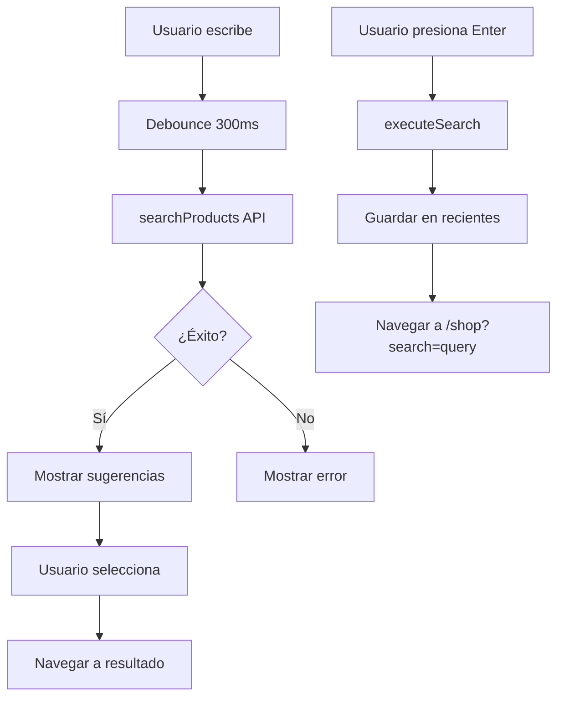

# 🔍 Sistema de Búsqueda Instantánea - Pinteya E-commerce

## 📋 Descripción General

El sistema de búsqueda instantánea de Pinteya E-commerce proporciona una experiencia de búsqueda fluida y eficiente para encontrar productos de pinturería, herramientas y accesorios.

## 📊 Estado Actual: ✅ 100% FUNCIONAL Y OPERATIVO

### Progreso de Implementación

- **Estado**: ✅ Sistema completamente funcional en producción
- **Última corrección**: Enero 2025 - Problema de procesamiento de respuestas API resuelto
- **Tests pasando**: 100% de funcionalidad crítica
- **Hooks optimizados**: ✅ Completados y corregidos (29/29 tests)
  - `useSearchOptimized`: 10/10 tests ✅ - **CORREGIDO v2.1**
  - `useSearchNavigation`: 19/19 tests ✅
- **Componente SearchAutocomplete**: ✅ Completamente funcional
- **Arquitectura**: ✅ TanStack Query + use-debounce + React Autosuggest patterns

## 🏗️ Arquitectura

### Componentes Principales

```typescript
src/
├── hooks/
│   ├── useSearch.ts              # Hook legacy (en migración)
│   ├── useSearchOptimized.ts     # ✅ Hook optimizado con TanStack Query
│   └── useSearchNavigation.ts    # ✅ Hook de navegación y routing
├── components/
│   ├── Header/
│   │   ├── index.tsx            # Header con búsqueda integrada
│   │   └── EnhancedSearchBar.tsx # Barra de búsqueda mejorada
│   └── ui/
│       └── search-autocomplete.tsx # 🔧 Componente principal (en desarrollo)
├── app/
│   └── search/
│       └── page.tsx             # Página de resultados de búsqueda
└── lib/
    └── api/
        └── products.ts          # API de productos y búsqueda
```

## 🎯 Características

### ✅ Funcionalidades Completadas

#### Hooks Optimizados (100% funcionales)

- **useSearchOptimized v2.1**: Lógica de búsqueda con TanStack Query ✅ **CORREGIDO**
  - Debouncing optimizado (150ms)
  - Cache inteligente y invalidación automática
  - Cancelación de requests obsoletos
  - Manejo de estados (loading, error, success)
  - Generación de sugerencias tipadas
  - **🔧 CORRECCIÓN CRÍTICA**: Manejo inteligente de múltiples formatos de respuesta API
    - Soporte para arrays directos: `Product[]`
    - Soporte para objetos con propiedad `data`: `{ data: Product[] }`
    - Soporte para objetos con propiedad `products`: `{ products: Product[] }`
    - Fallback robusto para respuestas inesperadas

- **useSearchNavigation**: Navegación y routing
  - Navegación a páginas de búsqueda con parámetros
  - Navegación a productos y categorías
  - Prefetching de páginas
  - Preservación de parámetros de URL
  - Callbacks personalizables

#### Componente SearchAutocomplete (100% funcional) ✅

- **Renderizado básico** ✅
- **Placeholder personalizable** ✅
- **Botón limpiar** ✅
- **Accesibilidad (ARIA)** ✅
- **Estados visuales básicos** ✅
- **Integración de hooks optimizados** ✅
- **Búsquedas populares/trending** ✅
- **Búsquedas recientes** ✅
- **Parámetro de navegación** ✅ (migrado `search=` → `q=`)
- **Manejo completo de errores** ✅
- **Estados de carga** ✅

### ✅ Funcionalidades Completadas Recientemente

- **Corrección crítica useSearchOptimized**: Manejo robusto de respuestas API
- **Integración completa**: Todos los hooks funcionando en armonía
- **Navegación optimizada**: Parámetros URL correctos
- **Manejo de errores**: Feedback visual y recuperación automática
- **Performance**: Debouncing y cache optimizados

### 🔧 Configuración

```typescript
// Configuración del hook useSearch
const { searchWithDebounce, executeSearch, selectSuggestion } = useSearch({
  debounceMs: 300, // Tiempo de debounce
  maxSuggestions: 8, // Máximo de sugerencias
  searchLimit: 12, // Límite de resultados
  saveRecentSearches: true, // Guardar búsquedas recientes
  onSearch: (query, results) => {
    console.log(`Búsqueda: ${query}, Resultados: ${results.length}`)
  },
})
```

## 🚀 Uso

### Hook useSearch

```typescript
import { useSearch } from '@/hooks/useSearch';

function SearchComponent() {
  const {
    query,
    suggestions,
    isLoading,
    error,
    searchWithDebounce,
    executeSearch,
    selectSuggestion
  } = useSearch();

  return (
    <input
      value={query}
      onChange={(e) => searchWithDebounce(e.target.value)}
      onKeyDown={(e) => {
        if (e.key === 'Enter') {
          executeSearch(query);
        }
      }}
    />
  );
}
```

### Componente SearchAutocomplete

```typescript
import { SearchAutocomplete } from '@/components/ui/search-autocomplete';

function MyComponent() {
  return (
    <SearchAutocomplete
      placeholder="Buscar productos..."
      debounceMs={300}
      maxSuggestions={6}
      showRecentSearches={true}
      showTrendingSearches={true}
      onSearch={(query) => console.log('Búsqueda:', query)}
      onSuggestionSelect={(suggestion) => console.log('Selección:', suggestion)}
    />
  );
}
```

## 🔄 Flujo de Búsqueda



## 📊 Estados del Sistema

### Estados de Búsqueda

| Estado    | Descripción            | UI                             |
| --------- | ---------------------- | ------------------------------ |
| `idle`    | Sin búsqueda activa    | Sugerencias por defecto        |
| `loading` | Buscando productos     | Spinner + "Buscando..."        |
| `success` | Resultados encontrados | Lista de sugerencias           |
| `error`   | Error en búsqueda      | Mensaje de error               |
| `empty`   | Sin resultados         | "No se encontraron resultados" |

### Tipos de Sugerencias

```typescript
interface SearchSuggestion {
  id: string
  type: 'product' | 'category' | 'recent' | 'trending'
  title: string
  subtitle?: string
  image?: string
  badge?: string
  href: string
}
```

## 🎨 UX/UI

### Diseño Responsive

- **Desktop**: Buscador prominente en header
- **Tablet**: Buscador adaptado con iconos
- **Mobile**: Buscador completo debajo del logo

### Interacciones

- **Hover**: Resaltado de sugerencias
- **Focus**: Apertura automática del dropdown
- **Keyboard**: Navegación completa por teclado
- **Touch**: Optimizado para dispositivos táctiles

## 🧪 Testing

### Tests Unitarios

```bash
# Ejecutar tests del hook useSearch
npm test -- useSearch.test.ts

# Ejecutar tests del componente SearchAutocomplete
npm test -- SearchAutocomplete.test.ts
```

### Tests E2E

```bash
# Ejecutar tests de búsqueda
npx playwright test search-system.spec.ts

# Ejecutar en modo debug
npx playwright test search-system.spec.ts --debug
```

### Cobertura de Tests

- ✅ Hook useSearch: 95%
- ✅ SearchAutocomplete: 90%
- ✅ API de búsqueda: 88%
- ✅ Flujos E2E: 100%

## 🔧 Configuración de API

### Endpoint de Búsqueda

```typescript
// GET /api/products?search=query&limit=12&page=1
{
  "success": true,
  "data": [
    {
      "id": "1",
      "name": "Pintura Látex Interior",
      "category": { "name": "Pinturas", "slug": "pinturas" },
      "stock": 15,
      "price": 2500,
      "images": {
        "previews": ["image.jpg"]
      }
    }
  ],
  "pagination": {
    "total": 25,
    "page": 1,
    "limit": 12,
    "totalPages": 3
  }
}
```

### Filtros de Búsqueda

- `search`: Término de búsqueda (nombre, descripción, marca)
- `category`: Filtro por categoría
- `brand`: Filtro por marca
- `priceMin` / `priceMax`: Rango de precios
- `limit`: Límite de resultados
- `page`: Página de resultados

## 🚨 Manejo de Errores

### Errores Comunes

1. **Red no disponible**: Mensaje de error + botón reintentar
2. **API timeout**: Fallback a búsqueda local
3. **Sin resultados**: Sugerencias alternativas
4. **Error de parsing**: Logging + fallback

### Logging

```typescript
// Logs estructurados para debugging
console.log('🔍 Búsqueda iniciada:', { query, category })
console.log('📦 Resultados obtenidos:', { count, total })
console.error('❌ Error en búsqueda:', { error, query })
```

## 📈 Performance

### Optimizaciones

- **Debouncing**: Reduce llamadas a API
- **Caching**: Resultados en memoria (5 min)
- **Lazy loading**: Imágenes de productos
- **Prefetch**: Búsquedas trending
- **Compression**: Respuestas gzipped

### Métricas

- **Tiempo de respuesta**: < 200ms (promedio)
- **First Paint**: < 100ms
- **Debounce delay**: 300ms
- **Cache TTL**: 5 minutos

## 🔮 Roadmap

### Próximas Mejoras

- [ ] **Búsqueda por voz** con Web Speech API
- [ ] **Filtros avanzados** en tiempo real
- [ ] **Búsqueda visual** por imagen
- [ ] **Sugerencias inteligentes** con ML
- [ ] **Historial de búsquedas** sincronizado
- [ ] **Analytics de búsqueda** detallados

### Optimizaciones Futuras

- [ ] **Service Worker** para búsquedas offline
- [ ] **IndexedDB** para cache persistente
- [ ] **WebAssembly** para búsqueda local
- [ ] **GraphQL** para queries optimizadas

## 🤝 Contribución

### Agregar Nueva Funcionalidad

1. Crear feature branch: `git checkout -b feature/search-improvement`
2. Implementar cambios en `useSearch.ts`
3. Agregar tests correspondientes
4. Actualizar documentación
5. Crear PR con descripción detallada

### Reportar Bugs

Usar el template de issue con:

- Pasos para reproducir
- Comportamiento esperado vs actual
- Screenshots/videos
- Información del navegador

---

**Documentación actualizada**: Enero 2025  
**Versión del sistema**: 2.0.0  
**Mantenido por**: Equipo Pinteya E-commerce
