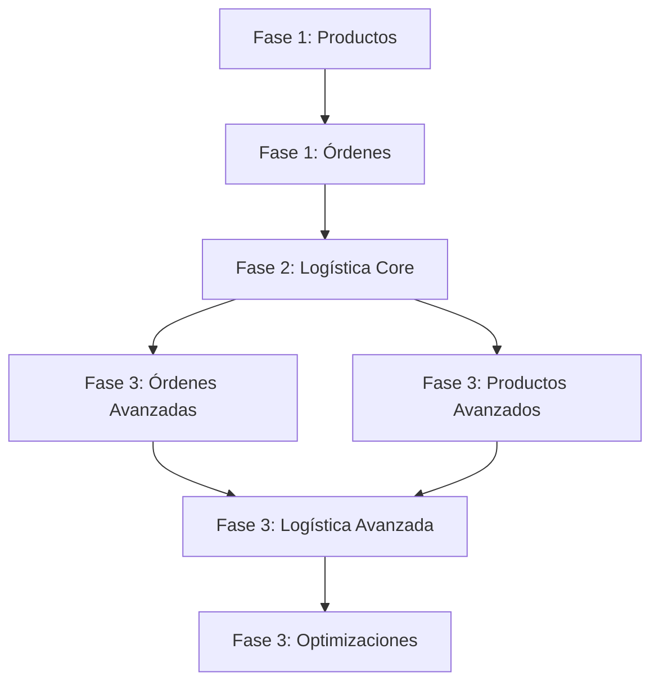

# 🚀 Roadmap de Implementación - Panel Administrativo Pinteya 2025

**Versión:** 3.0  
**Fecha:** Enero 2025  
**Estado:** 🔄 En Ejecución  
**Responsable:** Equipo de Desarrollo Pinteya

---

## 📋 **RESUMEN EJECUTIVO**

Este documento define la implementación completa del sistema administrativo enterprise-ready de Pinteya e-commerce, estructurado en 3 fases principales con una duración estimada de **14-20 semanas**.

### **Objetivos Estratégicos**

- ✅ Completar sistema CRUD de productos con gestión avanzada
- ✅ Implementar gestión completa de órdenes con fulfillment
- ✅ Desarrollar sistema de logística integrado con tracking
- ✅ Establecer base escalable para futuras funcionalidades

### **Métricas de Éxito**

- **Productos**: 100% CRUD + gestión imágenes + variantes
- **Órdenes**: Estados completos + fulfillment + reembolsos
- **Logística**: Tracking + couriers + reportes en tiempo real
- **Performance**: APIs < 300ms, UI < 100ms renderizado
- **Testing**: 90%+ cobertura, 0 errores críticos

---

## 🎯 **FASES DE IMPLEMENTACIÓN**

### **FASE 1: FUNDAMENTOS (4 semanas)**

**Objetivo:** Completar base sólida de productos y órdenes

#### **Semana 1-2: Panel de Productos Completo**

- ✅ APIs CRUD completas `/api/admin/products/[id]`
- ✅ ProductForm component para edición
- ✅ Gestión de imágenes avanzada
- ✅ Validaciones robustas y error handling

#### **Semana 3-4: Panel de Órdenes Básico**

- ✅ Conexión con datos reales Supabase
- ✅ OrderList y OrderDetail components
- ✅ Estados básicos de órdenes
- ✅ APIs de gestión de estados

### **FASE 2: LOGÍSTICA CORE (3 semanas)**

**Objetivo:** Sistema de logística funcional

#### **Semana 5-7: Sistema de Logística**

- ✅ Panel `/admin/logistics` completo
- ✅ Gestión de estados de envío
- ✅ APIs de tracking básico
- ✅ Integración con sistema de órdenes

### **FASE 3: FUNCIONALIDADES AVANZADAS (6-9 semanas)**

**Objetivo:** Sistema enterprise completo

#### **Semana 8-9: Órdenes Avanzadas**

- ✅ Fulfillment y cancelaciones
- ✅ Gestión de reembolsos
- ✅ Notificaciones automáticas

#### **Semana 10: Productos Avanzados**

- ✅ Variantes de productos
- ✅ Import/export CSV

#### **Semana 11-12: Logística Avanzada**

- ✅ Integración APIs courier
- ✅ Tracking tiempo real
- ✅ Reportes avanzados

#### **Semana 13: Optimizaciones**

- ✅ Performance y UX
- ✅ Testing completo

---

## 📊 **MATRIZ DE DEPENDENCIAS**



---

## 🛠️ **STACK TECNOLÓGICO**

### **Frontend**

- **Framework**: Next.js 15 + TypeScript
- **UI**: Tailwind CSS + shadcn/ui + Radix UI
- **Estado**: Redux Toolkit + React Query
- **Formularios**: React Hook Form + Zod

### **Backend**

- **APIs**: Next.js App Router + Middleware
- **Base de Datos**: Supabase PostgreSQL
- **Autenticación**: Clerk + RLS Policies
- **Cache**: Redis + React Query

### **Testing**

- **Unit**: Jest + React Testing Library
- **E2E**: Playwright
- **API**: Supertest + MSW

---

## 📁 **ESTRUCTURA DE DOCUMENTACIÓN**

```
docs/admin/implementation/
├── ADMIN_ROADMAP_IMPLEMENTATION_2025.md    # Este archivo
├── phase-1/
│   ├── PRODUCTS_IMPLEMENTATION.md          # Fase 1: Productos
│   └── ORDERS_BASIC_IMPLEMENTATION.md      # Fase 1: Órdenes
├── phase-2/
│   └── LOGISTICS_CORE_IMPLEMENTATION.md    # Fase 2: Logística
├── phase-3/
│   ├── ORDERS_ADVANCED_IMPLEMENTATION.md   # Fase 3: Órdenes Avanzadas
│   ├── PRODUCTS_ADVANCED_IMPLEMENTATION.md # Fase 3: Productos Avanzadas
│   └── LOGISTICS_ADVANCED_IMPLEMENTATION.md # Fase 3: Logística Avanzada
├── technical/
│   ├── API_SPECIFICATIONS.md               # Especificaciones de APIs
│   ├── COMPONENT_ARCHITECTURE.md           # Arquitectura de componentes
│   ├── DATABASE_SCHEMA.md                  # Esquemas de base de datos
│   └── SECURITY_GUIDELINES.md              # Guías de seguridad
└── testing/
    ├── TESTING_STRATEGY.md                 # Estrategia de testing
    ├── TEST_CASES.md                       # Casos de prueba
    └── AUTOMATION_SETUP.md                 # Configuración de automatización
```

---

## ⚡ **QUICK START**

### **Prerrequisitos**

1. ✅ Autenticación Clerk configurada
2. ✅ Base de datos Supabase operativa
3. ✅ Panel administrativo base funcionando
4. ✅ Sistema de permisos implementado

### **Comenzar Implementación**

```bash
# 1. Revisar documentación específica de fase
cd docs/admin/implementation/phase-1/

# 2. Seguir guías de implementación técnica
# Ver: technical/API_SPECIFICATIONS.md

# 3. Ejecutar tests antes de comenzar
npm run test:admin

# 4. Implementar siguiendo patrones establecidos
# Ver: technical/COMPONENT_ARCHITECTURE.md
```

---

## 📈 **MÉTRICAS Y MONITOREO**

### **KPIs por Fase**

- **Fase 1**: APIs funcionando + Components renderizando
- **Fase 2**: Tracking operativo + Estados sincronizados
- **Fase 3**: Sistema completo + Performance optimizada

### **Herramientas de Monitoreo**

- **Performance**: Lighthouse + Web Vitals
- **Errores**: Sentry + Console logs
- **APIs**: Response time monitoring
- **Testing**: Coverage reports + CI/CD

---

## 🔗 **ENLACES RELACIONADOS**

- [📦 Gestión de Productos](./modules/PRODUCT_MANAGEMENT_MODULE.md)
- [📋 Gestión de Órdenes](./modules/ORDER_MANAGEMENT_MODULE.md)
- [🚚 Sistema de Logística](./modules/LOGISTICS_MODULE.md)
- [🧪 Estrategia de Testing](./TESTING_STRATEGY.md)
- [🔒 Guía de Seguridad](./SECURITY_GUIDE.md)

---

**Próximo paso:** Revisar [Fase 1: Implementación de Productos](./phase-1/PRODUCTS_IMPLEMENTATION.md)
