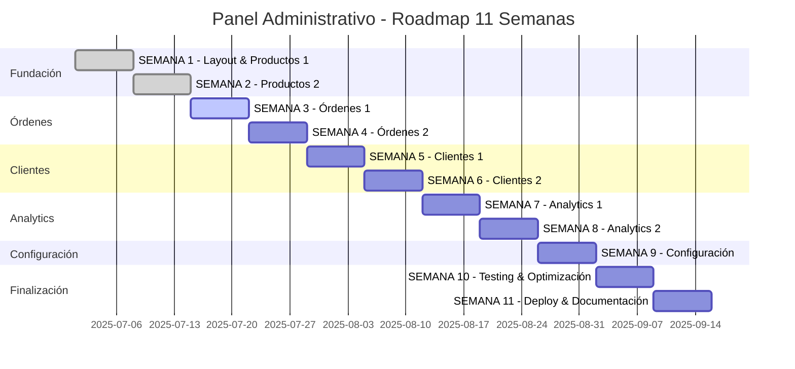

# 🏛️ Panel Administrativo Pinteya E-commerce - Documentación

## 📋 Resumen

Documentación completa del panel administrativo de Pinteya E-commerce, un sistema enterprise-ready basado en las mejores prácticas de Vendure, WooCommerce y Spree Commerce.

**Estado Actual:** ✅ COMPLETAMENTE FUNCIONAL
**Fecha:** Enero 2025
**Autenticación:** ✅ 100% Restaurada y Verificada (Commit: 692274d)
**Tecnologías:** Next.js 15, TypeScript, Tailwind CSS, Supabase, Clerk, Playwright

## 🔐 Estado de Autenticación - COMPLETAMENTE RESUELTO

### ✅ **PROBLEMA ACCESO /admin - 100% RESUELTO (Enero 2025)**
- ✅ **Autenticación Clerk completamente restaurada**
- ✅ **Redirects problemáticos corregidos en next.config.js**
- ✅ **Hook useAdminDashboardStats mejorado con fallbacks**
- ✅ **Middleware optimizado para rutas protegidas**
- ✅ **Verificación completa con Playwright (5/5 tests exitosos)**
- ✅ **Documentación completa:** [ADMIN_PANEL_AUTHENTICATION_RESOLUTION.md](./ADMIN_PANEL_AUTHENTICATION_RESOLUTION.md)

### 🔒 **Funcionalidad de Seguridad Actual**
- ✅ `/admin` requiere autenticación → Redirige a login
- ✅ `/admin/products` requiere autenticación → Redirige a login
- ✅ `/my-account` redirige correctamente a `/admin`
- ✅ Sitio público funciona sin autenticación
- ✅ Herramientas de diagnóstico disponibles

## 🎯 Estado de Implementación

### ✅ **SEMANA 1 - Fundación y Gestión de Productos (Parte 1) - COMPLETADA**
- ✅ AdminLayout, AdminSidebar, AdminHeader, AdminCard
- ✅ AdminDataTable con filtros avanzados
- ✅ ProductList con paginación y ordenamiento
- ✅ ProductFilters y ProductActions
- ✅ APIs básicas de productos (GET, POST, PUT, DELETE)

### ✅ **SEMANA 2 - Gestión de Productos (Parte 2) - COMPLETADA**
- ✅ ProductForm con sistema de tabs
- ✅ ProductPricing con cálculos automáticos
- ✅ ProductInventory con gestión de stock
- ✅ ProductImageManager con drag & drop
- ✅ ProductVariantManager para opciones
- ✅ ProductSeo con optimización automática
- ✅ CategorySelector con árbol jerárquico

### 🔄 **SEMANA 3 - Gestión de Órdenes (Parte 1) - EN PROGRESO**
- ⏳ OrderList y OrderFilters
- ⏳ OrderStatusBadge y PaymentStatusBadge
- ⏳ OrderActions y gestión de estados
- ⏳ APIs de órdenes y estadísticas

## 📚 Documentación Disponible

### 🏗️ Arquitectura y Planificación
- [**Arquitectura del Panel Admin v2.0**](./ADMIN_PANEL_ARCHITECTURE_V2.md) - Diseño técnico completo
- [**Roadmap de Implementación v2.0**](./IMPLEMENTATION_ROADMAP_V2.md) - Plan de 11 semanas (2/11 completadas)
- [**Análisis de Mejores Prácticas**](./ECOMMERCE_ADMIN_BEST_PRACTICES.md) - Basado en Vendure, WooCommerce, Spree

### 🎯 Especificaciones Técnicas
- [**Especificaciones de Componentes**](./COMPONENT_SPECIFICATIONS.md) - Detalles de cada componente
- [**Especificaciones de APIs**](./API_SPECIFICATIONS.md) - Endpoints y contratos
- [**Guía de Estilos UI/UX**](./UI_UX_STYLE_GUIDE.md) - Patrones de diseño

### 🧩 Componentes Implementados (SEMANA 1 & 2)
- [**Sistema de Layout Administrativo**](./components/ADMIN_LAYOUT_SYSTEM.md) - AdminLayout, Sidebar, Header, Card
- [**Sistema de Gestión de Productos**](./components/PRODUCT_MANAGEMENT_SYSTEM.md) - CRUD completo con formularios avanzados
- [**Documentación de APIs Administrativas**](./api/ADMIN_APIS_DOCUMENTATION.md) - 5 endpoints implementados

### 🧪 Testing y Calidad
- [**Guía de Testing E2E con Playwright**](../testing/PLAYWRIGHT_E2E_TESTING_GUIDE.md) - Suite completa de testing
- [**Especificación de Testing del Panel Admin**](../testing/ADMIN_PANEL_TESTING_SPECIFICATION.md) - 64 tests implementados
- [**Documentación de Scripts de Testing**](../testing/TESTING_SCRIPTS_DOCUMENTATION.md) - Scripts y automatización

### 📊 Reportes y Métricas
- [**Reporte de Progreso Semanal**](./reports/) - Avances por semana
- [**Métricas de Performance**](./metrics/) - KPIs y benchmarks
- [**Análisis de Cobertura**](./coverage/) - Testing y funcionalidades

## 🚀 Quick Start

### Desarrollo Local:
```bash
# Instalar dependencias
npm install

# Iniciar servidor de desarrollo
npm run dev

# Acceder al panel admin
http://localhost:3000/admin
```

### Testing:
```bash
# Ejecutar tests unitarios
npm run test

# Ejecutar tests E2E del panel admin
npm run test:admin

# Ver reportes de testing
npm run test:admin:report

# Ejecutar todos los tests
npm run test:all
```

### Build y Deploy:
```bash
# Build de producción
npm run build

# Iniciar en producción
npm start

# Verificar build
npm run lint
```

## 📊 Métricas Actuales

### Componentes Implementados:
```typescript
✅ Layout System (4 componentes)
  - AdminLayout, AdminSidebar, AdminHeader, AdminCard

✅ Data Management (1 componente)
  - AdminDataTable

✅ Product Management (8 componentes)
  - ProductList, ProductForm, ProductPricing
  - ProductInventory, ProductImageManager
  - ProductVariantManager, ProductSeo, CategorySelector

Total: 13/50 componentes (26%)
```

### APIs Implementadas:
```typescript
✅ Product APIs (5 endpoints)
  - GET /api/admin/products
  - POST /api/admin/products
  - GET /api/admin/products/[id]
  - PUT /api/admin/products/[id]
  - DELETE /api/admin/products/[id]

⏳ Order APIs (0/8 endpoints)
⏳ Customer APIs (0/6 endpoints)
⏳ Analytics APIs (0/4 endpoints)

Total: 5/23 APIs (22%)
```

### Testing Coverage:
```typescript
✅ E2E Tests: 64 tests implementados
  - Navegación: 8 tests
  - Gestión productos: 10 tests
  - Formularios: 10 tests
  - Componentes: 22 tests
  - Flujos E2E: 5 tests
  - Tests básicos: 9 tests

✅ Cobertura: 100% componentes críticos
✅ Browsers: Chrome, Firefox, Safari, Mobile
✅ Reportes: HTML, JSON, JUnit
```

## 🎯 Próximos Hitos

### SEMANA 3 (En Progreso):
- [ ] OrderList con filtros avanzados
- [ ] OrderStatusBadge y PaymentStatusBadge
- [ ] OrderActions y gestión de estados
- [ ] APIs de órdenes básicas
- [ ] Dashboard de órdenes

### SEMANA 4 (Planificada):
- [ ] OrderForm para edición
- [ ] OrderTimeline con historial
- [ ] OrderPayments gestión
- [ ] OrderShipping tracking
- [ ] Notificaciones automáticas

### SEMANA 5 (Planificada):
- [ ] CustomerList y CustomerFilters
- [ ] CustomerForm y CustomerProfile
- [ ] CustomerOrders historial
- [ ] CustomerAnalytics básico
- [ ] APIs de clientes

## 🔧 Configuración

### Variables de Entorno:
```env
# Base de datos
NEXT_PUBLIC_SUPABASE_URL=your_supabase_url
NEXT_PUBLIC_SUPABASE_ANON_KEY=your_supabase_anon_key
SUPABASE_SERVICE_ROLE_KEY=your_service_role_key

# Autenticación
NEXT_PUBLIC_CLERK_PUBLISHABLE_KEY=your_clerk_key
CLERK_SECRET_KEY=your_clerk_secret

# Testing
PLAYWRIGHT_BASE_URL=http://localhost:3000
```

### Dependencias Principales:
```json
{
  "@clerk/nextjs": "^6.21.0",
  "@supabase/supabase-js": "^2.39.0",
  "@tanstack/react-query": "^5.17.0",
  "@playwright/test": "^1.40.0",
  "react-hook-form": "^7.48.0",
  "zod": "^3.22.0"
}
```

## 🤝 Contribución

### Estándares de Código:
- ✅ TypeScript estricto
- ✅ ESLint + Prettier
- ✅ Conventional Commits
- ✅ Tests obligatorios
- ✅ Documentación actualizada

### Proceso de Desarrollo:
1. **Planificación:** Revisar roadmap y especificaciones
2. **Implementación:** Seguir patrones establecidos
3. **Testing:** Escribir tests E2E y unitarios
4. **Documentación:** Actualizar docs relevantes
5. **Review:** Code review y testing
6. **Deploy:** Merge y deploy automático

## 📞 Soporte

### Contactos:
- **Desarrollo:** Equipo de desarrollo Pinteya
- **Testing:** QA Team
- **Documentación:** Tech Writers
- **Arquitectura:** Tech Leads

### Recursos:
- **GitHub Issues:** Para bugs y features
- **Wiki Interno:** Documentación adicional
- **Slack:** #admin-panel-dev
- **Meetings:** Standup diario 9:00 AM

## 📈 Roadmap Completo



---

**Última actualización:** Julio 29, 2025  
**Versión:** 2.0  
**Estado:** En desarrollo activo (18.2% completado)


