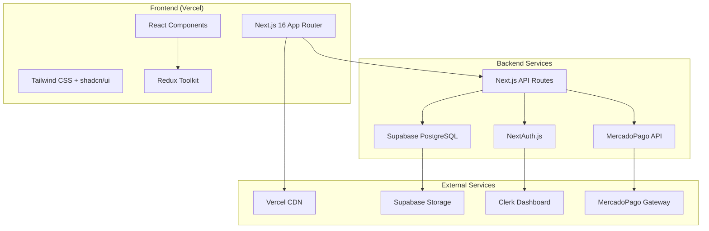

# 🏗️ Arquitectura - Visión General

> Documentación completa de la arquitectura del sistema Pinteya E-commerce

## 📐 Arquitectura General

Pinteya E-commerce está construido con una arquitectura moderna de **JAMstack** utilizando Next.js 16 con App Router y Turbopack, optimizada para performance, escalabilidad y mantenibilidad.

## 🎯 Principios de Diseño

### **1. Separación de Responsabilidades**

- **Frontend**: Next.js con React para UI/UX
- **Backend**: APIs serverless con Next.js API Routes
- **Database**: Supabase PostgreSQL con RLS
- **Auth**: NextAuth.js v5 con Google OAuth para autenticación y autorización
- **Payments**: MercadoPago para procesamiento de pagos

### **2. Escalabilidad**

- **Serverless**: Funciones auto-escalables en Vercel
- **CDN**: Assets estáticos distribuidos globalmente
- **Database**: PostgreSQL con conexiones pooling
- **Caching**: Estrategias de cache en múltiples niveles

### **3. Seguridad**

- **RLS**: Row Level Security en Supabase
- **Auth**: JWT tokens con NextAuth.js
- **HTTPS**: Comunicación encriptada end-to-end
- **Validation**: Validación de datos con Zod

## 🏛️ Diagrama de Arquitectura



## 📁 Estructura del Proyecto

```
pinteya-ecommerce/
├── src/
│   ├── app/                    # Next.js App Router
│   │   ├── (auth)/            # Rutas de autenticación
│   │   ├── (site)/            # Rutas principales
│   │   ├── api/               # API Routes (22 endpoints)
│   │   ├── globals.css        # Estilos globales
│   │   ├── layout.tsx         # Layout principal
│   │   └── page.tsx           # Página de inicio
│   ├── components/            # Componentes React
│   │   ├── Header/            # Navegación principal
│   │   ├── Shop/              # Tienda y productos
│   │   ├── Checkout/          # Proceso de compra
│   │   ├── User/              # Área de usuario
│   │   └── Common/            # Componentes reutilizables
│   ├── hooks/                 # Custom React Hooks
│   │   ├── useProducts.ts     # Gestión de productos
│   │   ├── useCheckout.ts     # Proceso de checkout
│   │   ├── useUserProfile.ts  # Perfil de usuario
│   │   └── useCart.ts         # Carrito de compras
│   ├── lib/                   # Configuraciones y utilidades
│   │   ├── supabase.ts        # Cliente Supabase
│   │   ├── clerk.ts           # Configuración Clerk
│   │   ├── mercadopago.ts     # Cliente MercadoPago
│   │   └── validations.ts     # Esquemas Zod
│   ├── redux/                 # Estado global
│   │   ├── store.ts           # Configuración Redux
│   │   ├── cartSlice.ts       # Estado del carrito
│   │   └── userSlice.ts       # Estado del usuario
│   ├── types/                 # Definiciones TypeScript
│   │   ├── database.ts        # Tipos de DB
│   │   ├── api.ts             # Tipos de API
│   │   └── components.ts      # Tipos de componentes
│   └── utils/                 # Funciones utilitarias
│       ├── helpers.ts         # Helpers generales
│       ├── formatters.ts      # Formateo de datos
│       └── constants.ts       # Constantes
├── docs/                      # Documentación
├── e2e/                       # Tests E2E Playwright
├── public/                    # Assets estáticos
├── supabase/                  # Migraciones DB
└── __tests__/                 # Tests unitarios
```

## 🔄 Flujo de Datos

### **1. Autenticación**

```
Usuario → Clerk → JWT Token → Middleware → Rutas Protegidas
```

### **2. Productos**

```
UI → useProducts Hook → API Route → Supabase → PostgreSQL
```

### **3. Checkout**

```
Carrito → Checkout Form → API → MercadoPago → Webhook → Supabase
```

### **4. Estado Global**

```
Componentes → Redux Actions → Store → Componentes
```

## 🔌 Integraciones Principales

### **Supabase (Database)**

- **PostgreSQL**: Base de datos principal
- **RLS**: Seguridad a nivel de fila
- **Storage**: Imágenes de productos
- **Real-time**: Actualizaciones en tiempo real

### **Clerk (Authentication)**

- **JWT**: Tokens de autenticación
- **SSO**: Single Sign-On
- **User Management**: Gestión de usuarios
- **Middleware**: Protección de rutas

### **MercadoPago (Payments)**

- **Preferences**: Creación de pagos
- **Webhooks**: Notificaciones de estado
- **SDK**: Integración nativa
- **Security**: Validación de pagos

## 🚀 Performance

### **Optimizaciones Frontend**

- **SSG**: Páginas estáticas generadas
- **ISR**: Regeneración incremental
- **Code Splitting**: División automática de código
- **Image Optimization**: Optimización de imágenes

### **Optimizaciones Backend**

- **Connection Pooling**: Pool de conexiones DB
- **Caching**: Cache de consultas frecuentes
- **Serverless**: Escalado automático
- **CDN**: Distribución global de assets

## 🔒 Seguridad

### **Autenticación & Autorización**

- **JWT Tokens**: Autenticación stateless
- **RLS Policies**: Autorización a nivel de DB
- **CORS**: Configuración de dominios permitidos
- **Rate Limiting**: Limitación de requests

### **Validación de Datos**

- **Zod Schemas**: Validación de entrada
- **TypeScript**: Tipado estático
- **Sanitization**: Limpieza de datos
- **SQL Injection**: Protección con prepared statements

## 📊 Monitoring & Observabilidad

### **Métricas**

- **Vercel Analytics**: Performance de páginas
- **Supabase Metrics**: Uso de base de datos
- **Error Tracking**: Captura de errores
- **User Analytics**: Comportamiento de usuarios

### **Logs**

- **API Logs**: Logs de endpoints
- **Error Logs**: Registro de errores
- **Performance Logs**: Métricas de rendimiento
- **Security Logs**: Eventos de seguridad

---

## 🔗 Enlaces Relacionados

- [🗄️ Base de Datos](./database.md)
- [🔌 APIs](./apis.md)
- [🎨 Frontend](./frontend.md)
- [🔐 Autenticación](./authentication.md)

---

_Última actualización: 15 de Diciembre, 2025_
