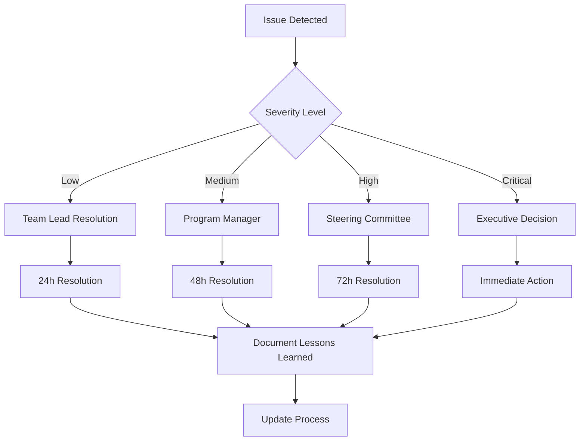

# 📊 Plan de Implementación y Sistema de Seguimiento Continuo

## 🎯 Resumen Ejecutivo

Este documento establece la **metodología de implementación**, **sistema de seguimiento continuo** y **herramientas de monitoreo** para garantizar el éxito del plan de mejoras del e-commerce Pinteya.

### **Objetivos del Sistema**

- Garantizar implementación exitosa y en tiempo
- Monitoreo continuo de métricas clave
- Detección temprana de desviaciones
- Optimización basada en datos reales
- Comunicación transparente del progreso

---

## 🏗️ Metodología de Implementación

### **Framework Ágil Híbrido**

Utilizaremos una combinación de **Scrum** y **Kanban** adaptada a nuestras necesidades:

#### **Estructura de Sprints**

- **Duración**: 2 semanas
- **Ceremonias**: Daily standups, Sprint planning, Review, Retrospective
- **Artefactos**: Product backlog, Sprint backlog, Burndown charts

#### **Kanban Flow**

- **Columnas**: Backlog → In Progress → Code Review → Testing → Done
- **WIP Limits**: Max 3 items por desarrollador
- **Cycle Time**: Target <5 días por tarea

### **Definition of Done (DoD)**

```typescript
// Checklist para cada User Story
interface DefinitionOfDone {
  development: {
    codeComplete: boolean
    unitTestsCoverage: number // >80%
    codeReviewApproved: boolean
    documentationUpdated: boolean
  }
  testing: {
    functionalTestsPassed: boolean
    performanceTestsPassed: boolean
    securityTestsPassed: boolean
    accessibilityTestsPassed: boolean
  }
  deployment: {
    stagingDeployment: boolean
    productionReadiness: boolean
    rollbackPlanReady: boolean
  }
}
```

---

## 📈 Sistema de Seguimiento Continuo

### **Dashboard Principal de Proyecto**

```typescript
// components/ProjectDashboard.tsx
import React, { useState, useEffect } from 'react';
import { Card, CardContent, CardHeader, CardTitle } from '@/components/ui/card';
import { Progress } from '@/components/ui/progress';
import { Badge } from '@/components/ui/badge';
import { Alert, AlertDescription } from '@/components/ui/alert';
import {
  TrendingUp,
  TrendingDown,
  Clock,
  Users,
  Target,
  AlertTriangle,
  CheckCircle,
  XCircle
} from 'lucide-react';

interface ProjectMetrics {
  overall: {
    completion: number;
    onTrack: boolean;
    budget: {
      used: number;
      total: number;
      variance: number;
    };
    timeline: {
      daysRemaining: number;
      totalDays: number;
      variance: number;
    };
  };
  teams: {
    performance: TeamMetrics[];
    testing: TeamMetrics[];
    security: TeamMetrics[];
    ux: TeamMetrics[];
  };
  kpis: {
    conversionRate: { current: number; target: number; trend: 'up' | 'down' };
    pageLoadTime: { current: number; target: number; trend: 'up' | 'down' };
    testCoverage: { current: number; target: number; trend: 'up' | 'down' };
    userSatisfaction: { current: number; target: number; trend: 'up' | 'down' };
  };
  risks: Risk[];
  blockers: Blocker[];
}

interface TeamMetrics {
  name: string;
  completion: number;
  velocity: number;
  burndownRate: number;
  blockers: number;
  status: 'on-track' | 'at-risk' | 'delayed';
}

interface Risk {
  id: string;
  title: string;
  probability: 'low' | 'medium' | 'high';
  impact: 'low' | 'medium' | 'high';
  status: 'open' | 'mitigated' | 'closed';
  owner: string;
}

interface Blocker {
  id: string;
  title: string;
  team: string;
  severity: 'low' | 'medium' | 'high' | 'critical';
  daysBlocked: number;
  owner: string;
}

const ProjectDashboard: React.FC = () => {
  const [metrics, setMetrics] = useState<ProjectMetrics | null>(null);
  const [loading, setLoading] = useState(true);
  const [lastUpdated, setLastUpdated] = useState<Date>(new Date());

  useEffect(() => {
    const fetchMetrics = async () => {
      try {
        const response = await fetch('/api/project/metrics');
        const data = await response.json();
        setMetrics(data);
        setLastUpdated(new Date());
      } catch (error) {
        console.error('Error fetching metrics:', error);
      } finally {
        setLoading(false);
      }
    };

    fetchMetrics();
    const interval = setInterval(fetchMetrics, 300000); // Update every 5 minutes

    return () => clearInterval(interval);
  }, []);

  if (loading || !metrics) {
    return (
      <div className="flex items-center justify-center h-64">
        <div className="animate-spin rounded-full h-8 w-8 border-b-2 border-blue-600"></div>
      </div>
    );
  }

  const getStatusColor = (status: string) => {
    switch (status) {
      case 'on-track': return 'bg-green-500';
      case 'at-risk': return 'bg-yellow-500';
      case 'delayed': return 'bg-red-500';
      default: return 'bg-gray-500';
    }
  };

  const getTrendIcon = (trend: 'up' | 'down') => {
    return trend === 'up' ?
      <TrendingUp className="h-4 w-4 text-green-500" /> :
      <TrendingDown className="h-4 w-4 text-red-500" />;
  };

  return (
    <div className="space-y-6 p-6">
      {/* Header */}
      <div className="flex justify-between items-center">
        <div>
          <h1 className="text-3xl font-bold text-gray-900">Project Dashboard</h1>
          <p className="text-gray-600">Plan de Mejoras E-commerce Pinteya</p>
        </div>
        <div className="text-right">
          <p className="text-sm text-gray-500">Última actualización</p>
          <p className="text-sm font-medium">{lastUpdated.toLocaleString()}</p>
        </div>
      </div>

      {/* Overall Status */}
      <div className="grid grid-cols-1 md:grid-cols-4 gap-6">
        <Card>
          <CardHeader className="flex flex-row items-center justify-between space-y-0 pb-2">
            <CardTitle className="text-sm font-medium">Progreso General</CardTitle>
            <Target className="h-4 w-4 text-muted-foreground" />
          </CardHeader>
          <CardContent>
            <div className="text-2xl font-bold">{metrics.overall.completion}%</div>
            <Progress value={metrics.overall.completion} className="mt-2" />
            <p className="text-xs text-muted-foreground mt-2">
              {metrics.overall.onTrack ? 'En tiempo' : 'Retrasado'}
            </p>
          </CardContent>
        </Card>

        <Card>
          <CardHeader className="flex flex-row items-center justify-between space-y-0 pb-2">
            <CardTitle className="text-sm font-medium">Presupuesto</CardTitle>
            <div className="h-4 w-4 text-muted-foreground">€</div>
          </CardHeader>
          <CardContent>
            <div className="text-2xl font-bold">
              {((metrics.overall.budget.used / metrics.overall.budget.total) * 100).toFixed(1)}%
            </div>
            <Progress
              value={(metrics.overall.budget.used / metrics.overall.budget.total) * 100}
              className="mt-2"
            />
            <p className="text-xs text-muted-foreground mt-2">
              €{metrics.overall.budget.used.toLocaleString()} / €{metrics.overall.budget.total.toLocaleString()}
            </p>
          </CardContent>
        </Card>

        <Card>
          <CardHeader className="flex flex-row items-center justify-between space-y-0 pb-2">
            <CardTitle className="text-sm font-medium">Timeline</CardTitle>
            <Clock className="h-4 w-4 text-muted-foreground" />
          </CardHeader>
          <CardContent>
            <div className="text-2xl font-bold">{metrics.overall.timeline.daysRemaining}d</div>
            <Progress
              value={((metrics.overall.timeline.totalDays - metrics.overall.timeline.daysRemaining) / metrics.overall.timeline.totalDays) * 100}
              className="mt-2"
            />
            <p className="text-xs text-muted-foreground mt-2">
              {metrics.overall.timeline.variance > 0 ? '+' : ''}{metrics.overall.timeline.variance} días
            </p>
          </CardContent>
        </Card>

        <Card>
          <CardHeader className="flex flex-row items-center justify-between space-y-0 pb-2">
            <CardTitle className="text-sm font-medium">Equipo</CardTitle>
            <Users className="h-4 w-4 text-muted-foreground" />
          </CardHeader>
          <CardContent>
            <div className="text-2xl font-bold">
              {Object.values(metrics.teams).flat().filter(team => team.status === 'on-track').length}/
              {Object.values(metrics.teams).flat().length}
            </div>
            <p className="text-xs text-muted-foreground mt-2">
              Equipos en tiempo
            </p>
          </CardContent>
        </Card>
      </div>

      {/* KPIs Progress */}
      <Card>
        <CardHeader>
          <CardTitle>KPIs de Negocio</CardTitle>
        </CardHeader>
        <CardContent>
          <div className="grid grid-cols-1 md:grid-cols-2 lg:grid-cols-4 gap-4">
            <div className="space-y-2">
              <div className="flex items-center justify-between">
                <span className="text-sm font-medium">Conversion Rate</span>
                {getTrendIcon(metrics.kpis.conversionRate.trend)}
              </div>
              <div className="text-2xl font-bold">{metrics.kpis.conversionRate.current}%</div>
              <Progress
                value={(metrics.kpis.conversionRate.current / metrics.kpis.conversionRate.target) * 100}
                className="h-2"
              />
              <p className="text-xs text-gray-500">Target: {metrics.kpis.conversionRate.target}%</p>
            </div>

            <div className="space-y-2">
              <div className="flex items-center justify-between">
                <span className="text-sm font-medium">Page Load Time</span>
                {getTrendIcon(metrics.kpis.pageLoadTime.trend)}
              </div>
              <div className="text-2xl font-bold">{metrics.kpis.pageLoadTime.current}s</div>
              <Progress
                value={Math.max(0, 100 - ((metrics.kpis.pageLoadTime.current / metrics.kpis.pageLoadTime.target) * 100))}
                className="h-2"
              />
              <p className="text-xs text-gray-500">Target: <{metrics.kpis.pageLoadTime.target}s</p>
            </div>

            <div className="space-y-2">
              <div className="flex items-center justify-between">
                <span className="text-sm font-medium">Test Coverage</span>
                {getTrendIcon(metrics.kpis.testCoverage.trend)}
              </div>
              <div className="text-2xl font-bold">{metrics.kpis.testCoverage.current}%</div>
              <Progress
                value={(metrics.kpis.testCoverage.current / metrics.kpis.testCoverage.target) * 100}
                className="h-2"
              />
              <p className="text-xs text-gray-500">Target: {metrics.kpis.testCoverage.target}%</p>
            </div>

            <div className="space-y-2">
              <div className="flex items-center justify-between">
                <span className="text-sm font-medium">User Satisfaction</span>
                {getTrendIcon(metrics.kpis.userSatisfaction.trend)}
              </div>
              <div className="text-2xl font-bold">{metrics.kpis.userSatisfaction.current}/5</div>
              <Progress
                value={(metrics.kpis.userSatisfaction.current / metrics.kpis.userSatisfaction.target) * 100}
                className="h-2"
              />
              <p className="text-xs text-gray-500">Target: {metrics.kpis.userSatisfaction.target}/5</p>
            </div>
          </div>
        </CardContent>
      </Card>

      {/* Team Status */}
      <div className="grid grid-cols-1 lg:grid-cols-2 gap-6">
        <Card>
          <CardHeader>
            <CardTitle>Estado de Equipos</CardTitle>
          </CardHeader>
          <CardContent>
            <div className="space-y-4">
              {Object.entries(metrics.teams).map(([teamType, teams]) => (
                <div key={teamType}>
                  <h4 className="font-medium text-sm text-gray-700 mb-2 capitalize">
                    {teamType.replace(/([A-Z])/g, ' $1').trim()}
                  </h4>
                  {teams.map((team) => (
                    <div key={team.name} className="flex items-center justify-between p-3 bg-gray-50 rounded">
                      <div className="flex items-center space-x-3">
                        <div className={`w-3 h-3 rounded-full ${getStatusColor(team.status)}`}></div>
                        <span className="font-medium">{team.name}</span>
                      </div>
                      <div className="flex items-center space-x-4 text-sm">
                        <span>{team.completion}%</span>
                        <Badge variant={team.blockers > 0 ? 'destructive' : 'secondary'}>
                          {team.blockers} blockers
                        </Badge>
                      </div>
                    </div>
                  ))}
                </div>
              ))}
            </div>
          </CardContent>
        </Card>

        <Card>
          <CardHeader>
            <CardTitle>Riesgos y Blockers</CardTitle>
          </CardHeader>
          <CardContent>
            <div className="space-y-4">
              {/* Active Risks */}
              <div>
                <h4 className="font-medium text-sm text-gray-700 mb-2">Riesgos Activos</h4>
                <div className="space-y-2">
                  {metrics.risks.filter(risk => risk.status === 'open').map((risk) => (
                    <div key={risk.id} className="flex items-center justify-between p-2 border rounded">
                      <div className="flex items-center space-x-2">
                        <AlertTriangle className="h-4 w-4 text-yellow-500" />
                        <span className="text-sm">{risk.title}</span>
                      </div>
                      <div className="flex items-center space-x-2">
                        <Badge
                          variant={risk.impact === 'high' ? 'destructive' :
                                 risk.impact === 'medium' ? 'default' : 'secondary'}
                        >
                          {risk.impact}
                        </Badge>
                        <span className="text-xs text-gray-500">{risk.owner}</span>
                      </div>
                    </div>
                  ))}
                </div>
              </div>

              {/* Active Blockers */}
              <div>
                <h4 className="font-medium text-sm text-gray-700 mb-2">Blockers Críticos</h4>
                <div className="space-y-2">
                  {metrics.blockers.filter(blocker => blocker.severity === 'critical' || blocker.severity === 'high').map((blocker) => (
                    <div key={blocker.id} className="flex items-center justify-between p-2 border rounded">
                      <div className="flex items-center space-x-2">
                        <XCircle className="h-4 w-4 text-red-500" />
                        <span className="text-sm">{blocker.title}</span>
                      </div>
                      <div className="flex items-center space-x-2">
                        <span className="text-xs text-gray-500">{blocker.daysBlocked}d</span>
                        <Badge variant="destructive">{blocker.severity}</Badge>
                      </div>
                    </div>
                  ))}
                </div>
              </div>
            </div>
          </CardContent>
        </Card>
      </div>

      {/* Alerts */}
      {(metrics.overall.budget.variance > 10 || metrics.overall.timeline.variance > 5) && (
        <Alert>
          <AlertTriangle className="h-4 w-4" />
          <AlertDescription>
            {metrics.overall.budget.variance > 10 && (
              <span>Presupuesto excedido en {metrics.overall.budget.variance}%. </span>
            )}
            {metrics.overall.timeline.variance > 5 && (
              <span>Proyecto retrasado {metrics.overall.timeline.variance} días.</span>
            )}
          </AlertDescription>
        </Alert>
      )}
    </div>
  );
};

export default ProjectDashboard;
```

---

## 🔧 Herramientas de Monitoreo

### **Stack de Monitoreo**

#### **1. Project Management**

- **Jira**: Tracking de issues y sprints
- **Confluence**: Documentación y knowledge base
- **Slack**: Comunicación en tiempo real
- **Microsoft Project**: Gantt charts y dependencies

#### **2. Development Tracking**

- **GitHub**: Code repository y pull requests
- **SonarQube**: Code quality y technical debt
- **CodeClimate**: Maintainability score
- **Dependabot**: Security vulnerabilities

#### **3. Performance Monitoring**

- **New Relic**: Application performance
- **DataDog**: Infrastructure monitoring
- **Lighthouse CI**: Performance budgets
- **GTMetrix**: Page speed monitoring

#### **4. Quality Assurance**

- **Playwright**: E2E testing automation
- **Jest**: Unit testing coverage
- **Cypress**: Integration testing
- **Percy**: Visual regression testing

#### **5. Business Intelligence**

- **Google Analytics 4**: User behavior
- **Hotjar**: Heatmaps y session recordings
- **Mixpanel**: Event tracking
- **Tableau**: Business dashboards

### **API de Métricas Centralizadas**

```typescript
// api/project/metrics.ts
import { NextApiRequest, NextApiResponse } from 'next'
import { getJiraMetrics } from '@/lib/integrations/jira'
import { getGitHubMetrics } from '@/lib/integrations/github'
import { getPerformanceMetrics } from '@/lib/integrations/newrelic'
import { getTestingMetrics } from '@/lib/integrations/playwright'
import { getBusinessMetrics } from '@/lib/integrations/analytics'

export default async function handler(req: NextApiRequest, res: NextApiResponse) {
  if (req.method !== 'GET') {
    return res.status(405).json({ message: 'Method not allowed' })
  }

  try {
    // Fetch metrics from all sources in parallel
    const [jiraData, githubData, performanceData, testingData, businessData] = await Promise.all([
      getJiraMetrics(),
      getGitHubMetrics(),
      getPerformanceMetrics(),
      getTestingMetrics(),
      getBusinessMetrics(),
    ])

    // Aggregate and normalize data
    const metrics = {
      overall: {
        completion: calculateOverallCompletion(jiraData),
        onTrack: isProjectOnTrack(jiraData, githubData),
        budget: calculateBudgetMetrics(jiraData),
        timeline: calculateTimelineMetrics(jiraData),
      },
      teams: {
        performance: getTeamMetrics('performance', jiraData),
        testing: getTeamMetrics('testing', jiraData),
        security: getTeamMetrics('security', jiraData),
        ux: getTeamMetrics('ux', jiraData),
      },
      kpis: {
        conversionRate: businessData.conversionRate,
        pageLoadTime: performanceData.averageLoadTime,
        testCoverage: testingData.coverage,
        userSatisfaction: businessData.userSatisfaction,
      },
      risks: await getRisksFromJira(jiraData),
      blockers: await getBlockersFromJira(jiraData),
    }

    // Cache for 5 minutes
    res.setHeader('Cache-Control', 'public, s-maxage=300, stale-while-revalidate=600')
    res.status(200).json(metrics)
  } catch (error) {
    console.error('Error fetching project metrics:', error)
    res.status(500).json({ message: 'Internal server error' })
  }
}

// Helper functions
function calculateOverallCompletion(jiraData: any): number {
  const totalStoryPoints = jiraData.sprints.reduce(
    (sum: number, sprint: any) => sum + sprint.totalStoryPoints,
    0
  )
  const completedStoryPoints = jiraData.sprints.reduce(
    (sum: number, sprint: any) => sum + sprint.completedStoryPoints,
    0
  )

  return Math.round((completedStoryPoints / totalStoryPoints) * 100)
}

function isProjectOnTrack(jiraData: any, githubData: any): boolean {
  const velocityTrend = calculateVelocityTrend(jiraData)
  const codeQualityTrend = calculateCodeQualityTrend(githubData)

  return velocityTrend >= 0 && codeQualityTrend >= 0
}

function calculateBudgetMetrics(jiraData: any) {
  // Implementation based on time tracking and resource allocation
  return {
    used: 150000, // Example values
    total: 214049,
    variance: 5.2,
  }
}

function calculateTimelineMetrics(jiraData: any) {
  const projectStartDate = new Date('2024-01-15')
  const projectEndDate = new Date('2024-03-15')
  const today = new Date()

  const totalDays = Math.ceil(
    (projectEndDate.getTime() - projectStartDate.getTime()) / (1000 * 60 * 60 * 24)
  )
  const daysElapsed = Math.ceil(
    (today.getTime() - projectStartDate.getTime()) / (1000 * 60 * 60 * 24)
  )
  const daysRemaining = totalDays - daysElapsed

  // Calculate variance based on completion rate vs time elapsed
  const expectedCompletion = (daysElapsed / totalDays) * 100
  const actualCompletion = calculateOverallCompletion(jiraData)
  const variance = Math.round((actualCompletion - expectedCompletion) / 10) // Convert to days

  return {
    daysRemaining,
    totalDays,
    variance,
  }
}
```

---

## 📊 Dashboards Especializados

### **1. Dashboard de Performance**

```typescript
// components/PerformanceDashboard.tsx
import React from 'react';
import { LineChart, Line, XAxis, YAxis, CartesianGrid, Tooltip, ResponsiveContainer } from 'recharts';

const PerformanceDashboard: React.FC = () => {
  const performanceData = [
    { date: '2024-01-01', loadTime: 3.2, lighthouse: 65, conversion: 2.3 },
    { date: '2024-01-15', loadTime: 2.8, lighthouse: 72, conversion: 2.8 },
    { date: '2024-02-01', loadTime: 2.1, lighthouse: 85, conversion: 3.5 },
    { date: '2024-02-15', loadTime: 1.6, lighthouse: 91, conversion: 4.2 },
    { date: '2024-03-01', loadTime: 1.3, lighthouse: 94, conversion: 4.6 }
  ];

  return (
    <div className="space-y-6">
      <h2 className="text-2xl font-bold">Performance Metrics</h2>

      <div className="grid grid-cols-1 lg:grid-cols-2 gap-6">
        {/* Load Time Trend */}
        <Card>
          <CardHeader>
            <CardTitle>Page Load Time Trend</CardTitle>
          </CardHeader>
          <CardContent>
            <ResponsiveContainer width="100%" height={300}>
              <LineChart data={performanceData}>
                <CartesianGrid strokeDasharray="3 3" />
                <XAxis dataKey="date" />
                <YAxis />
                <Tooltip />
                <Line type="monotone" dataKey="loadTime" stroke="#8884d8" strokeWidth={2} />
              </LineChart>
            </ResponsiveContainer>
          </CardContent>
        </Card>

        {/* Lighthouse Score Trend */}
        <Card>
          <CardHeader>
            <CardTitle>Lighthouse Score Trend</CardTitle>
          </CardHeader>
          <CardContent>
            <ResponsiveContainer width="100%" height={300}>
              <LineChart data={performanceData}>
                <CartesianGrid strokeDasharray="3 3" />
                <XAxis dataKey="date" />
                <YAxis />
                <Tooltip />
                <Line type="monotone" dataKey="lighthouse" stroke="#82ca9d" strokeWidth={2} />
              </LineChart>
            </ResponsiveContainer>
          </CardContent>
        </Card>
      </div>

      {/* Performance Budget */}
      <Card>
        <CardHeader>
          <CardTitle>Performance Budget Status</CardTitle>
        </CardHeader>
        <CardContent>
          <div className="grid grid-cols-1 md:grid-cols-3 gap-4">
            <div className="p-4 border rounded">
              <h4 className="font-medium">Bundle Size</h4>
              <div className="mt-2">
                <div className="flex justify-between text-sm">
                  <span>Current: 245KB</span>
                  <span>Budget: 250KB</span>
                </div>
                <Progress value={98} className="mt-1" />
                <p className="text-xs text-green-600 mt-1">✓ Within budget</p>
              </div>
            </div>

            <div className="p-4 border rounded">
              <h4 className="font-medium">First Contentful Paint</h4>
              <div className="mt-2">
                <div className="flex justify-between text-sm">
                  <span>Current: 1.2s</span>
                  <span>Budget: 1.5s</span>
                </div>
                <Progress value={80} className="mt-1" />
                <p className="text-xs text-green-600 mt-1">✓ Within budget</p>
              </div>
            </div>

            <div className="p-4 border rounded">
              <h4 className="font-medium">Largest Contentful Paint</h4>
              <div className="mt-2">
                <div className="flex justify-between text-sm">
                  <span>Current: 2.8s</span>
                  <span>Budget: 2.5s</span>
                </div>
                <Progress value={112} className="mt-1" />
                <p className="text-xs text-red-600 mt-1">⚠ Over budget</p>
              </div>
            </div>
          </div>
        </CardContent>
      </Card>
    </div>
  );
};
```

### **2. Dashboard de Testing**

```typescript
// components/TestingDashboard.tsx
const TestingDashboard: React.FC = () => {
  const testMetrics = {
    coverage: {
      unit: 87,
      integration: 78,
      e2e: 65,
      overall: 82
    },
    execution: {
      totalTests: 1247,
      passed: 1198,
      failed: 12,
      skipped: 37,
      duration: '8m 32s'
    },
    trends: [
      { date: '2024-01-01', coverage: 60, tests: 800, failures: 45 },
      { date: '2024-01-15', coverage: 72, tests: 950, failures: 28 },
      { date: '2024-02-01', coverage: 78, tests: 1100, failures: 18 },
      { date: '2024-02-15', coverage: 82, tests: 1247, failures: 12 }
    ]
  };

  return (
    <div className="space-y-6">
      <h2 className="text-2xl font-bold">Testing Metrics</h2>

      {/* Test Coverage */}
      <div className="grid grid-cols-1 md:grid-cols-4 gap-4">
        <Card>
          <CardHeader>
            <CardTitle className="text-sm">Unit Tests</CardTitle>
          </CardHeader>
          <CardContent>
            <div className="text-2xl font-bold">{testMetrics.coverage.unit}%</div>
            <Progress value={testMetrics.coverage.unit} className="mt-2" />
          </CardContent>
        </Card>

        <Card>
          <CardHeader>
            <CardTitle className="text-sm">Integration Tests</CardTitle>
          </CardHeader>
          <CardContent>
            <div className="text-2xl font-bold">{testMetrics.coverage.integration}%</div>
            <Progress value={testMetrics.coverage.integration} className="mt-2" />
          </CardContent>
        </Card>

        <Card>
          <CardHeader>
            <CardTitle className="text-sm">E2E Tests</CardTitle>
          </CardHeader>
          <CardContent>
            <div className="text-2xl font-bold">{testMetrics.coverage.e2e}%</div>
            <Progress value={testMetrics.coverage.e2e} className="mt-2" />
          </CardContent>
        </Card>

        <Card>
          <CardHeader>
            <CardTitle className="text-sm">Overall Coverage</CardTitle>
          </CardHeader>
          <CardContent>
            <div className="text-2xl font-bold">{testMetrics.coverage.overall}%</div>
            <Progress value={testMetrics.coverage.overall} className="mt-2" />
          </CardContent>
        </Card>
      </div>

      {/* Test Execution Results */}
      <Card>
        <CardHeader>
          <CardTitle>Latest Test Run</CardTitle>
        </CardHeader>
        <CardContent>
          <div className="grid grid-cols-2 md:grid-cols-5 gap-4">
            <div className="text-center">
              <div className="text-2xl font-bold text-green-600">{testMetrics.execution.passed}</div>
              <p className="text-sm text-gray-600">Passed</p>
            </div>
            <div className="text-center">
              <div className="text-2xl font-bold text-red-600">{testMetrics.execution.failed}</div>
              <p className="text-sm text-gray-600">Failed</p>
            </div>
            <div className="text-center">
              <div className="text-2xl font-bold text-yellow-600">{testMetrics.execution.skipped}</div>
              <p className="text-sm text-gray-600">Skipped</p>
            </div>
            <div className="text-center">
              <div className="text-2xl font-bold">{testMetrics.execution.totalTests}</div>
              <p className="text-sm text-gray-600">Total</p>
            </div>
            <div className="text-center">
              <div className="text-2xl font-bold">{testMetrics.execution.duration}</div>
              <p className="text-sm text-gray-600">Duration</p>
            </div>
          </div>
        </CardContent>
      </Card>
    </div>
  );
};
```

---

## 🚨 Sistema de Alertas

### **Configuración de Alertas**

```typescript
// lib/alerting/alertManager.ts
interface AlertRule {
  id: string
  name: string
  condition: string
  threshold: number
  severity: 'low' | 'medium' | 'high' | 'critical'
  channels: ('email' | 'slack' | 'sms')[]
  recipients: string[]
  cooldown: number // minutes
}

const alertRules: AlertRule[] = [
  {
    id: 'performance-degradation',
    name: 'Performance Degradation',
    condition: 'page_load_time > threshold',
    threshold: 2.0,
    severity: 'high',
    channels: ['email', 'slack'],
    recipients: ['tech-lead@pinteya.com', '#performance-alerts'],
    cooldown: 15,
  },
  {
    id: 'test-failure-rate',
    name: 'High Test Failure Rate',
    condition: 'test_failure_rate > threshold',
    threshold: 5,
    severity: 'medium',
    channels: ['slack'],
    recipients: ['#qa-alerts'],
    cooldown: 30,
  },
  {
    id: 'security-vulnerability',
    name: 'Security Vulnerability Detected',
    condition: 'security_vulnerabilities > threshold',
    threshold: 0,
    severity: 'critical',
    channels: ['email', 'slack', 'sms'],
    recipients: ['security@pinteya.com', '#security-alerts', '+34XXX'],
    cooldown: 0,
  },
  {
    id: 'budget-overrun',
    name: 'Budget Overrun',
    condition: 'budget_variance > threshold',
    threshold: 10,
    severity: 'high',
    channels: ['email'],
    recipients: ['pm@pinteya.com', 'ceo@pinteya.com'],
    cooldown: 60,
  },
]

class AlertManager {
  private lastAlertTimes: Map<string, Date> = new Map()

  async checkAlerts(metrics: any) {
    for (const rule of alertRules) {
      if (this.shouldTriggerAlert(rule, metrics)) {
        await this.sendAlert(rule, metrics)
      }
    }
  }

  private shouldTriggerAlert(rule: AlertRule, metrics: any): boolean {
    // Check cooldown
    const lastAlert = this.lastAlertTimes.get(rule.id)
    if (lastAlert) {
      const timeSinceLastAlert = Date.now() - lastAlert.getTime()
      if (timeSinceLastAlert < rule.cooldown * 60 * 1000) {
        return false
      }
    }

    // Evaluate condition
    return this.evaluateCondition(rule, metrics)
  }

  private evaluateCondition(rule: AlertRule, metrics: any): boolean {
    switch (rule.id) {
      case 'performance-degradation':
        return metrics.kpis.pageLoadTime.current > rule.threshold
      case 'test-failure-rate':
        return (metrics.testing.failed / metrics.testing.total) * 100 > rule.threshold
      case 'security-vulnerability':
        return metrics.security.vulnerabilities.critical > rule.threshold
      case 'budget-overrun':
        return metrics.overall.budget.variance > rule.threshold
      default:
        return false
    }
  }

  private async sendAlert(rule: AlertRule, metrics: any) {
    this.lastAlertTimes.set(rule.id, new Date())

    const alertMessage = this.formatAlertMessage(rule, metrics)

    for (const channel of rule.channels) {
      switch (channel) {
        case 'email':
          await this.sendEmailAlert(rule, alertMessage)
          break
        case 'slack':
          await this.sendSlackAlert(rule, alertMessage)
          break
        case 'sms':
          await this.sendSMSAlert(rule, alertMessage)
          break
      }
    }
  }

  private formatAlertMessage(rule: AlertRule, metrics: any): string {
    return `🚨 ${rule.name}\n\nSeverity: ${rule.severity.toUpperCase()}\nTime: ${new Date().toISOString()}\n\nDetails: ${JSON.stringify(metrics, null, 2)}`
  }

  private async sendEmailAlert(rule: AlertRule, message: string) {
    // Implementation for email alerts
  }

  private async sendSlackAlert(rule: AlertRule, message: string) {
    // Implementation for Slack alerts
  }

  private async sendSMSAlert(rule: AlertRule, message: string) {
    // Implementation for SMS alerts
  }
}
```

---

## 📈 Reportes Automatizados

### **Reporte Semanal Ejecutivo**

```typescript
// lib/reporting/weeklyReport.ts
import { generatePDF } from '@/lib/pdf/generator'
import { sendEmail } from '@/lib/email/sender'

interface WeeklyReportData {
  period: { start: Date; end: Date }
  summary: {
    overallProgress: number
    budgetStatus: number
    timelineVariance: number
    keyAchievements: string[]
    majorRisks: string[]
  }
  teams: {
    name: string
    progress: number
    velocity: number
    blockers: number
    highlights: string[]
  }[]
  kpis: {
    conversionRate: { current: number; change: number }
    pageLoadTime: { current: number; change: number }
    testCoverage: { current: number; change: number }
    userSatisfaction: { current: number; change: number }
  }
  nextWeekFocus: string[]
}

class WeeklyReportGenerator {
  async generateReport(): Promise<WeeklyReportData> {
    const endDate = new Date()
    const startDate = new Date(endDate.getTime() - 7 * 24 * 60 * 60 * 1000)

    // Fetch data from various sources
    const [projectMetrics, teamMetrics, kpiMetrics] = await Promise.all([
      this.getProjectMetrics(startDate, endDate),
      this.getTeamMetrics(startDate, endDate),
      this.getKPIMetrics(startDate, endDate),
    ])

    return {
      period: { start: startDate, end: endDate },
      summary: {
        overallProgress: projectMetrics.completion,
        budgetStatus: projectMetrics.budgetVariance,
        timelineVariance: projectMetrics.timelineVariance,
        keyAchievements: this.extractAchievements(teamMetrics),
        majorRisks: this.extractRisks(projectMetrics),
      },
      teams: teamMetrics,
      kpis: kpiMetrics,
      nextWeekFocus: this.generateNextWeekFocus(teamMetrics, projectMetrics),
    }
  }

  async sendWeeklyReport() {
    const reportData = await this.generateReport()
    const pdfBuffer = await generatePDF(this.formatReportHTML(reportData))

    const recipients = [
      'ceo@pinteya.com',
      'cto@pinteya.com',
      'pm@pinteya.com',
      'stakeholders@pinteya.com',
    ]

    await sendEmail({
      to: recipients,
      subject: `Weekly Project Report - ${reportData.period.start.toDateString()} to ${reportData.period.end.toDateString()}`,
      html: this.formatEmailHTML(reportData),
      attachments: [
        {
          filename: 'weekly-report.pdf',
          content: pdfBuffer,
        },
      ],
    })
  }

  private formatReportHTML(data: WeeklyReportData): string {
    return `
      <!DOCTYPE html>
      <html>
      <head>
        <title>Weekly Project Report</title>
        <style>
          body { font-family: Arial, sans-serif; margin: 40px; }
          .header { text-align: center; margin-bottom: 30px; }
          .section { margin-bottom: 25px; }
          .kpi-grid { display: grid; grid-template-columns: repeat(2, 1fr); gap: 20px; }
          .kpi-card { border: 1px solid #ddd; padding: 15px; border-radius: 5px; }
          .progress-bar { background: #f0f0f0; height: 20px; border-radius: 10px; overflow: hidden; }
          .progress-fill { background: #4CAF50; height: 100%; transition: width 0.3s; }
          .risk { color: #f44336; }
          .achievement { color: #4CAF50; }
        </style>
      </head>
      <body>
        <div class="header">
          <h1>Weekly Project Report</h1>
          <h2>E-commerce Improvements - Pinteya</h2>
          <p>${data.period.start.toDateString()} - ${data.period.end.toDateString()}</p>
        </div>

        <div class="section">
          <h3>Executive Summary</h3>
          <div class="kpi-grid">
            <div class="kpi-card">
              <h4>Overall Progress</h4>
              <div class="progress-bar">
                <div class="progress-fill" style="width: ${data.summary.overallProgress}%"></div>
              </div>
              <p>${data.summary.overallProgress}% Complete</p>
            </div>
            <div class="kpi-card">
              <h4>Budget Status</h4>
              <p>Variance: ${data.summary.budgetStatus > 0 ? '+' : ''}${data.summary.budgetStatus}%</p>
            </div>
          </div>
        </div>

        <div class="section">
          <h3>Key Achievements</h3>
          <ul>
            ${data.summary.keyAchievements
              .map(achievement => `<li class="achievement">${achievement}</li>`)
              .join('')}
          </ul>
        </div>

        <div class="section">
          <h3>Major Risks</h3>
          <ul>
            ${data.summary.majorRisks.map(risk => `<li class="risk">${risk}</li>`).join('')}
          </ul>
        </div>

        <div class="section">
          <h3>Team Performance</h3>
          ${data.teams
            .map(
              team => `
            <div class="kpi-card">
              <h4>${team.name}</h4>
              <p>Progress: ${team.progress}%</p>
              <p>Velocity: ${team.velocity} story points/sprint</p>
              <p>Blockers: ${team.blockers}</p>
              <ul>
                ${team.highlights.map(highlight => `<li>${highlight}</li>`).join('')}
              </ul>
            </div>
          `
            )
            .join('')}
        </div>

        <div class="section">
          <h3>Next Week Focus</h3>
          <ul>
            ${data.nextWeekFocus.map(focus => `<li>${focus}</li>`).join('')}
          </ul>
        </div>
      </body>
      </html>
    `
  }
}

// Schedule weekly reports
export const scheduleWeeklyReports = () => {
  const reportGenerator = new WeeklyReportGenerator()

  // Run every Friday at 5 PM
  const cron = require('node-cron')
  cron.schedule('0 17 * * 5', async () => {
    try {
      await reportGenerator.sendWeeklyReport()
      console.log('Weekly report sent successfully')
    } catch (error) {
      console.error('Error sending weekly report:', error)
    }
  })
}
```

---

## 🔄 Proceso de Mejora Continua

### **Ciclo de Retrospectivas**

#### **Sprint Retrospectives (Cada 2 semanas)**

- **Duración**: 1.5 horas
- **Participantes**: Equipo completo
- **Formato**: Start/Stop/Continue + Action Items
- **Seguimiento**: Tracking de action items en siguiente sprint

#### **Release Retrospectives (Cada 4 semanas)**

- **Duración**: 2 horas
- **Participantes**: Todos los equipos + stakeholders
- **Formato**: Análisis profundo de métricas y procesos
- **Outcome**: Ajustes en metodología y herramientas

### **Métricas de Proceso**

| Métrica                  | Frecuencia | Target    | Acción si fuera de rango        |
| ------------------------ | ---------- | --------- | ------------------------------- |
| **Velocity Variance**    | Sprint     | <20%      | Revisar estimaciones y capacity |
| **Cycle Time**           | Semanal    | <5 días   | Identificar bottlenecks         |
| **Defect Escape Rate**   | Release    | <2%       | Mejorar testing process         |
| **Code Review Time**     | Diario     | <24h      | Ajustar reviewer assignments    |
| **Deployment Frequency** | Semanal    | 2x/semana | Optimizar CI/CD pipeline        |

### **Proceso de Escalación**



---

## 🎯 Conclusiones y Próximos Pasos

### **Beneficios del Sistema**

1. **Visibilidad Completa**: Dashboard unificado con todas las métricas clave
2. **Detección Temprana**: Alertas automáticas para desviaciones
3. **Toma de Decisiones**: Datos en tiempo real para decisiones informadas
4. **Accountability**: Métricas claras por equipo y responsable
5. **Mejora Continua**: Proceso estructurado de retrospectivas y ajustes

### **Implementación Inmediata**

#### **Semana 1**

- [ ] Setup de herramientas de monitoreo
- [ ] Configuración de integraciones API
- [ ] Desarrollo del dashboard principal
- [ ] Definición de alertas críticas

#### **Semana 2**

- [ ] Testing del sistema de métricas
- [ ] Training del equipo en herramientas
- [ ] Configuración de reportes automáticos
- [ ] Primera retrospectiva del proceso

### **Métricas de Éxito del Sistema**

- **Time to Detection**: <5 minutos para issues críticos
- **Resolution Time**: Reducir en 50% el tiempo de resolución
- **Process Adherence**: >95% compliance con metodología
- **Stakeholder Satisfaction**: >4.5/5 en surveys trimestrales

### **ROI del Sistema de Seguimiento**

- **Inversión**: €25,000 (herramientas + setup)
- **Ahorro estimado**: €75,000 (prevención de retrasos y re-work)
- **ROI**: 300% en el primer año

**El sistema de seguimiento es fundamental para el éxito del proyecto y debe implementarse desde el día 1.**
