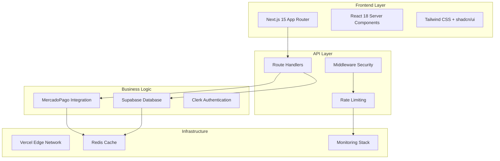
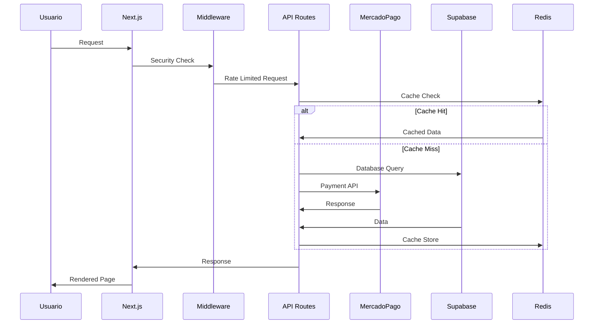

# 🏗️ Enterprise Architecture Integration - Pinteya E-commerce

> Arquitectura enterprise que integra Next.js 15 + MercadoPago + Supabase con patrones de Context7

[](../DOCUMENTATION_INDEX.md)
[](./README.md)
[](https://context7.ai/)

---

## 📋 Índice

- [🎯 Visión Arquitectónica](#-visión-arquitectónica)
- [🏗️ Diagrama de Arquitectura](#️-diagrama-de-arquitectura)
- [🔄 Flujos de Integración](#-flujos-de-integración)
- [⚡ Performance Patterns](#-performance-patterns)
- [🛡️ Security Layers](#️-security-layers)
- [📊 Observability Stack](#-observability-stack)

---

## 🎯 Visión Arquitectónica

### **Principios Enterprise**
- **Escalabilidad Horizontal**: Auto-scaling con Redis + Vercel Edge
- **Resilencia**: Circuit breakers + Retry logic + Fallbacks
- **Observabilidad**: Métricas en tiempo real + Alertas automáticas
- **Seguridad**: HMAC verification + Rate limiting + Audit trails

### **Stack Tecnológico Integrado**


---

## 🏗️ Diagrama de Arquitectura

### **Arquitectura de Capas Enterprise**
```typescript
// Estructura de capas enterprise
interface EnterpriseArchitecture {
  presentation: {
    framework: 'Next.js 15'
    rendering: 'Server Components + Client Components'
    styling: 'Tailwind CSS + shadcn/ui'
    state: 'React Server State + Client State'
  }
  
  api: {
    routing: 'App Router Route Handlers'
    middleware: 'Security + Rate Limiting + CORS'
    validation: 'Zod + TypeScript'
    caching: '4-Layer Cache Strategy'
  }
  
  business: {
    payments: 'MercadoPago Enterprise'
    database: 'Supabase PostgreSQL + RLS'
    auth: 'Clerk + Custom Roles'
    search: 'Full-text + Filters'
  }
  
  infrastructure: {
    hosting: 'Vercel Edge Network'
    cache: 'Redis + Next.js Cache'
    monitoring: 'Custom Dashboard + Alerts'
    security: 'HMAC + Rate Limiting + Audit'
  }
}
```

### **Flujo de Datos Enterprise**


---

## 🔄 Flujos de Integración

### **1. Payment Flow Enterprise**
```typescript
// lib/flows/payment-flow.ts
export class EnterprisePaymentFlow {
  constructor(
    private mercadoPago: MercadoPagoService,
    private database: SupabaseService,
    private cache: RedisService,
    private monitor: MonitoringService
  ) {}

  async processPayment(paymentData: PaymentRequest): Promise<PaymentResult> {
    const flowId = generateFlowId()
    const startTime = Date.now()
    
    try {
      // 1. Validación y rate limiting
      await this.validateRequest(paymentData)
      await this.checkRateLimit(paymentData.userId)
      
      // 2. Crear preferencia en MercadoPago
      const preference = await this.mercadoPago.createPreference({
        ...paymentData,
        notification_url: `${process.env.NEXT_PUBLIC_URL}/api/webhooks/mercadopago`
      })
      
      // 3. Guardar en base de datos
      const order = await this.database.createOrder({
        userId: paymentData.userId,
        preferenceId: preference.id,
        amount: paymentData.amount,
        status: 'pending'
      })
      
      // 4. Cache de la transacción
      await this.cache.setOrderCache(order.id, order, 3600)
      
      // 5. Métricas
      await this.monitor.recordPaymentFlow({
        flowId,
        duration: Date.now() - startTime,
        status: 'success'
      })
      
      return {
        success: true,
        preferenceId: preference.id,
        orderId: order.id,
        checkoutUrl: preference.init_point
      }
      
    } catch (error) {
      await this.monitor.recordPaymentFlow({
        flowId,
        duration: Date.now() - startTime,
        status: 'error',
        error: error instanceof Error ? error.message : 'Unknown error'
      })
      
      throw error
    }
  }
}
```

### **2. Webhook Processing Flow**
```typescript
// lib/flows/webhook-flow.ts
export class EnterpriseWebhookFlow {
  async processWebhook(notification: WebhookNotification): Promise<void> {
    const processor = new WebhookProcessor()
    
    // 1. Verificación HMAC
    const isValid = await processor.verifySignature(notification)
    if (!isValid) {
      throw new SecurityError('Invalid HMAC signature')
    }
    
    // 2. Idempotencia check
    const isProcessed = await this.cache.isWebhookProcessed(notification.id)
    if (isProcessed) {
      return // Ya procesado
    }
    
    // 3. Procesar según tipo
    switch (notification.type) {
      case 'payment':
        await this.handlePaymentUpdate(notification)
        break
      case 'subscription':
        await this.handleSubscriptionUpdate(notification)
        break
    }
    
    // 4. Marcar como procesado
    await this.cache.markWebhookProcessed(notification.id)
  }
}
```

---

## ⚡ Performance Patterns

### **1. Multi-Layer Caching Strategy**
```typescript
// lib/cache/enterprise-cache.ts
export class EnterpriseCacheManager {
  constructor(
    private redis: RedisClient,
    private nextCache: NextCacheManager
  ) {}
  
  async get<T>(key: string, options?: CacheOptions): Promise<T | null> {
    // Layer 1: Next.js Request Memoization
    const memoized = this.nextCache.getMemoized(key)
    if (memoized) return memoized
    
    // Layer 2: Redis Cache
    const cached = await this.redis.get(key)
    if (cached) {
      this.nextCache.setMemoized(key, cached)
      return cached
    }
    
    return null
  }
  
  async set<T>(
    key: string, 
    value: T, 
    ttl: number = 3600
  ): Promise<void> {
    // Almacenar en ambas capas
    await this.redis.setex(key, ttl, JSON.stringify(value))
    this.nextCache.setMemoized(key, value)
  }
  
  async invalidate(pattern: string): Promise<void> {
    // Invalidar en Redis
    const keys = await this.redis.keys(pattern)
    if (keys.length > 0) {
      await this.redis.del(...keys)
    }
    
    // Invalidar en Next.js
    this.nextCache.invalidatePattern(pattern)
  }
}
```

### **2. Database Query Optimization**
```typescript
// lib/database/optimized-queries.ts
export class OptimizedQueries {
  constructor(private supabase: SupabaseClient) {}
  
  async getProductsWithCache(filters: ProductFilters): Promise<Product[]> {
    const cacheKey = `products:${JSON.stringify(filters)}`
    
    // Usar unstable_cache para queries de base de datos
    return unstable_cache(
      async () => {
        const query = this.supabase
          .from('products')
          .select(`
            id,
            name,
            price,
            image_url,
            category:categories(name),
            inventory:inventory(stock)
          `)
        
        if (filters.category) {
          query.eq('category_id', filters.category)
        }
        
        if (filters.priceRange) {
          query.gte('price', filters.priceRange.min)
          query.lte('price', filters.priceRange.max)
        }
        
        const { data, error } = await query
        if (error) throw error
        
        return data
      },
      [cacheKey],
      {
        revalidate: 300, // 5 minutos
        tags: ['products']
      }
    )()
  }
}
```

---

## 🛡️ Security Layers

### **1. Defense in Depth**
```typescript
// lib/security/defense-layers.ts
export class SecurityLayers {
  // Layer 1: Edge Security (Middleware)
  static edgeMiddleware = (request: NextRequest) => {
    // Rate limiting por IP
    const ip = request.ip || 'unknown'
    const rateLimitResult = checkRateLimit(ip)
    
    if (!rateLimitResult.success) {
      return new Response('Rate limit exceeded', { status: 429 })
    }
    
    // Security headers
    const response = NextResponse.next()
    response.headers.set('X-Frame-Options', 'DENY')
    response.headers.set('X-Content-Type-Options', 'nosniff')
    response.headers.set('Strict-Transport-Security', 'max-age=31536000')
    
    return response
  }
  
  // Layer 2: API Security
  static async apiSecurity(request: NextRequest) {
    // CSRF protection
    const csrfToken = request.headers.get('x-csrf-token')
    if (!csrfToken || !validateCSRFToken(csrfToken)) {
      throw new SecurityError('Invalid CSRF token')
    }
    
    // Input validation
    const body = await request.json()
    const validatedData = await validateInput(body)
    
    return validatedData
  }
  
  // Layer 3: Business Logic Security
  static async businessSecurity(userId: string, action: string) {
    // Authorization check
    const permissions = await getUserPermissions(userId)
    if (!permissions.includes(action)) {
      throw new AuthorizationError('Insufficient permissions')
    }
    
    // Audit logging
    await logSecurityEvent({
      userId,
      action,
      timestamp: new Date().toISOString(),
      result: 'authorized'
    })
  }
}
```

### **2. Audit Trail System**
```typescript
// lib/security/audit-trail.ts
export interface AuditEvent {
  id: string
  userId?: string
  action: string
  resource: string
  timestamp: string
  ipAddress: string
  userAgent: string
  result: 'success' | 'failure' | 'blocked'
  metadata?: Record<string, any>
}

export class AuditTrailManager {
  async logEvent(event: Omit<AuditEvent, 'id' | 'timestamp'>): Promise<void> {
    const auditEvent: AuditEvent = {
      ...event,
      id: generateEventId(),
      timestamp: new Date().toISOString()
    }
    
    // Almacenar en base de datos segura
    await this.storeAuditEvent(auditEvent)
    
    // Alertar eventos críticos
    if (this.isCriticalEvent(auditEvent)) {
      await this.sendSecurityAlert(auditEvent)
    }
  }
  
  private isCriticalEvent(event: AuditEvent): boolean {
    const criticalActions = [
      'admin_access',
      'payment_failure',
      'security_violation',
      'data_export'
    ]
    
    return criticalActions.includes(event.action) || 
           event.result === 'blocked'
  }
}
```

---

## 📊 Observability Stack

### **1. Metrics Collection**
```typescript
// lib/monitoring/metrics-collector.ts
export class MetricsCollector {
  private metrics: Map<string, Metric[]> = new Map()
  
  async recordMetric(name: string, value: number, tags?: Record<string, string>) {
    const metric: Metric = {
      name,
      value,
      timestamp: Date.now(),
      tags: tags || {}
    }
    
    // Almacenar localmente
    const existing = this.metrics.get(name) || []
    existing.push(metric)
    this.metrics.set(name, existing.slice(-1000)) // Mantener últimas 1000
    
    // Enviar a sistema de monitoreo
    await this.sendToMonitoringSystem(metric)
    
    // Verificar alertas
    await this.checkAlerts(name, value, tags)
  }
  
  async getMetrics(name: string, timeRange: TimeRange): Promise<Metric[]> {
    const metrics = this.metrics.get(name) || []
    return metrics.filter(m => 
      m.timestamp >= timeRange.start && 
      m.timestamp <= timeRange.end
    )
  }
}
```

### **2. Real-time Dashboard**
```typescript
// components/monitoring/RealTimeDashboard.tsx
'use client'

export function RealTimeDashboard() {
  const [metrics, setMetrics] = useState<DashboardMetrics>()
  
  useEffect(() => {
    const interval = setInterval(async () => {
      const data = await fetch('/api/monitoring/metrics').then(r => r.json())
      setMetrics(data)
    }, 5000) // Actualizar cada 5 segundos
    
    return () => clearInterval(interval)
  }, [])
  
  return (
    <div className="dashboard-grid">
      <MetricCard 
        title="Response Time" 
        value={metrics?.responseTime} 
        unit="ms"
        threshold={1000}
      />
      <MetricCard 
        title="Error Rate" 
        value={metrics?.errorRate} 
        unit="%"
        threshold={5}
      />
      <MetricCard 
        title="Throughput" 
        value={metrics?.throughput} 
        unit="req/min"
      />
      <AlertsPanel alerts={metrics?.alerts} />
    </div>
  )
}
```

---

## 🚀 Deployment Strategy

### **1. Environment Configuration**
```typescript
// lib/config/environment.ts
export const ENVIRONMENT_CONFIG = {
  development: {
    mercadoPago: {
      publicKey: process.env.MERCADOPAGO_PUBLIC_KEY_TEST!,
      accessToken: process.env.MERCADOPAGO_ACCESS_TOKEN_TEST!,
      webhookSecret: process.env.MERCADOPAGO_WEBHOOK_SECRET_TEST!
    },
    database: {
      url: process.env.SUPABASE_URL_DEV!,
      anonKey: process.env.SUPABASE_ANON_KEY_DEV!
    },
    redis: {
      url: process.env.REDIS_URL_DEV!
    }
  },
  
  production: {
    mercadoPago: {
      publicKey: process.env.MERCADOPAGO_PUBLIC_KEY_PROD!,
      accessToken: process.env.MERCADOPAGO_ACCESS_TOKEN_PROD!,
      webhookSecret: process.env.MERCADOPAGO_WEBHOOK_SECRET_PROD!
    },
    database: {
      url: process.env.SUPABASE_URL_PROD!,
      anonKey: process.env.SUPABASE_ANON_KEY_PROD!
    },
    redis: {
      url: process.env.REDIS_URL_PROD!
    }
  }
} as const
```

---

**Documentado por**: Augment Agent  
**Fecha**: Enero 2025  
**Versión**: Enterprise v3.0  
**Integración**: Next.js 15 + MercadoPago + Supabase + Context7
