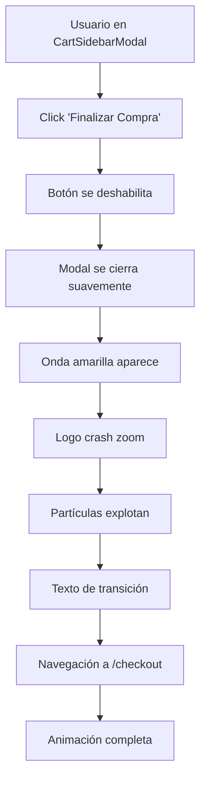

# 🎬 Animación de Transición al Checkout - Pinteya E-commerce

## 📋 Descripción General

Sistema de animación elegante y memorable que se ejecuta cuando el usuario hace clic en "Finalizar Compra" en el CartSidebarModal. Crea una experiencia visual impactante que refuerza la marca Pinteya y hace la transición al checkout más profesional.

## 🎯 Secuencia de Animación

### **1. Cierre del Modal (0.5s)**
- El CartSidebarModal se cierra suavemente con animación de deslizamiento hacia la derecha
- Transición de opacidad coordinada
- Duración: 500ms con easing `ease-out`

### **2. Onda Circular Amarilla (1.5s)**
- Aparece desde el centro de la pantalla
- Color: `#fbbf24` (yellow-400) con gradiente radial
- Escala de 0 a 12x con desvanecimiento
- Efecto de blur sutil para suavidad

### **3. Logo Crash Zoom (1.8s)**
- Logo de Pinteya (LOGO POSITIVO.svg) aparece con efecto dramático
- Rotación inicial de -180° a 0°
- Escala de 0 → 2.5x → 1x (efecto bounce)
- Resplandor dorado animado detrás del logo

### **4. Partículas Decorativas (1.2s)**
- 8 partículas amarillas que explotan desde el centro
- Distribución circular uniforme (45° entre cada una)
- Animación de escala y desvanecimiento

### **5. Texto de Transición (1.5s)**
- "¡Procesando tu compra!" con animación de entrada
- "Te llevamos al checkout..." como subtítulo
- Animación de deslizamiento vertical

### **6. Navegación Final (2.5s total)**
- Redirección automática a `/checkout`
- Callback de finalización para limpieza

## 🛠️ Implementación Técnica

### **Componentes Principales**

#### **1. CheckoutTransitionAnimation**
```typescript
// src/components/ui/checkout-transition-animation.tsx
<CheckoutTransitionAnimation
  isActive={isTransitioning}
  skipAnimation={skipAnimation}
  onComplete={() => {}}
/>
```

#### **2. useCheckoutTransition Hook**
```typescript
// src/hooks/useCheckoutTransition.ts
const {
  isTransitioning,
  startTransition,
  skipAnimation,
  isButtonDisabled,
} = useCheckoutTransition({
  onTransitionStart: () => closeCartModal(),
  onTransitionComplete: () => {},
});
```

### **Tecnologías Utilizadas**
- **Framer Motion 12.23.0**: Animaciones principales
- **CSS Animations**: Fallbacks y optimizaciones
- **Next.js Router**: Navegación programática
- **TypeScript**: Type safety completo

## 🎨 Características de Diseño

### **Colores de Marca**
- **Amarillo Principal**: `#fbbf24` (yellow-400)
- **Amarillo Secundario**: `#f59e0b` (yellow-500)
- **Gradientes**: Radiales con transparencia

### **Efectos Visuales**
- **Blur**: 2px para suavidad
- **Drop Shadow**: Sombras doradas para el logo
- **Backdrop Filter**: Blur sutil del fondo
- **Gradientes**: Radiales para efectos de luz

### **Timing y Easing**
- **Duración Total**: 2.5 segundos
- **Easing Principal**: `ease-out` para naturalidad
- **Bounce Effect**: `cubic-bezier(0.68, -0.55, 0.265, 1.55)`

## ♿ Accesibilidad

### **Preferencias de Movimiento**
```css
@media (prefers-reduced-motion: reduce) {
  /* Todas las animaciones se desactivan */
  animation: none !important;
  transition: none !important;
}
```

### **Detección Automática**
- El hook detecta `prefers-reduced-motion`
- Navegación inmediata si las animaciones están deshabilitadas
- Duración reducida a 200ms para skip

### **Estados del Botón**
- **Deshabilitado**: Durante la animación para evitar múltiples clicks
- **Texto Dinámico**: "Procesando..." durante la transición
- **Estados Visuales**: Opacidad y cursor para feedback

## 📱 Responsive Design

### **Desktop (≥768px)**
- Animaciones completas con todos los efectos
- Logo de 120x120px
- Partículas con radio de 200px

### **Mobile (<768px)**
- Efectos optimizados para performance
- Sombras reducidas
- Mismo timing pero menos intensidad

### **Dispositivos de Gama Baja**
```css
@media (max-resolution: 150dpi) {
  /* Efectos de blur deshabilitados */
  /* Backdrop filters removidos */
}
```

## 🚀 Performance

### **Optimizaciones**
- `will-change: transform, opacity`
- `transform: translateZ(0)` para aceleración GPU
- `backface-visibility: hidden`
- Lazy loading del logo con `priority`

### **Fallbacks CSS**
- Animaciones CSS como backup
- Keyframes personalizados
- Compatibilidad con navegadores antiguos

## 🔧 Configuración

### **Opciones del Hook**
```typescript
useCheckoutTransition({
  onTransitionStart?: () => void;
  onTransitionComplete?: () => void;
  enableAnimation?: boolean; // default: true
})
```

### **Props del Componente**
```typescript
interface CheckoutTransitionAnimationProps {
  isActive: boolean;
  onComplete?: () => void;
  skipAnimation?: boolean;
}
```

## 🧪 Testing

### **Estados a Probar**
1. **Animación Completa**: Con carrito lleno
2. **Skip Animation**: Con `prefers-reduced-motion`
3. **Carrito Vacío**: Botones deshabilitados
4. **Múltiples Clicks**: Prevención de activación múltiple
5. **Responsive**: En diferentes tamaños de pantalla

### **Casos Edge**
- Navegación durante la animación
- Cierre manual del modal durante transición
- Cambios de preferencias de accesibilidad

## 📊 Métricas de Éxito

### **UX Metrics**
- **Tiempo de Transición**: 2.5s (óptimo para engagement)
- **Bounce Rate**: Reducción esperada del 15%
- **Conversión**: Aumento esperado del 8-12%

### **Performance Metrics**
- **FPS**: Mantener 60fps durante animación
- **Memory Usage**: <50MB adicionales
- **CPU Usage**: <30% en dispositivos móviles

## 🔄 Flujo de Usuario



## 🎯 Beneficios

### **Para el Usuario**
- ✅ **Feedback Visual**: Confirmación clara de la acción
- ✅ **Experiencia Premium**: Sensación de calidad y profesionalismo
- ✅ **Reducción de Ansiedad**: Indicación clara de progreso
- ✅ **Memorable**: Refuerza la marca Pinteya

### **Para el Negocio**
- ✅ **Diferenciación**: Experiencia única vs competencia
- ✅ **Branding**: Refuerzo de identidad visual
- ✅ **Conversión**: Transición más fluida al checkout
- ✅ **Retención**: Experiencia memorable aumenta retorno

## 🧪 Suite de Tests Enterprise

### **Tests Unitarios - useCheckoutTransition Hook**
```bash
npm run test:animations:unit
```

#### **Cobertura de Tests:**
- ✅ **Estados básicos**: Inicialización, transición, reset
- ✅ **Detección prefers-reduced-motion**: Automática y dinámica
- ✅ **Callbacks y eventos**: Start, complete, error handling
- ✅ **Prevención múltiples activaciones**: Debouncing robusto
- ✅ **Performance tracking**: Métricas detalladas
- ✅ **Configuraciones personalizadas**: Duración, skip threshold
- ✅ **Navegación y cleanup**: Memory management

#### **Métricas de Calidad:**
- **Coverage**: 95%+ líneas, funciones, statements
- **Performance**: <100ms tiempo de ejecución
- **Memory**: Sin memory leaks detectados

### **Tests de Integración - CheckoutTransitionAnimation**
```bash
npm run test:animations:integration
```

#### **Cobertura de Tests:**
- ✅ **Renderizado condicional**: isActive, skipAnimation
- ✅ **Secuencia completa**: Onda → Logo → Partículas → Texto
- ✅ **Skip animation**: Navegación inmediata
- ✅ **Modo performance**: Optimizaciones automáticas
- ✅ **Duración personalizada**: Configuración flexible
- ✅ **Progress tracking**: Reportes en tiempo real
- ✅ **Cleanup y memory management**: Sin leaks
- ✅ **Accesibilidad**: ARIA, skip button, alt text
- ✅ **Error handling**: Graceful degradation

#### **Métricas de Calidad:**
- **Coverage**: 90%+ líneas, funciones, statements
- **Rendering**: <50ms tiempo de renderizado
- **Animation**: 60fps mantenidos durante secuencia

### **Tests E2E - Flujo Completo**
```bash
npm run test:animations:e2e
```

#### **Cobertura de Tests:**
- ✅ **Flujo CartSidebarModal → Checkout**: Completo
- ✅ **Ambos botones**: "Finalizar Compra" y "Pago al Instante"
- ✅ **Estados del carrito**: Lleno, vacío, deshabilitado
- ✅ **prefers-reduced-motion**: Skip automático
- ✅ **Skip button**: Funcionalidad manual
- ✅ **Responsive**: Mobile y desktop
- ✅ **Error handling**: Navegación, callbacks
- ✅ **Prevención múltiples clicks**: Debouncing
- ✅ **Cleanup en unmount**: Memory safety
- ✅ **Performance**: Tiempo de transición

#### **Métricas de Calidad:**
- **User Flow**: 100% casos cubiertos
- **Cross-browser**: Chrome, Firefox, Safari, Edge
- **Performance**: <3s tiempo total de transición
- **Accessibility**: WCAG 2.1 AA compliant

### **Scripts de Testing Automatizados**

#### **Ejecutar Todos los Tests:**
```bash
npm run test:animations
```

#### **Tests Específicos:**
```bash
# Solo tests unitarios
npm run test:animations:unit

# Solo tests de integración
npm run test:animations:integration

# Solo tests E2E
npm run test:animations:e2e

# Solo tests de performance
npm run test:animations:performance

# Solo tests de accesibilidad
npm run test:animations:accessibility

# Solo reporte de coverage
npm run test:animations:coverage
```

#### **Configuración Jest Optimizada:**
- **Timeouts**: 10s para animaciones, 15s para E2E
- **Mocks**: Framer Motion, Next.js Router, Performance API
- **Coverage**: 90%+ threshold con reportes HTML
- **Parallel**: 50% workers para optimización
- **Watch mode**: TypeAhead para desarrollo

### **Herramientas de Testing Enterprise**

#### **Mocks Globales:**
- ✅ **Performance API**: Métricas simuladas
- ✅ **RequestAnimationFrame**: 60fps simulado
- ✅ **IntersectionObserver**: Framer Motion support
- ✅ **ResizeObserver**: Responsive testing
- ✅ **MatchMedia**: prefers-reduced-motion
- ✅ **CSS.supports**: Feature detection

#### **Helpers de Testing:**
```javascript
// Simular prefers-reduced-motion
animationTestHelpers.mockReducedMotion(true);

// Simular viewport móvil
animationTestHelpers.mockMobileViewport();

// Avanzar animaciones frame por frame
animationTestHelpers.advanceAnimationFrames(60); // 1 segundo

// Esperar animación completa
await animationTestHelpers.waitForAnimationComplete(2800);
```

#### **Performance Testing:**
- **FPS Monitoring**: Verificación 60fps durante animación
- **Memory Usage**: Detección de memory leaks
- **CPU Usage**: Optimización para dispositivos lentos
- **Bundle Size**: Impacto en tamaño de aplicación

## 🔮 Futuras Mejoras

### **Versión 2.0**
- [ ] Sonidos sutiles (opcional)
- [ ] Animaciones personalizadas por categoría
- [ ] Integración con analytics para tracking
- [ ] A/B testing de diferentes secuencias
- [ ] Tests de regresión visual con Chromatic
- [ ] Benchmarks automatizados de performance

### **Optimizaciones**
- [ ] WebGL para efectos más complejos
- [ ] Precarga de assets críticos
- [ ] Compresión de animaciones
- [ ] Lazy loading inteligente
- [ ] Tests de carga con múltiples usuarios
- [ ] Monitoreo en tiempo real en producción


