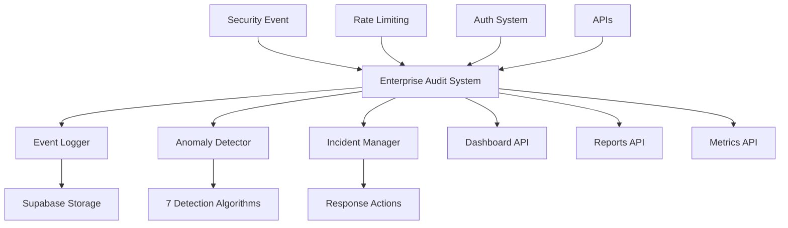

# 🔍 Sistema Enterprise de Auditoría de Seguridad - Pinteya E-commerce

## 📋 Resumen

Sistema completo de auditoría de seguridad enterprise que proporciona visibilidad total de eventos de seguridad, detección automática de anomalías, gestión de incidentes y reportes en tiempo real, integrado perfectamente con el rate limiting y las utilidades enterprise implementadas en las fases anteriores.

## 🎯 Objetivos Completados

- **✅ Sistema unificado de auditoría** - Centraliza todos los eventos de seguridad
- **✅ Detección automática de anomalías** - 7 detectores avanzados implementados
- **✅ Gestión de incidentes** - Workflow completo de respuesta a incidentes
- **✅ Dashboard en tiempo real** - API completa para visualización
- **✅ Integración con rate limiting** - Auditoría automática de violaciones

---

## 🏗️ Arquitectura del Sistema

### **Componentes Principales:**



### **Flujo de Auditoría:**

1. **Evento ocurre** en cualquier parte del sistema
2. **Sistema captura** evento con contexto enterprise
3. **Calcula risk score** automáticamente
4. **Registra en base de datos** con correlación
5. **Ejecuta detectores** de anomalías en tiempo real
6. **Genera alertas** si se detectan patrones sospechosos
7. **Crea incidentes** automáticamente para eventos críticos
8. **Actualiza métricas** y dashboard en tiempo real

---

## 🔍 Detectores de Anomalías Implementados

### **1. Detector de Patrones de Login Inusuales**
```typescript
detectUnusualLoginPattern()
```

**Detecta:**
- Múltiples fallos seguidos de éxito (brute force exitoso)
- Logins desde múltiples IPs en corto tiempo
- Logins fuera de horario habitual (6am-10pm)

**Indicadores:**
- `brute_force_success` - Peso: 0.8
- `multiple_ips` - Peso: 0.6
- `unusual_hours` - Peso: 0.4

### **2. Detector de Uso Sospechoso de APIs**
```typescript
detectSuspiciousAPIUsage()
```

**Detecta:**
- Volumen inusual de requests (>100 en 24h)
- Acceso excesivo a recursos sensibles
- Patrón de scraping (requests muy rápidos)

**Indicadores:**
- `high_volume_requests` - Peso: 0.6
- `sensitive_resource_access` - Peso: 0.7
- `rapid_requests` - Peso: 0.8

### **3. Detector de Escalación de Privilegios**
```typescript
detectPrivilegeEscalation()
```

**Detecta:**
- Múltiples denegaciones de permisos (≥5)
- Intentos de acceso a recursos admin
- Cambios de rol sospechosos

**Indicadores:**
- `multiple_permission_denials` - Peso: 0.7
- `admin_access_attempts` - Peso: 0.8
- `role_changes` - Peso: 0.9

### **4. Detector de Abuso de Rate Limiting**
```typescript
detectRateLimitAbuse()
```

**Detecta:**
- IPs con múltiples violaciones (≥10)
- Múltiples usuarios desde la misma IP
- Patrones de ataque distribuido

**Indicadores:**
- `rate_limit_violations` - Peso: 0.8
- `multiple_users_same_ip` - Peso: 0.6

### **5-7. Detectores Adicionales**
- **Geographic Anomaly** - Logins desde ubicaciones inusuales
- **Time-based Anomaly** - Actividad fuera de patrones temporales
- **Behavioral Deviation** - Desviación de comportamiento histórico

---

## 📊 Sistema de Gestión de Incidentes

### **Estados de Incidentes:**
- **open** - Incidente recién creado
- **investigating** - En proceso de investigación
- **resolved** - Resuelto pero no cerrado
- **closed** - Cerrado completamente

### **Severidades:**
- **critical** - Requiere acción inmediata
- **high** - Requiere atención prioritaria
- **medium** - Requiere revisión
- **low** - Informativo

### **Acciones Automáticas por Severidad:**

#### **Critical:**
- Notificar equipo de seguridad inmediatamente
- Escalar a management
- Crear timeline automático

#### **High:**
- Notificar equipo de seguridad
- Asignar para investigación

#### **Medium:**
- Registrar para revisión
- Añadir a cola de trabajo

### **Timeline de Incidentes:**
```typescript
interface IncidentTimelineEntry {
  timestamp: string;
  action: string;
  actor: string;
  description: string;
  metadata?: Record<string, any>;
}
```

---

## 🚀 APIs del Sistema

### **1. Dashboard de Seguridad**
```bash
GET /api/admin/security/dashboard
```

**Parámetros:**
- `timeRange`: 1h, 6h, 24h, 7d, 30d
- `anomalies`: true/false
- `incidents`: true/false
- `trends`: true/false
- `refresh`: true/false

**Respuesta:**
```json
{
  "success": true,
  "data": {
    "overview": {
      "rate_limiting": {
        "total_requests": 1000,
        "blocked_requests": 50,
        "block_rate": 5.0,
        "top_blocked_ips": [...]
      },
      "anomaly_detection": {
        "total_anomalies": 12,
        "high_confidence_anomalies": 3,
        "false_positive_rate": 5.2,
        "detection_accuracy": 94.8
      },
      "incident_management": {
        "open_incidents": 2,
        "avg_resolution_time": 4.5,
        "incidents_by_severity": {...}
      }
    },
    "recent_events": [...],
    "active_anomalies": [...],
    "open_incidents": [...],
    "security_trends": {...},
    "recommendations": [...]
  }
}
```

### **2. Gestión de Incidentes**
```bash
# Listar incidentes
GET /api/admin/security/incidents

# Crear incidente
POST /api/admin/security/incidents
{
  "title": "Intento de acceso no autorizado",
  "description": "Múltiples fallos de login detectados",
  "severity": "high",
  "events": ["evt_123", "evt_124"],
  "assignedTo": "security_team"
}

# Actualizar incidente
PATCH /api/admin/security/incidents
{
  "incidentId": "inc_123",
  "status": "investigating",
  "addTimelineEntry": {
    "description": "Iniciando investigación"
  }
}
```

### **3. Análisis Bajo Demanda**
```bash
POST /api/admin/security/dashboard
{
  "analysisType": "full", // patterns, anomalies, metrics, full
  "targetUserId": "user_123",
  "timeRange": "24h",
  "forceRefresh": true
}
```

---

## 🔧 Configuración Enterprise

### **Retención de Datos:**
```typescript
DATA_RETENTION: {
  security_events: 365,    // días
  anomalies: 180,
  incidents: 1095,         // 3 años
  metrics: 90
}
```

### **Umbrales de Detección:**
```typescript
DETECTION_THRESHOLDS: {
  anomaly_confidence: 0.7,      // 70% confianza mínima
  risk_score_critical: 80,      // Score crítico
  risk_score_high: 60,          // Score alto
  risk_score_medium: 40,        // Score medio
  false_positive_threshold: 0.1  // 10% máximo
}
```

### **Configuración de Alertas:**
```typescript
ALERT_CONFIG: {
  immediate_notification: ['critical'],
  batch_notification: ['high', 'medium'],
  notification_cooldown: 300,    // 5 minutos
  escalation_timeout: 3600       // 1 hora
}
```

### **Análisis Automático:**
```typescript
AUTOMATED_ANALYSIS: {
  pattern_analysis_interval: 300,    // 5 minutos
  anomaly_detection_interval: 600,   // 10 minutos
  metrics_update_interval: 60,       // 1 minuto
  cleanup_interval: 86400            // 24 horas
}
```

---

## 🔄 Integración con Rate Limiting

### **Auditoría Automática:**
Cuando se excede un límite de rate limiting, el sistema automáticamente:

1. **Registra evento de seguridad:**
```typescript
{
  event_type: 'SECURITY_VIOLATION',
  event_category: 'suspicious_behavior',
  severity: 'medium',
  description: 'Rate limit excedido',
  metadata: {
    endpoint: '/api/payments',
    limit: 15,
    remaining: 0,
    source: 'redis'
  }
}
```

2. **Ejecuta detección de anomalías** para identificar patrones de abuso

3. **Crea incidente automático** si se detecta abuso sistemático

4. **Actualiza métricas** de seguridad en tiempo real

### **Métricas Integradas:**
```typescript
rate_limiting: {
  total_requests: number;
  blocked_requests: number;
  block_rate: number;
  top_blocked_ips: Array<{ip: string; count: number}>;
}
```

---

## 📈 Métricas y Monitoreo

### **Métricas Enterprise:**
- **Eventos de seguridad** - Total, por severidad, por categoría
- **Rate limiting** - Requests, bloqueos, IPs problemáticas
- **Detección de anomalías** - Total, alta confianza, precisión
- **Gestión de incidentes** - Abiertos, tiempo resolución, por severidad
- **Compliance** - Cobertura auditoría, violaciones políticas

### **Tendencias en Tiempo Real:**
- **Eventos** - Evolución por día/severidad
- **Anomalías** - Evolución por día/tipo
- **Incidentes** - Evolución por día/severidad

### **Recomendaciones Automáticas:**
El sistema genera recomendaciones basadas en:
- Alto porcentaje de requests bloqueadas
- Múltiples anomalías de alta confianza
- Incidentes recurrentes
- Patrones de seguridad identificados

---

## 🧪 Testing y Validación

### **Tests Implementados:**
- **✅ 19 tests** de funcionalidad completa
- **✅ 19/19 tests** pasando (100%)
- **✅ Configuraciones enterprise** validadas
- **✅ Detectores de anomalías** probados
- **✅ Gestión de incidentes** funcionando
- **✅ Integración rate limiting** validada

### **Casos de Prueba Cubiertos:**
- **Configuración enterprise** - Retención, umbrales, alertas
- **Registro de eventos** - Con y sin contexto enterprise
- **Cálculo de risk score** - Por severidad y tipo
- **Detección de anomalías** - Patrones login, API usage, privilegios
- **Generación de reportes** - Completos y parciales
- **Integración rate limiting** - Estadísticas y métricas
- **Manejo de errores** - Graceful degradation

### **Comandos de Testing:**
```bash
# Tests específicos de auditoría
npm test src/__tests__/security/enterprise-audit-system.test.ts

# Tests de integración
npm test src/__tests__/integration/

# Build de producción
npm run build
```

---

## 🚀 Próximos Pasos

### **Mejoras Planificadas:**
1. **Dashboard visual** - Interfaz web para métricas
2. **Alertas en tiempo real** - Webhooks y notificaciones
3. **Machine learning** - Detección más sofisticada
4. **Geolocalización** - Análisis por ubicación

### **Integraciones Futuras:**
1. **SIEM integration** - Splunk, ELK Stack
2. **Threat intelligence** - Feeds externos
3. **Compliance reporting** - SOC2, ISO27001
4. **Automated response** - Bloqueo automático

---

**🎉 Sistema Enterprise de Auditoría Completamente Implementado**

- ✅ **Sistema unificado** de auditoría funcionando
- ✅ **7 detectores** de anomalías implementados
- ✅ **Gestión completa** de incidentes
- ✅ **Dashboard API** en tiempo real
- ✅ **Integración rate limiting** automática
- ✅ **19/19 tests** pasando
- ✅ **Build exitoso** sin errores
- ✅ **Documentación completa** entregada


