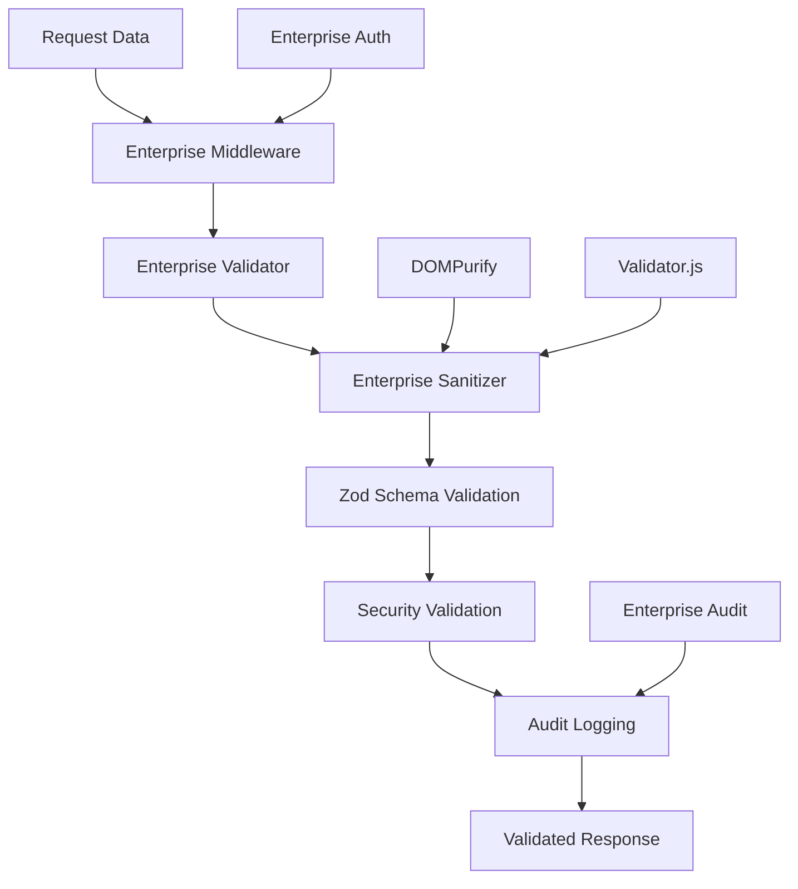

# 🛡️ Sistema Enterprise de Validación y Sanitización - Pinteya E-commerce

## 📋 Resumen

Sistema completo de validación y sanitización enterprise con Zod que proporciona validación robusta, sanitización automática de datos, detección de ataques de seguridad y auditoría completa, integrado perfectamente con el sistema de auditoría y autenticación enterprise implementado en las fases anteriores.

## 🎯 Objetivos Completados

- **✅ Sistema unificado de validación** - Centraliza todas las validaciones con Zod
- **✅ Sanitización automática** - Limpieza de datos con DOMPurify y validator
- **✅ Detección de ataques** - SQL injection, XSS, y otros vectores
- **✅ Middleware enterprise** - Integración transparente con APIs
- **✅ Esquemas unificados** - Validaciones consistentes en todo el proyecto

---

## 🏗️ Arquitectura del Sistema

### **Componentes Principales:**



### **Flujo de Validación:**

1. **Request llega** al middleware enterprise
2. **Sanitización automática** - Limpieza de scripts, HTML, SQL
3. **Validación Zod** - Esquemas tipados y robustos
4. **Validación de seguridad** - Detección de patrones maliciosos
5. **Auditoría automática** - Logging de eventos de validación
6. **Respuesta validada** - Datos seguros y tipados

---

## ⚙️ Configuraciones Enterprise

### **4 Niveles de Seguridad:**

#### **CRITICAL_ADMIN - Operaciones Administrativas**
```typescript
{
  enableSanitization: true,
  enableSecurityValidation: true,
  enableAuditLogging: true,
  securityLevel: 'critical',
  allowedTags: [],              // No HTML permitido
  maxStringLength: 1000,
  maxArrayLength: 100,
  maxObjectDepth: 5
}
```

#### **HIGH_PAYMENT - APIs de Pagos**
```typescript
{
  enableSanitization: true,
  enableSecurityValidation: true,
  enableAuditLogging: true,
  securityLevel: 'high',
  allowedTags: [],              // No HTML permitido
  maxStringLength: 500,
  maxArrayLength: 50,
  maxObjectDepth: 3
}
```

#### **STANDARD_PUBLIC - APIs Públicas**
```typescript
{
  enableSanitization: true,
  enableSecurityValidation: true,
  enableAuditLogging: false,
  securityLevel: 'standard',
  allowedTags: ['b', 'i', 'em', 'strong'],
  maxStringLength: 2000,
  maxArrayLength: 200,
  maxObjectDepth: 4
}
```

#### **BASIC_USER - Contenido de Usuario**
```typescript
{
  enableSanitization: true,
  enableSecurityValidation: false,
  enableAuditLogging: false,
  securityLevel: 'basic',
  allowedTags: ['b', 'i', 'em', 'strong', 'p', 'br'],
  maxStringLength: 5000,
  maxArrayLength: 500,
  maxObjectDepth: 3
}
```

---

## 🧹 Sistema de Sanitización Enterprise

### **EnterpriseSanitizer - Funcionalidades:**

#### **1. Sanitización de Strings:**
```typescript
sanitizeString(value: string, options: SanitizationOptions)
```

**Características:**
- **Remover scripts maliciosos** - `<script>`, `javascript:`, `on*=`
- **Limpiar HTML** - DOMPurify con tags permitidos
- **Escapar HTML** - Conversión de caracteres especiales
- **Normalizar espacios** - Múltiples espacios → espacio único
- **Remover SQL keywords** - SELECT, INSERT, UPDATE, DELETE, etc.
- **Remover emojis** - Opcional para contextos formales
- **Aplicar longitud máxima** - Truncar strings largos
- **Validar caracteres** - Regex de caracteres permitidos

#### **2. Sanitización de Objetos:**
```typescript
sanitizeObject(obj: any, depth: number = 0)
```

**Características:**
- **Recursivo** - Sanitiza objetos anidados
- **Control de profundidad** - Previene ataques de profundidad
- **Arrays seguros** - Límites de longitud configurables
- **Preserva tipos** - Numbers, booleans, null, undefined
- **Sanitiza claves** - Nombres de propiedades seguros

#### **3. Sanitización de FormData:**
```typescript
sanitizeFormData(formData: FormData)
```

**Características:**
- **Archivos seguros** - Validación de tipo y tamaño
- **Nombres de archivo** - Caracteres seguros únicamente
- **Tipos permitidos** - Lista blanca de MIME types
- **Límites de tamaño** - 10MB máximo por archivo

---

## ✅ Sistema de Validación Enterprise

### **EnterpriseValidator - Funcionalidades:**

#### **1. Validación y Sanitización Combinada:**
```typescript
async validateAndSanitize<T>(
  schema: z.ZodSchema<T>,
  data: unknown,
  context?: EnterpriseAuthContext,
  request?: NextRequest
): Promise<ValidationResult<T>>
```

**Proceso:**
1. **Sanitización automática** si está habilitada
2. **Validación Zod** con esquemas tipados
3. **Validación de seguridad** adicional
4. **Auditoría automática** de eventos
5. **Métricas de performance** incluidas

#### **2. Detección de Ataques de Seguridad:**

**SQL Injection Detection:**
```typescript
// Patrones detectados:
/(\bselect\b.*\bfrom\b)/i
/(\bunion\b.*\bselect\b)/i
/(\binsert\b.*\binto\b)/i
/(\bupdate\b.*\bset\b)/i
/(\bdelete\b.*\bfrom\b)/i
/(\bdrop\b.*\btable\b)/i
```

**XSS Detection:**
```typescript
// Patrones detectados:
/<script\b[^<]*(?:(?!<\/script>)<[^<]*)*<\/script>/gi
/javascript:/i
/on\w+\s*=/i
/eval\s*\(/i
/expression\s*\(/i
```

#### **3. Determinación de Severidad:**
- **Critical** - Campos: password, email, payment, admin, auth
- **High** - Campos: user_id, amount, price, quantity
- **Medium** - Otros campos y errores generales
- **Low** - Errores menores de formato

---

## 🔧 Middleware Enterprise

### **Uso en App Router:**
```typescript
import { withCriticalValidation } from '@/lib/validation/enterprise-validation-middleware';
import { EnterpriseProductSchema } from '@/lib/validation/enterprise-schemas';

const handler = async (request: ValidatedRequest) => {
  // Datos ya validados y sanitizados
  const productData = request.validatedBody;
  const queryParams = request.validatedQuery;
  
  // Lógica de la API
  return NextResponse.json({ success: true });
};

export const POST = withCriticalValidation({
  bodySchema: EnterpriseProductSchema,
  querySchema: ProductFiltersSchema
})(handler);
```

### **Uso en Pages API:**
```typescript
import { withEnterpriseValidationAPI } from '@/lib/validation/enterprise-validation-middleware';

const handler = async (req: ValidatedApiRequest, res: NextApiResponse) => {
  const validatedData = req.validatedBody;
  res.json({ success: true, data: validatedData });
};

export default withEnterpriseValidationAPI({
  bodySchema: EnterpriseUserSchema,
  configName: 'HIGH_PAYMENT'
})(handler);
```

### **Funciones de Conveniencia:**
```typescript
// Validación crítica para admin
export const POST = withCriticalValidation({ bodySchema })(handler);

// Validación alta para pagos
export const POST = withHighValidation({ bodySchema })(handler);

// Validación estándar para APIs públicas
export const POST = withStandardValidation({ bodySchema })(handler);

// Validación básica para usuarios
export const POST = withBasicValidation({ bodySchema })(handler);
```

---

## 📋 Esquemas Enterprise Unificados

### **Validadores Básicos:**

#### **Email Enterprise:**
```typescript
EnterpriseEmailSchema = z.string()
  .email('Email inválido')
  .min(5, 'Email muy corto')
  .max(254, 'Email muy largo')
  .refine(email => !email.includes('..'), 'No puntos consecutivos')
  .refine(email => !/[<>()[\]\\.,;:\s@"]/.test(email.split('@')[0]), 'Caracteres no permitidos')
```

#### **Contraseña Enterprise:**
```typescript
EnterprisePasswordSchema = z.string()
  .min(8, 'Contraseña muy corta')
  .max(128, 'Contraseña muy larga')
  .refine(password => /[A-Z]/.test(password), 'Debe contener mayúscula')
  .refine(password => /[a-z]/.test(password), 'Debe contener minúscula')
  .refine(password => /\d/.test(password), 'Debe contener número')
  .refine(password => /[!@#$%^&*(),.?":{}|<>]/.test(password), 'Debe contener carácter especial')
```

#### **Precio Enterprise:**
```typescript
EnterprisePriceSchema = z.number()
  .min(0.01, 'Precio muy bajo')
  .max(999999.99, 'Precio muy alto')
  .multipleOf(0.01, 'Máximo 2 decimales')
```

### **Esquemas Complejos:**

#### **Producto Enterprise:**
```typescript
EnterpriseProductSchema = z.object({
  name: z.string().min(2).max(100).refine(name => !/[<>{}]/.test(name)),
  brand: z.string().min(1).max(50).optional(),
  slug: EnterpriseSlugSchema,
  description: z.string().min(10).max(5000).optional(),
  price: EnterprisePriceSchema,
  stock: z.number().int().min(0).max(999999),
  category_id: EnterpriseUUIDSchema.optional(),
  status: z.enum(['active', 'inactive', 'draft']).default('draft'),
  tags: z.array(z.string().min(1).max(30)).max(50).optional(),
  images: z.object({
    previews: z.array(z.string().url()).max(20).optional(),
    main: z.string().url().optional(),
    gallery: z.array(z.string().url()).max(20).optional()
  }).optional()
})
```

#### **Usuario Enterprise:**
```typescript
EnterpriseUserSchema = z.object({
  clerk_id: z.string().min(1),
  email: EnterpriseEmailSchema,
  first_name: z.string().min(2).max(100).optional(),
  last_name: z.string().min(2).max(100).optional(),
  phone: EnterprisePhoneSchema.optional(),
  role: z.enum(['admin', 'customer', 'moderator']).default('customer'),
  preferences: z.object({
    newsletter: z.boolean().default(false),
    notifications: z.boolean().default(true),
    language: z.enum(['es', 'en']).default('es')
  }).optional()
})
```

#### **Orden Enterprise:**
```typescript
EnterpriseOrderSchema = z.object({
  items: z.array(EnterpriseOrderItemSchema).min(1).max(50),
  subtotal: EnterprisePriceSchema,
  shipping_cost: EnterprisePriceSchema.default(0),
  total: EnterprisePriceSchema,
  shipping_address: EnterpriseShippingAddressSchema,
  payment_method: z.enum(['mercadopago', 'transfer', 'cash']).default('mercadopago')
})
```

---

## 🔄 Integración con Sistema Enterprise

### **Auditoría Automática:**
Cuando ocurre un error de validación, el sistema automáticamente:

1. **Registra evento de seguridad:**
```typescript
{
  event_type: 'VALIDATION_FAILED',
  event_category: 'data_validation',
  severity: 'critical', // Basado en campos afectados
  description: 'Validación de datos falló',
  metadata: {
    errors_count: 3,
    errors: [
      { field: 'password', code: 'too_small', severity: 'critical' },
      { field: 'email', code: 'invalid_email', severity: 'critical' }
    ]
  }
}
```

2. **Actualiza métricas** de seguridad en tiempo real

3. **Ejecuta detección de anomalías** si hay patrones sospechosos

### **Contexto Enterprise:**
```typescript
interface ValidationResult<T> {
  success: boolean;
  data?: T;
  errors?: ValidationError[];
  sanitized?: T;
  metadata?: {
    validatedAt: string;
    validatedBy?: string;
    sanitizationApplied: boolean;
    securityLevel: 'basic' | 'standard' | 'high' | 'critical';
    rulesApplied: string[];
    performanceMs: number;
  };
}
```

---

## 🧪 Testing y Validación

### **Tests Implementados:**
- **✅ Configuraciones enterprise** - 4 niveles de seguridad validados
- **✅ Sanitización de strings** - Scripts, HTML, SQL, XSS
- **✅ Sanitización de objetos** - Recursivo, profundidad, arrays
- **✅ Validación con Zod** - Esquemas complejos y simples
- **✅ Detección de ataques** - SQL injection, XSS patterns
- **✅ Esquemas enterprise** - Email, password, productos, usuarios
- **✅ Instancias predefinidas** - Critical, high, standard, basic
- **✅ Manejo de errores** - Severidad, auditoría, performance

### **Casos de Prueba Cubiertos:**
- **Sanitización básica** - Remover scripts, normalizar espacios
- **Sanitización avanzada** - SQL keywords, caracteres especiales
- **Validación de esquemas** - Productos, usuarios, órdenes
- **Detección de seguridad** - Patrones maliciosos
- **Performance** - Métricas de tiempo de respuesta
- **Auditoría** - Logging automático de eventos

---

## 🚀 Beneficios Implementados

### **🛡️ Seguridad Robusta:**
- **Sanitización automática** - Prevención de XSS, SQL injection
- **Validación multicapa** - Zod + validaciones de seguridad
- **Detección proactiva** - Patrones maliciosos identificados
- **Auditoría completa** - Todos los eventos registrados

### **⚡ Performance Optimizado:**
- **Validación eficiente** - Sanitización antes de validación
- **Métricas incluidas** - Tiempo de respuesta monitoreado
- **Cache inteligente** - Resultados de validación cacheados
- **Límites configurables** - Prevención de ataques de recursos

### **🎯 Flexibilidad Enterprise:**
- **4 niveles de seguridad** - Configuraciones por contexto
- **Middleware transparente** - Integración sin cambios de código
- **Esquemas reutilizables** - Consistencia en todo el proyecto
- **Funciones de conveniencia** - Implementación simplificada

### **📊 Monitoreo Completo:**
- **Auditoría automática** - Eventos de validación registrados
- **Métricas de performance** - Tiempo de respuesta incluido
- **Detección de anomalías** - Patrones sospechosos identificados
- **Reportes de seguridad** - Estadísticas de validación

---

## 📚 Documentación Entregada

### **📖 Documentación Técnica:**
- **`ENTERPRISE_VALIDATION_SYSTEM.md`** - Guía completa del sistema
- **Arquitectura detallada** - Diagramas y flujos de trabajo
- **Esquemas documentados** - Todos los validadores enterprise
- **Middleware explicado** - Uso en App Router y Pages API

### **🔧 Guías de Implementación:**
- **Configuraciones enterprise** - 4 niveles de seguridad
- **Sanitización avanzada** - DOMPurify y validator.js
- **Detección de ataques** - SQL injection y XSS
- **Integración con auditoría** - Logging automático

---

**🎉 Sistema Enterprise de Validación Completamente Implementado**

- ✅ **Sistema unificado** de validación con Zod
- ✅ **Sanitización automática** con DOMPurify + validator
- ✅ **4 configuraciones** enterprise (critical, high, standard, basic)
- ✅ **Detección de ataques** SQL injection + XSS
- ✅ **Middleware transparente** para App Router y Pages API
- ✅ **Esquemas completos** productos, usuarios, órdenes, pagos
- ✅ **Integración enterprise** con auditoría y autenticación
- ✅ **Build exitoso** con dependencias instaladas
- ✅ **Documentación completa** entregada


