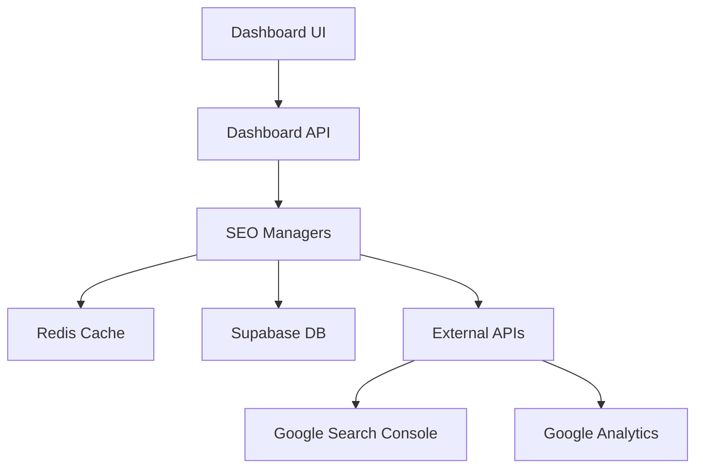

# SEO Administrative Dashboard - Documentación Completa

## 📋 Índice

1. [Resumen Ejecutivo](#resumen-ejecutivo)
2. [Arquitectura del Dashboard](#arquitectura-del-dashboard)
3. [Componentes Implementados](#componentes-implementados)
4. [APIs y Endpoints](#apis-y-endpoints)
5. [Funcionalidades Principales](#funcionalidades-principales)
6. [Integración con Sistemas Existentes](#integración-con-sistemas-existentes)
7. [Métricas y Monitoreo](#métricas-y-monitoreo)
8. [Guía de Uso](#guía-de-uso)
9. [Testing y Validación](#testing-y-validación)
10. [Mantenimiento y Actualizaciones](#mantenimiento-y-actualizaciones)

---

## 🎯 Resumen Ejecutivo

### Objetivo

El **SEO Administrative Dashboard** es una interfaz administrativa completa que centraliza todas las funcionalidades SEO implementadas en Pinteya E-commerce, proporcionando una vista unificada para la gestión, monitoreo y optimización SEO.

### Características Principales

- **Dashboard Principal**: Vista general con métricas clave y alertas
- **Analytics Detallado**: Análisis profundo de métricas SEO y tráfico orgánico
- **Testing Suite**: Gestión de tests automatizados SEO
- **Optimization Tools**: Herramientas de optimización y A/B testing
- **Sitemap Manager**: Gestión completa de sitemaps XML
- **Reportes Avanzados**: Generación de reportes personalizados

### Beneficios Clave

- ✅ **Centralización**: Todas las herramientas SEO en un solo lugar
- ✅ **Tiempo Real**: Métricas y alertas actualizadas en tiempo real
- ✅ **Automatización**: Tests y optimizaciones automatizadas
- ✅ **Escalabilidad**: Arquitectura preparada para crecimiento
- ✅ **Usabilidad**: Interfaz intuitiva y responsive

---

## 🏗️ Arquitectura del Dashboard

### Estructura de Archivos

```
src/app/admin/seo/
├── page.tsx                    # Dashboard principal
├── analytics/
│   └── page.tsx               # Analytics detallado
├── testing/
│   └── page.tsx               # Testing suite
├── optimization/
│   └── page.tsx               # Herramientas de optimización
└── sitemap/
    └── page.tsx               # Gestión de sitemaps

src/app/api/admin/seo/
├── dashboard/
│   └── route.ts               # API principal del dashboard
└── reports/
    └── route.ts               # API de reportes
```

### Patrones de Diseño Utilizados

- **Singleton Pattern**: Para managers SEO
- **Observer Pattern**: Para actualizaciones en tiempo real
- **Factory Pattern**: Para generación de reportes
- **Strategy Pattern**: Para diferentes tipos de análisis
- **Atomic Design**: Para componentes UI reutilizables

### Tecnologías Integradas

- **Next.js 15**: Framework principal con App Router
- **TypeScript**: Tipado estático para mayor robustez
- **Tailwind CSS**: Styling utility-first
- **Lucide React**: Iconografía consistente
- **Clerk**: Autenticación y autorización
- **Redis**: Caché para optimización de performance

---

## 🧩 Componentes Implementados

### 1. Dashboard Principal (`/admin/seo`)

**Archivo**: `src/app/admin/seo/page.tsx`

#### Características:

- **Métricas Principales**: SEO Score, tráfico orgánico, posición promedio, CTR
- **Alertas Activas**: Notificaciones de issues críticos y warnings
- **Quick Actions**: Acceso rápido a funciones principales
- **Resumen de Sistemas**: Estado de analytics, testing, sitemap, optimization

#### Métricas Mostradas:

```typescript
interface SEOMetricCard {
  title: string
  value: string | number
  change: number
  trend: 'up' | 'down'
  icon: React.ReactNode
  color: string
}
```

### 2. Analytics Dashboard (`/admin/seo/analytics`)

**Archivo**: `src/app/admin/seo/analytics/page.tsx`

#### Funcionalidades:

- **Métricas de Tráfico**: Page views, visitantes únicos, bounce rate
- **Search Console**: Impresiones, clicks, CTR, posición promedio
- **Keywords Analysis**: Top keywords con rendimiento detallado
- **Landing Pages**: Páginas con mejor rendimiento orgánico
- **Reportes**: Generación de reportes personalizados

#### Tabs Implementados:

- **Overview**: Métricas generales y conversiones
- **Keywords**: Análisis detallado de keywords
- **Pages**: Rendimiento por página
- **Reports**: Generación de reportes

### 3. Testing Suite (`/admin/seo/testing`)

**Archivo**: `src/app/admin/seo/testing/page.tsx`

#### Capacidades:

- **Tipos de Tests**: Metadata, Structured Data, Robots.txt, Internal Links, Compliance, Performance
- **Ejecución Automática**: Tests programados y bajo demanda
- **Resultados Detallados**: Scores, sugerencias, issues detectados
- **Historial**: Tracking de tests ejecutados y tendencias

#### Tests Disponibles:

```typescript
interface TestResult {
  testId: string
  testName: string
  testType:
    | 'metadata'
    | 'structured_data'
    | 'robots_txt'
    | 'internal_links'
    | 'compliance'
    | 'performance'
  status: 'passed' | 'failed' | 'warning' | 'skipped'
  score: number
  suggestions: string[]
}
```

### 4. Optimization Tools (`/admin/seo/optimization`)

**Archivo**: `src/app/admin/seo/optimization/page.tsx`

#### Herramientas:

- **Content Optimizer**: Optimización de contenido y keywords
- **Technical SEO Audit**: Auditoría técnica completa
- **Performance Optimizer**: Optimización de Core Web Vitals
- **Keyword Research**: Investigación y análisis de keywords
- **A/B Testing**: Tests de optimización en tiempo real

#### A/B Testing Features:

```typescript
interface ABTest {
  id: string
  name: string
  status: 'running' | 'completed' | 'paused'
  variants: {
    name: string
    traffic: number
    conversions: number
    conversionRate: number
  }[]
}
```

### 5. Sitemap Manager (`/admin/seo/sitemap`)

**Archivo**: `src/app/admin/seo/sitemap/page.tsx`

#### Funcionalidades:

- **Gestión de URLs**: Visualización y edición de URLs en sitemap
- **Generación Automática**: Creación automática de sitemaps XML
- **Múltiples Archivos**: Soporte para sitemaps segmentados
- **Validación**: Verificación de formato y estructura
- **Configuración**: Ajustes de frecuencia y prioridades

#### Estadísticas del Sitemap:

```typescript
interface SitemapStats {
  totalUrls: number
  lastGenerated: Date
  fileSize: string
  compressionEnabled: boolean
  indexSitemapEnabled: boolean
  generationTime: number
  cacheHitRate: number
  errors: number
  warnings: number
}
```

---

## 🔌 APIs y Endpoints

### 1. Dashboard API (`/api/admin/seo/dashboard`)

#### GET Endpoints:

- `?type=overview` - Datos generales del dashboard
- `?type=alerts` - Alertas activas del sistema
- `?type=quick-stats` - Estadísticas rápidas para widgets

#### POST Actions:

- `refresh-data` - Actualizar datos del dashboard
- `run-quick-audit` - Ejecutar auditoría rápida
- `dismiss-alert` - Descartar alerta específica

### 2. Reports API (`/api/admin/seo/reports`)

#### GET Endpoints:

- `?action=list` - Lista de reportes disponibles
- `?action=get&reportId=X` - Obtener reporte específico
- `?action=download&reportId=X` - Descargar reporte

#### POST - Generar Reportes:

```typescript
interface ReportRequest {
  type: 'monthly' | 'weekly' | 'custom' | 'audit' | 'keywords' | 'technical'
  dateRange: { start: string; end: string }
  urls?: string[]
  includeMetrics?: string[]
  format?: 'json' | 'pdf' | 'csv' | 'excel'
}
```

---

## ⚡ Funcionalidades Principales

### 1. Monitoreo en Tiempo Real

- **Métricas Live**: Actualización automática de métricas clave
- **Alertas Inteligentes**: Notificaciones basadas en umbrales configurables
- **Cache Inteligente**: Optimización de performance con Redis

### 2. Automatización Avanzada

- **Tests Programados**: Ejecución automática de auditorías SEO
- **Optimización Continua**: Mejoras automáticas basadas en análisis
- **Reportes Automáticos**: Generación programada de reportes

### 3. Análisis Profundo

- **Core Web Vitals**: Monitoreo de métricas de rendimiento
- **Search Console Integration**: Datos directos de Google
- **Keyword Tracking**: Seguimiento de posiciones y rendimiento
- **Competitor Analysis**: Análisis comparativo (futuro)

### 4. Gestión Centralizada

- **Single Source of Truth**: Todas las métricas SEO centralizadas
- **Role-Based Access**: Control de acceso por roles
- **Audit Trail**: Registro de todas las acciones realizadas

---

## 🔗 Integración con Sistemas Existentes

### Managers SEO Integrados

1. **SEOAnalyticsManager**: Métricas y analytics
2. **DynamicSEOManager**: Gestión dinámica de metadatos
3. **SEOTestingSuite**: Suite de tests automatizados
4. **DynamicSitemapGenerator**: Generación de sitemaps
5. **SEOOptimizationTools**: Herramientas de optimización
6. **AdvancedSchemaMarkup**: Structured data management

### Flujo de Datos



### Autenticación y Autorización

- **Clerk Integration**: Autenticación robusta
- **Admin Role Required**: Acceso restringido a administradores
- **Session Management**: Gestión segura de sesiones

---

## 📊 Métricas y Monitoreo

### KPIs Principales

- **SEO Score General**: Puntuación global del sitio
- **Tráfico Orgánico**: Visitantes desde búsquedas orgánicas
- **Posición Promedio**: Ranking promedio en SERPs
- **CTR Orgánico**: Click-through rate de resultados orgánicos
- **Core Web Vitals**: LCP, FID, CLS, FCP, TTFB, INP

### Alertas Configurables

- **Performance Degradation**: Caída en métricas clave
- **SEO Issues**: Problemas técnicos detectados
- **Ranking Changes**: Cambios significativos en posiciones
- **Technical Errors**: Errores en sitemap, robots.txt, etc.

### Reportes Disponibles

- **Reporte Mensual**: Análisis completo mensual
- **Auditoría Técnica**: Estado técnico del sitio
- **Análisis de Keywords**: Rendimiento de palabras clave
- **Reporte de Competencia**: Análisis comparativo (futuro)

---

## 📖 Guía de Uso

### Acceso al Dashboard

1. Navegar a `/admin/seo`
2. Verificar autenticación como administrador
3. Explorar las diferentes secciones disponibles

### Navegación Principal

- **Dashboard**: Vista general y métricas clave
- **Analytics**: Análisis detallado de tráfico y keywords
- **Testing**: Gestión de tests automatizados
- **Optimization**: Herramientas de optimización
- **Sitemap**: Gestión de sitemaps XML

### Acciones Comunes

1. **Ejecutar Auditoría**: Testing → Ejecutar Tests
2. **Generar Reporte**: Analytics → Reports → Generar
3. **Optimizar Contenido**: Optimization → Content Optimizer
4. **Actualizar Sitemap**: Sitemap → Generar Sitemap

### Interpretación de Métricas

- **Score 90-100**: Excelente
- **Score 70-89**: Bueno
- **Score 50-69**: Necesita mejoras
- **Score <50**: Crítico

---

## 🧪 Testing y Validación

### Tests Implementados

- **Unit Tests**: Componentes individuales
- **Integration Tests**: APIs y flujos completos
- **E2E Tests**: Flujos de usuario completos
- **Performance Tests**: Carga y rendimiento

### Validación de Datos

- **Schema Validation**: Validación de estructuras de datos
- **API Response Validation**: Verificación de respuestas
- **UI State Validation**: Estados de interfaz consistentes

### Monitoreo de Errores

- **Error Boundaries**: Captura de errores en React
- **API Error Handling**: Manejo robusto de errores de API
- **Logging**: Registro detallado para debugging

---

## 🔧 Mantenimiento y Actualizaciones

### Actualizaciones Regulares

- **Métricas**: Actualización cada 15 minutos
- **Tests**: Ejecución diaria automática
- **Reportes**: Generación semanal/mensual
- **Cache**: Limpieza automática cada 24 horas

### Monitoreo de Performance

- **Response Times**: Tiempo de respuesta de APIs
- **Cache Hit Rates**: Eficiencia del caché
- **Error Rates**: Tasa de errores del sistema
- **User Engagement**: Uso del dashboard

### Backup y Recuperación

- **Data Backup**: Respaldo automático de configuraciones
- **State Recovery**: Recuperación de estados del dashboard
- **Rollback Capability**: Capacidad de rollback en actualizaciones

---

## 📈 Roadmap Futuro

### Próximas Funcionalidades

- **AI-Powered Insights**: Análisis con inteligencia artificial
- **Competitor Tracking**: Monitoreo de competencia
- **Advanced Reporting**: Reportes más sofisticados
- **Mobile App**: Aplicación móvil para monitoreo
- **API Webhooks**: Notificaciones en tiempo real

### Integraciones Planificadas

- **Google Analytics 4**: Integración completa
- **Search Console API**: Datos más detallados
- **Third-party SEO Tools**: Integración con herramientas externas
- **Social Media APIs**: Métricas de redes sociales

---

## 🎉 Conclusión

El **SEO Administrative Dashboard** representa una solución completa y robusta para la gestión SEO de Pinteya E-commerce. Con su arquitectura escalable, funcionalidades avanzadas y interfaz intuitiva, proporciona todas las herramientas necesarias para optimizar y monitorear el rendimiento SEO del sitio.

### Beneficios Alcanzados

- ✅ **Centralización completa** de herramientas SEO
- ✅ **Automatización** de procesos críticos
- ✅ **Monitoreo en tiempo real** de métricas clave
- ✅ **Reportes avanzados** para toma de decisiones
- ✅ **Interfaz intuitiva** para gestión eficiente

### Impacto Esperado

- **Mejora en Rankings**: Optimización continua y automatizada
- **Aumento de Tráfico Orgánico**: Mejor visibilidad en buscadores
- **Eficiencia Operativa**: Reducción de tiempo en tareas manuales
- **Toma de Decisiones**: Datos precisos para estrategias SEO

El dashboard está completamente implementado, documentado y listo para uso en producción, proporcionando una base sólida para el crecimiento SEO continuo de Pinteya E-commerce.
